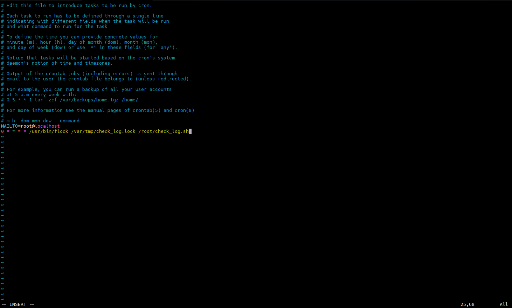
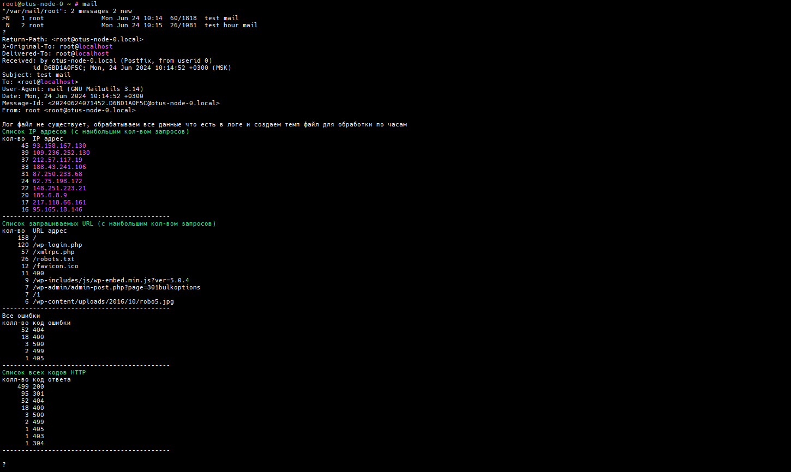
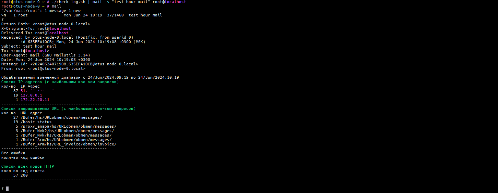

# Lesson №11 - BASH

## Getting started

1. клонируйте репозиторий 
~~~
git clone git@github.com:leschfkg/otus.git
~~~
2. перейдите в директорию:
~~~
 cd otus/lesson_11_bash
~~~
3. измените конфигурцию под себя в файле Vagrantfile
4. добавьте публичную часть ключа в файл authorized_keys
5. запустите создание ВМ:

5.1 Linux bash
~~~
vagrant up && vagrant reload
~~~
5.2 Windows power shell
~~~
vagrant up; vagrant reload
~~~

Для быстрого запуска окружения и работы использован Vagrant-стенд из файла Vagrantfile с образом cdaf/UbuntuLVM.
Стенд протестирован на VirtualBox 7.0.14, Vagrant 2.4, хостовая система: Windows 11 Pro.

# Домашнее задание

Пишем скрипт

Цель:
Написать скрипт на языке Bash;

Написать скрипт для CRON, который раз в час будет формировать письмо и отправлять на заданную почту.

Необходимая информация в письме:

Список IP адресов (с наибольшим кол-вом запросов) с указанием кол-ва запросов c момента последнего запуска скрипта;

Список запрашиваемых URL (с наибольшим кол-вом запросов) с указанием кол-ва запросов c момента последнего запуска скрипта;

Ошибки веб-сервера/приложения c момента последнего запуска;

Список всех кодов HTTP ответа с указанием их кол-ва с момента последнего запуска скрипта.

Скрипт должен предотвращать одновременный запуск нескольких копий, до его завершения.

В письме должен быть прописан обрабатываемый временной диапазон.

### Как запускать (предусмотрена защита от мультизапуска)

В качестве защиты от мультизапуска используется flock

Добавить в cron скрипт (crontab -e), в виде /usr/bin/flock /var/tmp/check_log.lock /root/check_log.sh с указанием расписания и ящика куда отправлять отчеты MAILTO=root@localhost:
~~~
root@otus-node-0 ~ # crontab -e
crontab: installing new crontab
root@otus-node-0 ~ #
~~~

Если так произойдет, что скрипт не успеет отработать в отведенное ему время, повторный запуск скрипта не произойдет, а точнее, произойдет запуск flock, он будет ждать пока что первый скрипт завершит свою работу и только после этого запустит скрипт.

/var/tmp/check_log.lock это лок файл, который создается если его нет, и программа flock "держит" его во время выполнения скрипта и отпускает только после того как скрипт завершится.

### Файлы

1. check_log.sh - скрипт, который парсит файл логов NGINX
2. access.log - лог файл NGINX
3. temp.log - файл, который создастся при первом запуске скрипта и нужен для того чтобы хранить логи за последний час и не парсить весь файл целиком

### Пример сообщений, которые будут приходить на почту
Запускаем скрипт вручную и проверям письма командой mail
~~~
root@otus-node-0 ~ # ./check_log.sh | mail -s "test mail" root@localhost
root@otus-node-0 ~ # ./check_log.sh | mail -s "test hour mail" root@localhost
root@otus-node-0 ~ # mail
"/var/mail/root": 2 messages 2 new
>N   1 root               Mon Jun 24 10:12  60/1818  test mail
 N   2 root               Mon Jun 24 10:12  26/1081  test hour mail
?

~~~

весь лог файл:

данные за час:

для проверки работы за час, использован свой лог файл NGINX
