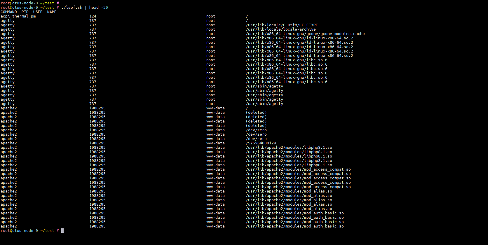
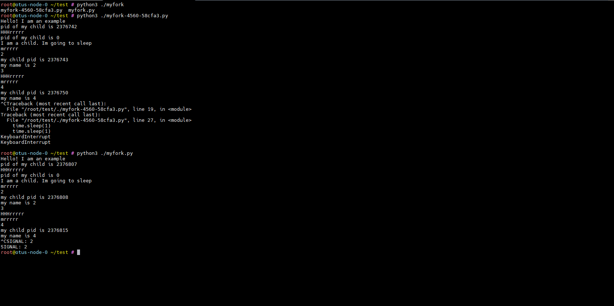

# Lesson №11 - Process Management

## Getting started

1. клонируйте репозиторий 
~~~
git clone git@github.com:leschfkg/otus.git
~~~
2. перейдите в директорию:
~~~
 cd otus/lesson_12_process_management
~~~
3. измените конфигурцию под себя в файле Vagrantfile
4. добавьте публичную часть ключа в файл authorized_keys
5. запустите создание ВМ:

5.1 Linux bash
~~~
vagrant up && vagrant reload
~~~
5.2 Windows power shell
~~~
vagrant up; vagrant reload
~~~

Для быстрого запуска окружения и работы использован Vagrant-стенд из файла Vagrantfile с образом cdaf/UbuntuLVM.
Стенд протестирован на VirtualBox 7.0.14, Vagrant 2.4, хостовая система: Windows 11 Pro.

# Домашнее задание

Задания на выбор:

1. написать свою реализацию ps ax используя анализ /proc

Результат ДЗ - рабочий скрипт который можно запустить

2. написать свою реализацию lsof

Результат ДЗ - рабочий скрипт который можно запустить

3. дописать обработчики сигналов в прилагаемом скрипте, оттестировать, приложить сам скрипт, инструкции по использованию

Результат ДЗ - рабочий скрипт который можно запустить + инструкция по использованию и лог консоли

4. реализовать 2 конкурирующих процесса по IO. пробовать запустить с разными ionice

Результат ДЗ - скрипт запускающий 2 процесса с разными ionice, замеряющий время выполнения и лог консоли

5. реализовать 2 конкурирующих процесса по CPU. пробовать запустить с разными nice

Результат ДЗ - скрипт запускающий 2 процесса с разными nice и замеряющий время выполнения и лог консоли

Статус "Принято" ставится при написании любого скрипта.

Более одного скрипта - по желанию.

### 1. Написать свою реализацию ps ax используя анализ /proc
файлы: ps.sh

результат выполения и сравнение с ps -ax:

### 2. Написать свою реализацию lsof
файлы: lsof.sh

результат выполения

### 3. дописать обработчики сигналов в прилагаемом скрипте, оттестировать, приложить сам скрипт, инструкции по использованию
файлы: myfork.py
В этом скрипте добалены обработчики некоторых сигналов - SIGHUP, SIGINT, SIGTERM. Чтобы прервать работу скрипта нажмите Ctrl+C и скрипт будет прерван по сигналу SIGINT (номер 2).  Без обработчиков также можно будет выйти из скрипта, но будет выведена ошибка. В скрипте в комментариях указано что было добавлено.

### 4. реализовать 2 конкурирующих процесса по IO. пробовать запустить с разными ionice