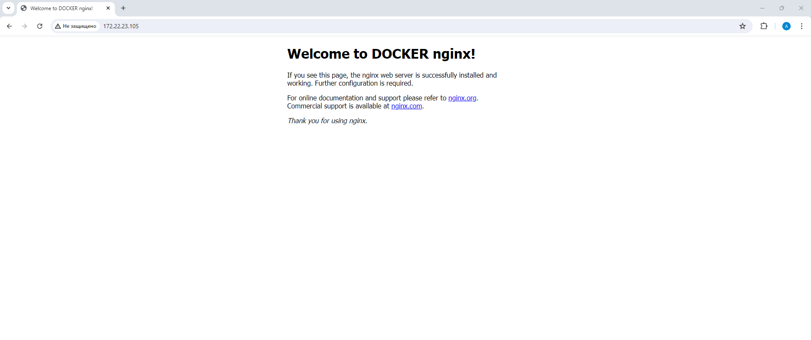
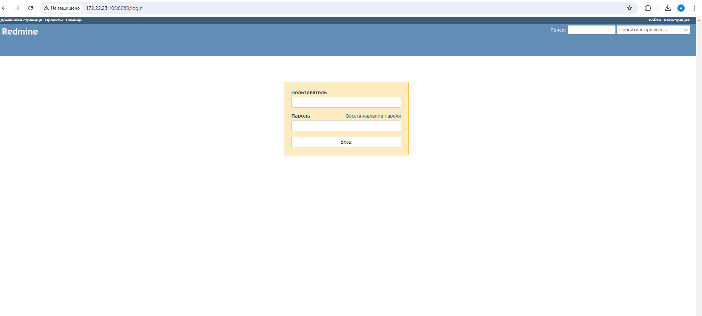
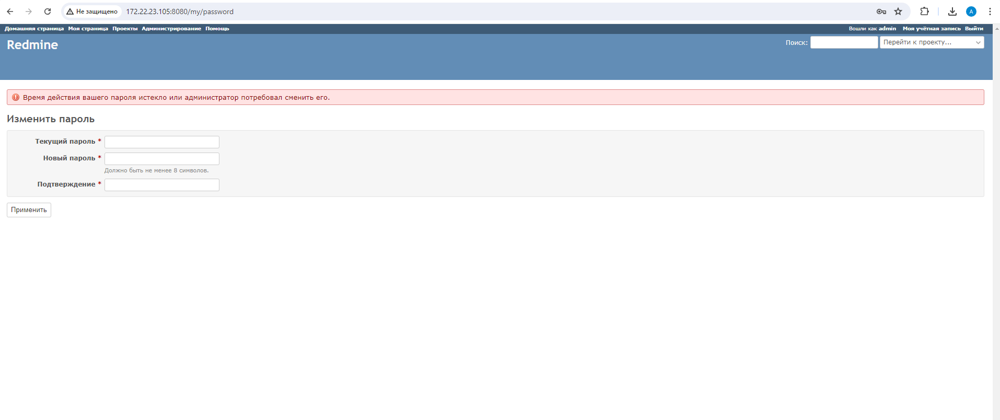
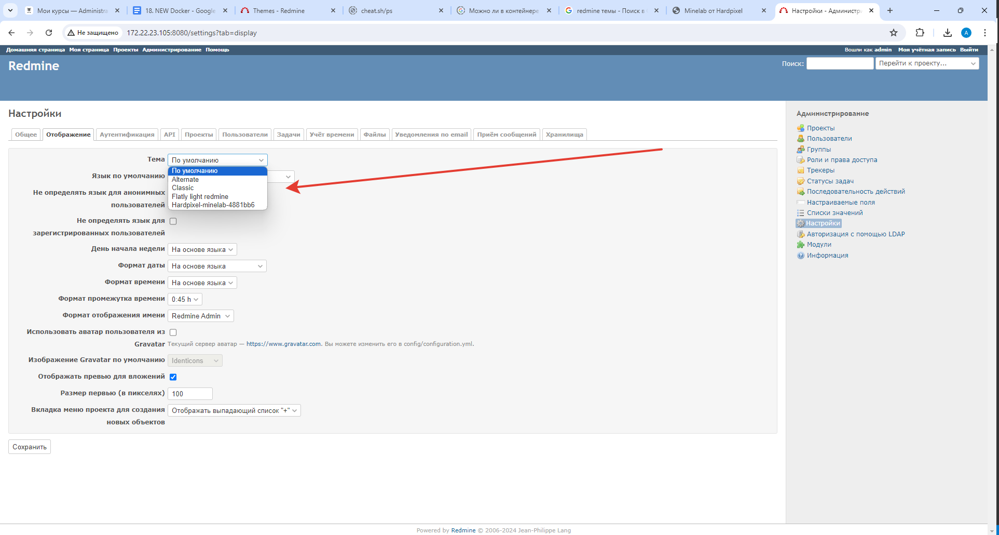
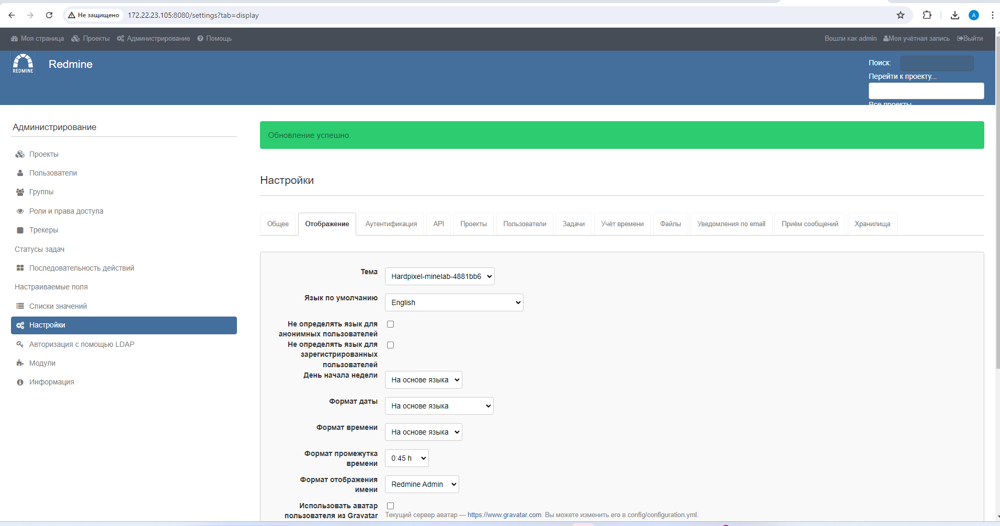

# Lesson №14 - Docker

## Getting started

1. клонируйте репозиторий 
~~~
git clone git@github.com:leschfkg/otus.git
~~~
2. перейдите в директорию:
~~~
 cd otus/lesson_14_Docker
~~~
3. измените конфигурцию под себя в файле Vagrantfile
4. добавьте публичную часть ключа в файл authorized_keys
5. запустите создание ВМ:

5.1 Linux bash
~~~
vagrant up && vagrant reload
~~~
5.2 Windows power shell
~~~
vagrant up; vagrant reload
~~~

Для быстрого запуска окружения и работы использован Vagrant-стенд из файла Vagrantfile с образом cdaf/UbuntuLVM.
Стенд протестирован на VirtualBox 7.0.14, Vagrant 2.4, хостовая система: Windows 11 Pro.

# Домашнее задание

1. Установите Docker на хост машину

https://docs.docker.com/engine/install/ubuntu/

2. Установите Docker Compose - как плагин, или как отдельное приложение

3. Создайте свой кастомный образ nginx на базе alpine. После запуска nginx должен отдавать кастомную страницу (достаточно изменить дефолтную страницу nginx)

4. Определите разницу между контейнером и образом

Вывод опишите в домашнем задании.
5. Ответьте на вопрос: Можно ли в контейнере собрать ядро?

Собранный образ необходимо запушить в docker hub и дать ссылку на ваш репозиторий.

### 1. Установите Docker на хост машину

для автоматической установки docker и docker compose в Vargantfie добавлены команды:
~~~
apt install ca-certificates curl
    install -m 0755 -d /etc/apt/keyrings
    curl -fsSL https://download.docker.com/linux/ubuntu/gpg -o /etc/apt/keyrings/docker.asc
    chmod a+r /etc/apt/keyrings/docker.asc
    echo \
      "deb [arch=$(dpkg --print-architecture) \
       signed-by=/etc/apt/keyrings/docker.asc] https://download.docker.com/linux/ubuntu \
       $(. /etc/os-release && echo "$VERSION_CODENAME") stable" | \
      sudo tee /etc/apt/sources.list.d/docker.list > /dev/null
    apt update -y
    apt install  docker-ce docker-ce-cli containerd.io docker-buildx-plugin docker-compose-plugin -y
~~~
### 2. Установите Docker Compose - как плагин, или как отдельное приложение
после поднятия ВМ проверяем правильность установки и версии:
~~~
root@otus-node-0 ~ # docker -v
Docker version 27.0.3, build 7d4bcd8
root@otus-node-0 ~ # docker compose version
Docker Compose version v2.28.1
root@otus-node-0 ~ #
~~~

### 3. Создайте свой кастомный образ nginx на базе alpine. После запуска nginx должен отдавать кастомную страницу (достаточно изменить дефолтную страницу nginx)
Создаем директорию docker_nginx и в ней директорию build, в директории build создаем файлы Dockerfile и index.html

Пишем Dockerfile
~~~
FROM nginx:stable-alpine
COPY ./index.html /usr/share/nginx/html
EXPOSE 80
CMD exec nginx -g 'daemon off;'
~~~
Создаем кастомную страницу NGINX
~~~
<!DOCTYPE html>
<html>

<head>
    <title>Welcome to DOCKER nginx!</title>
    
</head>

<body>
    <h1>Welcome to DOCKER nginx!</h1>
    
If you see this page, the nginx web server is successfully installed and
        working. Further configuration is required.

    
For online documentation and support please refer to
        <a href="https://nginx.org/">nginx.org</a>. 
        Commercial support is available at
        <a href="https://nginx.com/">nginx.com</a>.
    

    
<em>Thank you for using nginx.</em>

</body>

</html>
~~~
Создаем файл docker-compose.yml в директории docker-nginx для сборки и запуска контейнера с NGINX
~~~
networks:
  web:
    external: true
services:
  web:
    build: ./build
    restart: always
    networks:
      - web
    ports:
      - 80:80   
~~~
Создаем сеть для контейнера и после запускаем сборку и запуск
~~~
root@otus-node-0 ~/docker_nginx # docker network create web
e87d43cd9879807e25232084c93ebd15b732da1858fdf5eb9963ca56d98ad64a
root@otus-node-0 ~/docker_nginx # docker compose up -d --build
[+] Building 0.8s (7/7) FINISHED                                                                                                                                                       docker:default
 => [web internal] load build definition from Dockerfile                                                                                                                                         0.0s
 => => transferring dockerfile: 146B                                                                                                                                                             0.0s
 => [web internal] load metadata for docker.io/library/nginx:stable-alpine                                                                                                                       0.6s
 => [web internal] load .dockerignore                                                                                                                                                            0.0s
 => => transferring context: 2B                                                                                                                                                                  0.0s
 => [web internal] load build context                                                                                                                                                            0.0s
 => => transferring context: 32B                                                                                                                                                                 0.0s
 => [web 1/2] FROM docker.io/library/nginx:stable-alpine@sha256:208ae3c180b7d26f6a8046fac4c8468b2ab8bd92123ab73f9c5ad0f6f1c5543d                                                                 0.0s
 => CACHED [web 2/2] COPY ./index.html /usr/share/nginx/html                                                                                                                                     0.0s
 => [web] exporting to image                                                                                                                                                                     0.0s
 => => exporting layers                                                                                                                                                                          0.0s
 => => writing image sha256:6d24199ec0ef4b3cedd827ae41388f53b77acd119a8ee2d141a8134f20d3bff5                                                                                                     0.0s
 => => naming to docker.io/library/docker_nginx-web                                                                                                                                              0.0s
[+] Running 1/1
 ✔ Container docker_nginx-web-1  Started                                                                                                                                                         0.9s
root@otus-node-0 ~/docker_nginx # docker compose ps
NAME                 IMAGE              COMMAND                  SERVICE   CREATED         STATUS         PORTS
docker_nginx-web-1   docker_nginx-web   "/docker-entrypoint.…"   web       8 seconds ago   Up 7 seconds   0.0.0.0:80->80/tcp, :::80->80/tcp
root@otus-node-0 ~/docker_nginx #
~~~
Проверяем работу в браузере

### Определите разницу между контейнером и образом

Контейнер создается из образа и не должен хранить никакой информации, из однаго образа можно создать множество контейнеров, образы можно использовать для создания новых образов. В образе все слои рид онли, в контейнере в последний слой можно записывать информацию, но она не сохраниться после уничтожения контейнера, для сохранения информации нужно использовать тома и монтировать их с хостовой машины.

### Ответьте на вопрос: Можно ли в контейнере собрать ядро?

~~~
root@otus-node-0 ~/docker_nginx # docker compose ps
NAME                 IMAGE              COMMAND                  SERVICE   CREATED          STATUS          PORTS
docker_nginx-web-1   docker_nginx-web   "/docker-entrypoint.…"   web       13 minutes ago   Up 13 minutes   0.0.0.0:80->80/tcp, :::80->80/tcp
root@otus-node-0 ~/docker_nginx # docker exec -ti docker_nginx-web-1 sh
/ # uname -a
Linux 7c6c679b2c48 5.15.0-116-generic #126-Ubuntu SMP Mon Jul 1 10:14:24 UTC 2024 x86_64 Linux
/ #
~~~
Если зайти в контейнера и проверить какое ядро у него, то видим что даже если в образе у нас Alpine Linux, то в контейнере мы видим ядро хоста с Ubuntu.
Думаю, что нет, ядро собрать нельзя, так как контейнеры используют ядро хостовой системы и предназначены для запуска одного процесса, т.е. один контейнер - один процесс.

## Задание со звездочкой

Написать Docker-compose для приложения Redmine, с использованием опции build.

Добавить в базовый образ redmine любую кастомную тему оформления.

Убедиться что после сборки новая тема доступна в настройках.

Настроить вольюмы, для сохранения всей необходимой информации

1. Создаем директорию redmine и в ней директорию build, скачиваем две темы flatly_light_redmine и hardpixel-minelab в директорию build, создаем Dockerfile в директории build
~~~
FROM redmine:5.1
COPY . /usr/src/redmine/public/themes/
~~~
2. Создаем файл docker-compose.yml в директории redmine
~~~
networks:
  web:
    external: true
  db:
    external: true
      
services:

  redmine:
    build: ./build
    restart: always
    networks:
      - web
      - db
    ports:
      - 8080:3000
    environment:
      REDMINE_DB_MYSQL: db
      REDMINE_DB_PASSWORD: example
      REDMINE_SECRET_KEY_BASE: supersecretkey

  db:
    image: mysql:8.0
    restart: always
    networks:
      - db
    environment:
      MYSQL_ROOT_PASSWORD: example
      MYSQL_DATABASE: redmine
    volumes:
      - ./data:/var/lib/mysql
~~~
3. создаем сеть для контейнера с базой данных mysql
~~~
root@otus-node-0 ~/redmine # docker network create db
a783ade891c6942b0f50fe6aae7c8621d8abbc93a9895abc4e509ac02843bd42
root@otus-node-0 ~/redmine #
~~~
4. Поднимаем контейнеры и проверяем работу
~~~
root@otus-node-0 ~/redmine # docker compose up -d --build
[+] Running 12/12
 ✔ db Pulled                                                                                                                                                                                    49.2s
   ✔ d9a40b27c30f Pull complete                                                                                                                                                                 19.8s
   ✔ c3e750b66554 Pull complete                                                                                                                                                                 19.8s
   ✔ 8c7ce6c9ed47 Pull complete                                                                                                                                                                 19.9s
   ✔ 07b15d10f125 Pull complete                                                                                                                                                                 20.6s
   ✔ 36aa6d82134c Pull complete                                                                                                                                                                 20.7s
   ✔ ff7ba837a054 Pull complete                                                                                                                                                                 20.7s
   ✔ 2434679df156 Pull complete                                                                                                                                                                 24.1s
   ✔ 6bf60bd2cde3 Pull complete                                                                                                                                                                 24.1s
   ✔ 4914dbc1b9fc Pull complete                                                                                                                                                                 45.1s
   ✔ a24e196bc810 Pull complete                                                                                                                                                                 45.3s
   ✔ 068a7d33dd38 Pull complete                                                                                                                                                                 45.9s
[+] Building 71.5s (7/7) FINISHED                                                                                                                                                      docker:default
 => [redmine internal] load build definition from Dockerfile                                                                                                                                     0.2s
 => => transferring dockerfile: 93B                                                                                                                                                              0.0s
 => [redmine internal] load metadata for docker.io/library/redmine:5.1                                                                                                                           2.1s
 => [redmine internal] load .dockerignore                                                                                                                                                        0.2s
 => => transferring context: 2B                                                                                                                                                                  0.0s
 => [redmine internal] load build context                                                                                                                                                        0.3s
 => => transferring context: 5.48MB                                                                                                                                                              0.1s
 => [redmine 1/2] FROM docker.io/library/redmine:5.1@sha256:c4a8e49a776acc4b98a1976da03a3e3d92c0618f1ca67a115276fbc070b84245                                                                    59.3s
 => => resolve docker.io/library/redmine:5.1@sha256:c4a8e49a776acc4b98a1976da03a3e3d92c0618f1ca67a115276fbc070b84245                                                                             0.2s
 => => sha256:c4a8e49a776acc4b98a1976da03a3e3d92c0618f1ca67a115276fbc070b84245 10.28kB / 10.28kB                                                                                                 0.0s
 => => sha256:8a91a725a845ffe068766771c3452a1671df46980f013686fa2c882d40026250 3.45kB / 3.45kB                                                                                                   0.0s
 => => sha256:8efd64e76c5f0bcd3b15ff75255dba4c0a50dcf16fd728822c825df525cbd0b6 13.17kB / 13.17kB                                                                                                 0.0s
 => => sha256:f11c1adaa26e078479ccdd45312ea3b88476441b91be0ec898a7e07bfd05badc 29.13MB / 29.13MB                                                                                                 6.0s
 => => sha256:cd1fba034e37128557221284b24cadfd0eeaf14dff4ab3482aa6d7e5693584e2 199B / 199B                                                                                                       0.9s
 => => sha256:ba298d811313322ade2572cd92d67474226a055794ef9bb5a3389746885150d2 13.86MB / 13.86MB                                                                                                 6.2s
 => => sha256:ad8c1e8e10476fd40929f9f0b31101065416740be0b26383fb86c5246ceab08e 34.83MB / 34.83MB                                                                                                 9.5s
 => => sha256:64abf45450098e5cf9e0be6c77fc781519e9d363c458822ac43b1a35edf3e453 1.11kB / 1.11kB                                                                                                   6.7s
 => => sha256:a021b96d476ac05b7398bce1461337bbe7eb91a726eeaa3f846f5efd6c8f57e5 143B / 143B                                                                                                       6.8s
 => => sha256:a016f8c861b9b1f8dc121c88296ec7a5ecc40426c132ec5024976ed282c2efa0 122.18MB / 122.18MB                                                                                              29.6s
 => => extracting sha256:f11c1adaa26e078479ccdd45312ea3b88476441b91be0ec898a7e07bfd05badc                                                                                                       21.1s
 => => sha256:8e7bcb73e338e65412d6405f1fea4135f9e0f3401ac3998bea48fc5cdd273019 1.15MB / 1.15MB                                                                                                   7.8s
 => => sha256:cb5c7570345022e626d8553bfbdef29884c4a43968f9d08ede48ca257a092898 139B / 139B                                                                                                       8.3s
 => => sha256:8cadbfb00768655b6a8cff3dd457c110b5a1d40b3918271295cbb7bdda02cbf9 125B / 125B                                                                                                       8.7s
 => => sha256:90084e4a2656ff5fb959d7e74519a2723122a0cb268524277e3d46683d4feeab 3.24MB / 3.24MB                                                                                                  10.1s
 => => sha256:aa440f4608537373d6f18bfa5ea53e8bdf97e1b55d0d22b163d6e8da3fc9a4df 54.60MB / 54.60MB                                                                                                26.6s
 => => sha256:b2f74b90d6ed91e09a767dbeaefd2d7b80f2238e19438f32419de8bd9168aebf 2.01kB / 2.01kB                                                                                                  10.5s
 => => extracting sha256:ba298d811313322ade2572cd92d67474226a055794ef9bb5a3389746885150d2                                                                                                        2.8s
 => => extracting sha256:cd1fba034e37128557221284b24cadfd0eeaf14dff4ab3482aa6d7e5693584e2                                                                                                        0.0s
 => => extracting sha256:ad8c1e8e10476fd40929f9f0b31101065416740be0b26383fb86c5246ceab08e                                                                                                        2.9s
 => => extracting sha256:a021b96d476ac05b7398bce1461337bbe7eb91a726eeaa3f846f5efd6c8f57e5                                                                                                        0.0s
 => => extracting sha256:64abf45450098e5cf9e0be6c77fc781519e9d363c458822ac43b1a35edf3e453                                                                                                        0.0s
 => => extracting sha256:a016f8c861b9b1f8dc121c88296ec7a5ecc40426c132ec5024976ed282c2efa0                                                                                                       14.0s
 => => extracting sha256:8e7bcb73e338e65412d6405f1fea4135f9e0f3401ac3998bea48fc5cdd273019                                                                                                        0.1s
 => => extracting sha256:cb5c7570345022e626d8553bfbdef29884c4a43968f9d08ede48ca257a092898                                                                                                        0.0s
 => => extracting sha256:8cadbfb00768655b6a8cff3dd457c110b5a1d40b3918271295cbb7bdda02cbf9                                                                                                        0.0s
 => => extracting sha256:90084e4a2656ff5fb959d7e74519a2723122a0cb268524277e3d46683d4feeab                                                                                                        1.9s
 => => extracting sha256:aa440f4608537373d6f18bfa5ea53e8bdf97e1b55d0d22b163d6e8da3fc9a4df                                                                                                        6.4s
 => => extracting sha256:b2f74b90d6ed91e09a767dbeaefd2d7b80f2238e19438f32419de8bd9168aebf                                                                                                        0.0s
 => [redmine 2/2] COPY . /usr/src/redmine/public/themes/                                                                                                                                         9.6s
 => [redmine] exporting to image                                                                                                                                                                 0.1s
 => => exporting layers                                                                                                                                                                          0.1s
 => => writing image sha256:6616a74ad9876d335db5f9913aa7da4a218796f35b40abf385ed93fa8740a82c                                                                                                     0.0s
 => => naming to docker.io/library/redmine-redmine                                                                                                                                               0.0s
[+] Running 2/2
 ✔ Container redmine-redmine-1  Started                                                                                                                                                          1.4s
 ✔ Container redmine-db-1       Started                                                                                                                                                          1.2s
root@otus-node-0 ~/redmine #
~~~
~~~
root@otus-node-0 ~/redmine # docker compose ps
NAME                IMAGE             COMMAND                  SERVICE   CREATED         STATUS         PORTS
redmine-db-1        mysql:8.0         "docker-entrypoint.s…"   db        2 minutes ago   Up 2 minutes   3306/tcp, 33060/tcp
redmine-redmine-1   redmine-redmine   "/docker-entrypoint.…"   redmine   2 minutes ago   Up 2 minutes   0.0.0.0:8080->3000/tcp, :::8080->3000/tcp
root@otus-node-0 ~/redmine #
~~~
~~~
docker logs -f redmine-redmine-1
~~~
~~~
=> Booting Puma
=> Rails 6.1.7.8 application starting in production
=> Run `bin/rails server --help` for more startup options
W, [2024-07-16T08:19:59.278291 #1]  WARN -- : Creating scope :system. Overwriting existing method Enumeration.system.
W, [2024-07-16T08:19:59.370724 #1]  WARN -- : Creating scope :sorted. Overwriting existing method User.sorted.
W, [2024-07-16T08:19:59.420908 #1]  WARN -- : Creating scope :sorted. Overwriting existing method Group.sorted.
Puma starting in single mode...
* Puma version: 6.4.2 (ruby 3.2.4-p170) ("The Eagle of Durango")
*  Min threads: 0
*  Max threads: 5
*  Environment: production
*          PID: 1
* Listening on http://0.0.0.0:3000
Use Ctrl-C to stop
~~~
5. Так как для контейнера с базой данных мы создали вольюм, для сохранения всей необходимой информации, то проверяем его на хост машине
~~~
root@otus-node-0 ~/redmine # ls -lah
total 20K
drwxr-xr-x 4 root root 4.0K Jul 16 11:19 .
drwx------ 8 root root 4.0K Jul 15 16:12 ..
drwxr-xr-x 4 root root 4.0K Jul 16 11:02 build
drwxr-xr-x 8 lxd  root 4.0K Jul 16 11:19 data
-rw-r--r-- 1 root root  547 Jul 16 11:16 docker-compose.yml
root@otus-node-0 ~/redmine #
~~~
Видим, что создалась директория data, проверяем ее содержимое
~~~
root@otus-node-0 ~/redmine # cd data/
root@otus-node-0 ~/redmine/data # ls -lah
total 99M
drwxr-xr-x 8 lxd  root   4.0K Jul 16 11:19  .
drwxr-xr-x 4 root root   4.0K Jul 16 11:19  ..
-rw-r----- 1 lxd  vboxsf   56 Jul 16 11:19  auto.cnf
-rw-r----- 1 lxd  vboxsf 2.9M Jul 16 11:19  binlog.000001
-rw-r----- 1 lxd  vboxsf 232K Jul 16 11:19  binlog.000002
-rw-r----- 1 lxd  vboxsf   32 Jul 16 11:19  binlog.index
-rw------- 1 lxd  vboxsf 1.7K Jul 16 11:19  ca-key.pem
-rw-r--r-- 1 lxd  vboxsf 1.1K Jul 16 11:19  ca.pem
-rw-r--r-- 1 lxd  vboxsf 1.1K Jul 16 11:19  client-cert.pem
-rw------- 1 lxd  vboxsf 1.7K Jul 16 11:19  client-key.pem
-rw-r----- 1 lxd  vboxsf 192K Jul 16 11:20 '#ib_16384_0.dblwr'
-rw-r----- 1 lxd  vboxsf 8.2M Jul 16 11:19 '#ib_16384_1.dblwr'
-rw-r----- 1 lxd  vboxsf 5.6K Jul 16 11:19  ib_buffer_pool
-rw-r----- 1 lxd  vboxsf  12M Jul 16 11:20  ibdata1
-rw-r----- 1 lxd  vboxsf  12M Jul 16 11:19  ibtmp1
drwxr-x--- 2 lxd  vboxsf 4.0K Jul 16 11:19 '#innodb_redo'
drwxr-x--- 2 lxd  vboxsf 4.0K Jul 16 11:19 '#innodb_temp'
drwxr-x--- 2 lxd  vboxsf 4.0K Jul 16 11:19  mysql
-rw-r----- 1 lxd  vboxsf  31M Jul 16 11:20  mysql.ibd
lrwxrwxrwx 1 lxd  vboxsf   27 Jul 16 11:19  mysql.sock -> /var/run/mysqld/mysqld.sock
drwxr-x--- 2 lxd  vboxsf 4.0K Jul 16 11:19  performance_schema
-rw------- 1 lxd  vboxsf 1.7K Jul 16 11:19  private_key.pem
-rw-r--r-- 1 lxd  vboxsf  452 Jul 16 11:19  public_key.pem
drwxr-x--- 2 lxd  vboxsf 4.0K Jul 16 11:19  redmine
-rw-r--r-- 1 lxd  vboxsf 1.1K Jul 16 11:19  server-cert.pem
-rw------- 1 lxd  vboxsf 1.7K Jul 16 11:19  server-key.pem
drwxr-x--- 2 lxd  vboxsf 4.0K Jul 16 11:19  sys
-rw-r----- 1 lxd  vboxsf  16M Jul 16 11:20  undo_001
-rw-r----- 1 lxd  vboxsf  16M Jul 16 11:20  undo_002
root@otus-node-0 ~/redmine/data #
~~~
Видим, что данные из контейнера вынесены на хост систему и при пересоздании или удалении контейнера с бд, сама бд и ее настройки не удалятся.

6. Проверяем темы оформления, которые мы добавили при сборке образа

перехоим на страницу redmine

авторизуемся и меняем пароль, по умолчанию admin/admin

переходим в администрирвоание - настройки - отображение и проверяем доступны ли темы добавленные при сборке образа контейнера

темы доступны, меняем тему по умолчанию

### Задание выполнено!