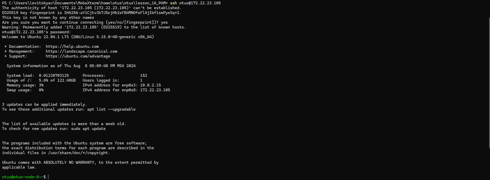
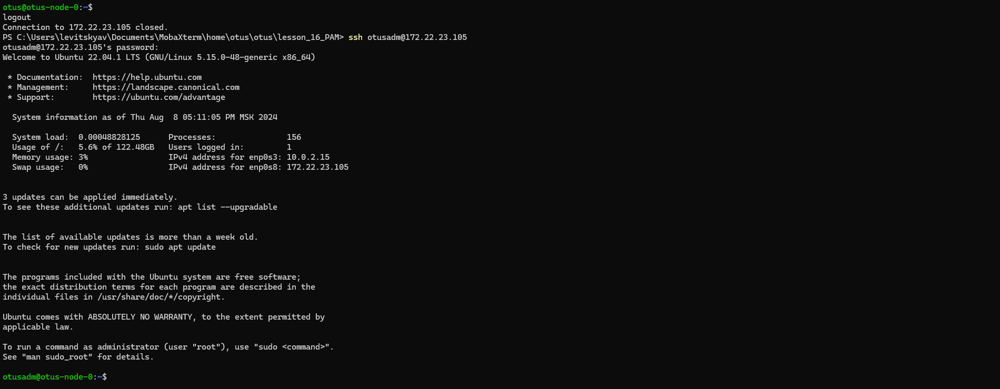
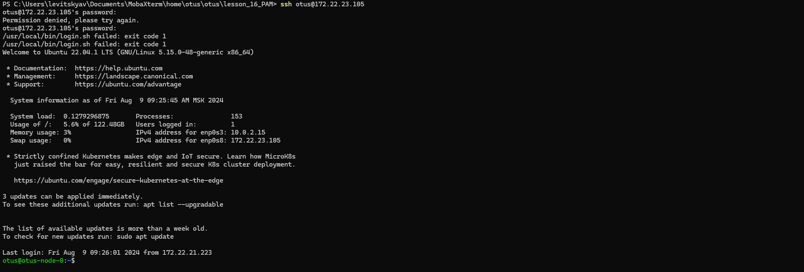
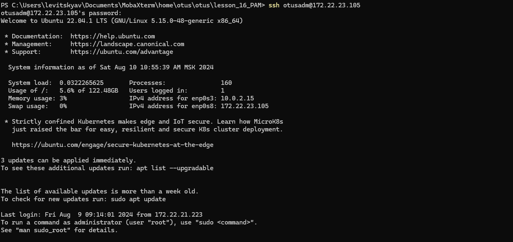

# Lesson №16 - PAM

## Getting started

1. клонируйте репозиторий 
~~~
git clone git@github.com:leschfkg/otus.git
~~~
2. перейдите в директорию:
~~~
 cd otus/lesson_16_PAM
~~~
3. измените конфигурцию под себя в файле Vagrantfile
4. добавьте публичную часть ключа в файл authorized_keys
5. запустите создание ВМ:

5.1 Linux bash
~~~
vagrant up && vagrant reload
~~~
5.2 Windows power shell
~~~
vagrant up; vagrant reload
~~~

Для быстрого запуска окружения и работы использован Vagrant-стенд из файла Vagrantfile с образом cdaf/UbuntuLVM.
Стенд протестирован на VirtualBox 7.0.14, Vagrant 2.4, хостовая система: Windows 11 Pro.

# Домашнее задание
* Что нужно сделать?

* Запретить всем пользователям, кроме группы admin логин в выходные (суббота и воскресенье), без учета праздников

* Дать конкретному пользователю права работать с докером и возможность рестартить докер сервис*

### Запретить всем пользователям, кроме группы admin логин в выходные (суббота и воскресенье), без учета праздников

 Подключаемся к нашей созданной ВМ и переходим в пользователя root:

 Создаем пользователей:
~~~
root@otus-node-0 ~ # useradd -s /bin/bash -m -d /opt/otusadm otusadm
root@otus-node-0 ~ # useradd -s /bin/bash -m -d /opt/otus otus
root@otus-node-0 ~ #
~~~
Создаём пользователям пароли:
~~~
root@otus-node-0 ~ # passwd otusadm
New password:
Retype new password:
passwd: password updated successfully
root@otus-node-0 ~ # passwd otus
New password:
Retype new password:
passwd: password updated successfully
root@otus-node-0 ~ #
~~~
Создаём группу admin:
~~~
root@otus-node-0 ~ # groupadd -f admin
root@otus-node-0 ~ #
~~~
Добавляем пользователей vagrant,root и otusadm в группу admin:
~~~
root@otus-node-0 ~ # usermod otusadm -aG admin && usermod root -aG admin && usermod vagrant -aG admin
root@otus-node-0 ~ #
~~~
После создания пользователей, нужно проверить, что они могут подключаться по SSH к нашей ВМ. Для этого пытаемся подключиться с хостовой машины: 

* Далее настроим правило, по которому все пользователи кроме тех, что указаны в группе admin не смогут подключаться в выходные дни:

Проверим, что пользователи root, vagrant и otusadm есть в группе admin:
~~~
root@otus-node-0 ~ # cat /etc/group | grep admin
admin:x:1003:otusadm,root,vagrant
root@otus-node-0 ~ #
~~~
Выберем метод PAM-аутентификации, так как у нас используется только ограничение по времени, то было бы логично использовать метод pam_time, однако, данный метод не работает с локальными группами пользователей, и, получается, что использование данного метода добавит нам большое количество однообразных строк с разными пользователями. В текущей ситуации лучше написать небольшой скрипт контроля и использовать модуль pam_exec

Создадим файл-скрипт /usr/local/bin/login.sh
~~~
vim /usr/local/bin/login.sh
~~~
~~~
#!/bin/bash
#Первое условие: если день недели суббота или воскресенье
if [ $(date +%a) = "Sat" ] || [ $(date +%a) = "Sun" ]; then
 #Второе условие: входит ли пользователь в группу admin
 if getent group admin | grep -qw "$PAM_USER"; then
        #Если пользователь входит в группу admin, то он может подключиться
        exit 0
      else
        #Иначе ошибка (не сможет подключиться)
        exit 1
    fi
  #Если день не выходной, то подключиться может любой пользователь
  else
    exit 0
fi
~~~
Добавим права на исполнение файла:
~~~
root@otus-node-0 ~ # chmod +x /usr/local/bin/login.sh
root@otus-node-0 ~ #
~~~
Рассмотрим файл /etc/pam.d/sshd:
~~~
vim /etc/pam.d/sshd
~~~
В конфигурации для ubuntu видно что подгружается конфигурация common-auth , которая включает основные требования и реквизиты pam_unix
~~~
# PAM configuration for the Secure Shell service

# Standard Un*x authentication.
@include common-auth
# Disallow non-root logins when /etc/nologin exists.
account    required     pam_nologin.so

# Uncomment and edit /etc/security/access.conf if you need to set complex
# access limits that are hard to express in sshd_config.
# account  required     pam_access.so

# Standard Un*x authorization.
@include common-account

# SELinux needs to be the first session rule.  This ensures that any
# lingering context has been cleared.  Without this it is possible that a
# module could execute code in the wrong domain.
session [success=ok ignore=ignore module_unknown=ignore default=bad]        pam_selinux.so close

# Set the loginuid process attribute.
session    required     pam_loginuid.so

# Create a new session keyring.
session    optional     pam_keyinit.so force revoke

# Standard Un*x session setup and teardown.
@include common-session

# Print the message of the day upon successful login.
# This includes a dynamically generated part from /run/motd.dynamic
# and a static (admin-editable) part from /etc/motd.
session    optional     pam_motd.so  motd=/run/motd.dynamic
session    optional     pam_motd.so noupdate

# Print the status of the user's mailbox upon successful login.
session    optional     pam_mail.so standard noenv # [1]

# Set up user limits from /etc/security/limits.conf.
session    required     pam_limits.so

# Read environment variables from /etc/environment and
# /etc/security/pam_env.conf.
session    required     pam_env.so # [1]
# In Debian 4.0 (etch), locale-related environment variables were moved to
# /etc/default/locale, so read that as well.
session    required     pam_env.so user_readenv=1 envfile=/etc/default/locale

# SELinux needs to intervene at login time to ensure that the process starts
# in the proper default security context.  Only sessions which are intended
# to run in the user's context should be run after this.
session [success=ok ignore=ignore module_unknown=ignore default=bad]        pam_selinux.so open

# Standard Un*x password updating.
@include common-password
~
~
"/etc/pam.d/sshd" 55L, 2199B                                                   
~~~
Соответственно открываем конфигурацию /etc/pam.d/common-auth
~~~
vim /etc/pam.d/common-auth
~~~
И добавляем в нее скрипт проверки подключения пользователей:
~~~
# /etc/pam.d/common-auth - authentication settings common to all services
#
# This file is included from other service-specific PAM config files,
# and should contain a list of the authentication modules that define
# the central authentication scheme for use on the system
# (e.g., /etc/shadow, LDAP, Kerberos, etc.).  The default is to use the
# traditional Unix authentication mechanisms.
#
# As of pam 1.0.1-6, this file is managed by pam-auth-update by default.
# To take advantage of this, it is recommended that you configure any
# local modules either before or after the default block, and use
# pam-auth-update to manage selection of other modules.  See
# pam-auth-update(8) for details.

# here are the per-package modules (the "Primary" block)
auth    [success=1 default=ignore]      pam_unix.so nullok
# here's the fallback if no module succeeds
auth    requisite                       pam_deny.so
auth       required     pam_exec.so debug /usr/local/bin/login.sh
# prime the stack with a positive return value if there isn't one already;
# this avoids us returning an error just because nothing sets a success code
# since the modules above will each just jump around
auth    required                        pam_permit.so
# and here are more per-package modules (the "Additional" block)
auth    optional                        pam_cap.so
# end of pam-auth-update config
~~~
На этом настройка завершена, нужно только проверить, что скрипт отрабатывает корректно.

Установим дату соответствующую выходному дню:
~~~
root@otus-node-0 ~ # date --set "2024-08-10 10:55:36"
Sat Aug 10 10:55:36 AM MSK 2024
root@otus-node-0 ~ # date
Sat Aug 10 10:55:39 AM MSK 2024
root@otus-node-0 ~ #
~~~
Пробуем подключиться:

Пока дата на сервере соответсвовала выходному дню, мы не можем зайти в систему и получаем ошибку
~~~
/usr/local/bin/login.sh failed: exit code 1
~~~
Пользователь otusadm должен подключаться без проблем: 

### Дать конкретному пользователю права работать с докером и возможность рестартить докер сервис*

Переходим в пользователя otus и проверяем права на перезапуск демонов:
~~~
root@otus-node-0 /usr/share/polkit-1/rules.d # su otus
otus@otus-node-0:/usr/share/polkit-1/rules.d$ systemctl restart ssh
==== AUTHENTICATING FOR org.freedesktop.systemd1.manage-units ====
Authentication is required to restart 'ssh.service'.
Authenticating as: vagrant
Password:
otus@otus-node-0:/usr/share/polkit-1/rules.d$ systemctl restart docker.service
==== AUTHENTICATING FOR org.freedesktop.systemd1.manage-units ====
Authentication is required to restart 'docker.service'.
Authenticating as: vagrant
Password:
otus@otus-node-0:/usr/share/polkit-1/rules.d$

~~~
в данный момент прав у пользователя otus нет!

Создаем файл с правилами для доступа пользователя otus к перезапуску службы docker  в директории /usr/share/polkit-1/rules.d/00-docker-daemon.rules
~~~
polkit.addRule(function(action, subject) {
    if (action.id == "org.freedesktop.systemd1.manage-units" &&
        action.lookup("unit") == "docker.service" &&
        subject.user == "otus") {
        return polkit.Result.YES;
    }
});
~~~

перезапускае службу polkit

~~~
root@otus-node-0 /usr/share/polkit-1/rules.d # systemctl restart polkit.service
root@otus-node-0 /usr/share/polkit-1/rules.d #
~~~

переходим в пользоватея otus и проверяем работу:
~~~
root@otus-node-0 /usr/share/polkit-1/rules.d # ll
total 36
drwxr-xr-x 2 root root 4096 Aug  9 15:26 .
drwxr-xr-x 4 root root 4096 Apr 23 12:40 ..
-rw-r--r-- 1 root root  245 Aug  9 15:26 00-docker-daemon.rules
-rw-r--r-- 1 root root  104 Aug  9 14:17 49-ubuntu-admin.rules
-rw-r--r-- 1 root root  325 Aug  9 14:17 50-default.rules
-rw-r--r-- 1 root root  368 Apr 23 12:45 org.freedesktop.bolt.rules
-rw-r--r-- 1 root root  251 Apr 23 12:45 org.freedesktop.fwupd.rules
-rw-r--r-- 1 root root  334 Mar 31 11:13 org.freedesktop.packagekit.rules
-rw-r--r-- 1 root root  527 Feb 27 20:26 systemd-networkd.rules
root@otus-node-0 /usr/share/polkit-1/rules.d # su otus
otus@otus-node-0:/usr/share/polkit-1/rules.d$ systemctl restart docker.service
otus@otus-node-0:/usr/share/polkit-1/rules.d$ systemctl restart ssh
==== AUTHENTICATING FOR org.freedesktop.systemd1.manage-units ====
Authentication is required to restart 'ssh.service'.
Authenticating as: vagrant
Password:
otus@otus-node-0:/usr/share/polkit-1/rules.d$
~~~
как видим пользователь otus может управлять демоном docker.service и все так же не может управлять демоном sshd

Проверяем может ли пользователь работать с docker:
~~~
otus@otus-node-0:/usr/share/polkit-1/rules.d$ docker pull hello-world
Using default tag: latest
permission denied while trying to connect to the Docker daemon socket at unix:///var/run/docker.sock: Post "http://%2Fvar%2Frun%2Fdocker.sock/v1.46/images/create?fromImage=hello-world&tag=latest": dial unix /var/run/docker.sock: connect: permission denied
otus@otus-node-0:/usr/share/polkit-1/rules.d$
~~~
Прав у пользователя нет!

Для того чтобы пользователь мог работать с docker без sudo, его требуется добавить в группу docker, добавляем пользователя otus в группу docker:
~~~
root@otus-node-0 /usr/share/polkit-1/rules.d # usermod -aG docker otus
root@otus-node-0 /usr/share/polkit-1/rules.d # id otus
uid=1001(otus) gid=1001(otus) groups=1001(otus),986(docker)
root@otus-node-0 /usr/share/polkit-1/rules.d #
~~~
проверяем работу:
~~~
root@otus-node-0 /usr/share/polkit-1/rules.d # su otus
otus@otus-node-0:/usr/share/polkit-1/rules.d$ docker pull hello-world
Using default tag: latest
latest: Pulling from library/hello-world
c1ec31eb5944: Pull complete
Digest: sha256:1408fec50309afee38f3535383f5b09419e6dc0925bc69891e79d84cc4cdcec6
Status: Downloaded newer image for hello-world:latest
docker.io/library/hello-world:latest
otus@otus-node-0:/usr/share/polkit-1/rules.d$ docker images
REPOSITORY    TAG       IMAGE ID       CREATED         SIZE
hello-world   latest    d2c94e258dcb   15 months ago   13.3kB
otus@otus-node-0:/usr/share/polkit-1/rules.d$
~~~

Задание выполнено!

