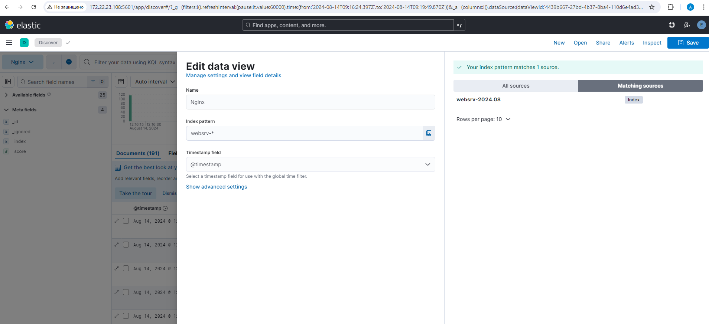

# Lesson №17 - Logs

## Getting started

1. клонируйте репозиторий 
~~~
git clone git@github.com:leschfkg/otus.git
~~~
2. перейдите в директорию:
~~~
 cd otus/lesson_16_Logs
~~~
3. измените конфигурцию под себя в файле Vagrantfile
4. добавьте публичную часть ключа в файл authorized_keys
5. запустите создание ВМ:

5.1 Linux bash
~~~
vagrant up && vagrant reload
~~~
5.2 Windows power shell
~~~
vagrant up; vagrant reload
~~~

Для быстрого запуска окружения и работы использован Vagrant-стенд из файла Vagrantfile с образом bento/ubuntu-24.04.
Стенд протестирован на VirtualBox 7.0.14, Vagrant 2.4, хостовая система: Windows 11 Pro.

# Домашнее задание
1. в вагранте поднимаем 2 машины web и log
2. на web поднимаем nginx
3. на log настраиваем центральный лог сервер на любой системе на выбор
    * journald;
    * rsyslog;
    * elk.

4. настраиваем аудит, следящий за изменением конфигов нжинкса

Все критичные логи с web должны собираться и локально и удаленно.

Все логи с nginx должны уходить на удаленный сервер (локально только критичные).

Логи аудита должны также уходить на удаленную систему.

Формат сдачи ДЗ - vagrant + ansible

5. развернуть еще машину elk*
     * таким образом настроить 2 центральных лог системы elk и какую либо еще;
     * в elk должны уходить только логи нжинкса;
     * во вторую систему все остальное.

Для правильной работы c логами, нужно, чтобы на всех хостах было настроено одинаковое время.

~~~
root@otus-node-0 ~ # timedatectl
               Local time: Tue 2024-08-13 11:34:45 MSK
           Universal time: Tue 2024-08-13 08:34:45 UTC
                 RTC time: Tue 2024-08-13 08:34:45
                Time zone: Europe/Moscow (MSK, +0300)
System clock synchronized: no
              NTP service: inactive
          RTC in local TZ: no
root@otus-node-0 ~ # date
Tue Aug 13 11:35:04 AM MSK 2024
root@otus-node-0 ~ #
~~~
~~~
root@otus-node-1 ~ # timedatectl
               Local time: Tue 2024-08-13 11:34:54 MSK
           Universal time: Tue 2024-08-13 08:34:54 UTC
                 RTC time: Tue 2024-08-13 08:34:53
                Time zone: Europe/Moscow (MSK, +0300)
System clock synchronized: no
              NTP service: inactive
          RTC in local TZ: no
root@otus-node-1 ~ # date
Tue Aug 13 11:35:09 AM MSK 2024
root@otus-node-1 ~ #
~~~

### Установка nginx на виртуальной машине otus-node-0

~~~
root@otus-node-0 ~ # apt update && apt install -y nginx
~~~
Проверим, что nginx работает корректно:
~~~
root@otus-node-0 ~ # systemctl status nginx
● nginx.service - A high performance web server and a reverse proxy server
     Loaded: loaded (/usr/lib/systemd/system/nginx.service; enabled; preset: enabled)
     Active: active (running) since Tue 2024-08-13 11:37:31 MSK; 45s ago
       Docs: man:nginx(8)
   Main PID: 14000 (nginx)
      Tasks: 7 (limit: 4611)
     Memory: 5.0M (peak: 5.7M)
        CPU: 45ms
     CGroup: /system.slice/nginx.service
             ├─14000 "nginx: master process /usr/sbin/nginx -g daemon on; master_process on;"
             ├─14001 "nginx: worker process"
             ├─14002 "nginx: worker process"
             ├─14003 "nginx: worker process"
             ├─14004 "nginx: worker process"
             ├─14005 "nginx: worker process"
             └─14006 "nginx: worker process"

Aug 13 11:37:31 otus-node-0 systemd[1]: Starting nginx.service - A high performance web server and a reverse proxy server...
Aug 13 11:37:31 otus-node-0 systemd[1]: Started nginx.service - A high performance web server and a reverse proxy server.
root@otus-node-0 ~ #
~~~
~~~
root@otus-node-0 ~ # ss -tunl | grep 80
tcp   LISTEN 0      511           0.0.0.0:80        0.0.0.0:*
tcp   LISTEN 0      511              [::]:80           [::]:*
root@otus-node-0 ~ #
~~~
Также работу nginx можно проверить на хосте. В браузере ввведем в адерсную строку http://172.22.23.105/

Видим что nginx запускается корректно.

### Настройка центрального сервера сбора логов

rsyslog должен быть установлен по умолчанию в нашей ОС, проверим это:
~~~
root@otus-node-1 ~ # apt list rsyslog
Listing... Done
rsyslog/noble,now 8.2312.0-3ubuntu9 amd64 [installed,automatic]
root@otus-node-1 ~ #
root@otus-node-1 ~ # apt install rsyslog
Reading package lists... Done
Building dependency tree... Done
Reading state information... Done
rsyslog is already the newest version (8.2312.0-3ubuntu9).
rsyslog set to manually installed.
0 upgraded, 0 newly installed, 0 to remove and 0 not upgraded.
root@otus-node-1 ~ #
~~~
Все настройки Rsyslog хранятся в файле /etc/rsyslog.conf 

Для того, чтобы наш сервер мог принимать логи, нам необходимо внести следующие изменения в файл: 
Открываем порт 514 (TCP и UDP):
~~~
root@otus-node-1 ~ # vim /etc/rsyslog.conf
root@otus-node-1 ~ #
~~~
находим закоментированные строки
~~~
# provides UDP syslog reception
module(load="imudp")
input(type="imudp" port="514")

# provides TCP syslog reception
module(load="imtcp")
input(type="imtcp" port="514")
~~~
И приводим их к виду:
~~~
# /etc/rsyslog.conf configuration file for rsyslog
#
# For more information install rsyslog-doc and see
# /usr/share/doc/rsyslog-doc/html/configuration/index.html
#
# Default logging rules can be found in /etc/rsyslog.d/50-default.conf

#################
#### MODULES ####
#################

module(load="imuxsock") # provides support for local system logging
#module(load="immark")  # provides --MARK-- message capability

# provides UDP syslog reception
module(load="imudp")
input(type="imudp" port="514")

# provides TCP syslog reception
module(load="imtcp")
input(type="imtcp" port="514")

# provides kernel logging support and enable non-kernel klog messages
module(load="imklog" permitnonkernelfacility="on")

###########################
#### GLOBAL DIRECTIVES ####
###########################

# Filter duplicated messages
$RepeatedMsgReduction on

#
# Set the default permissions for all log files.
#
$FileOwner syslog
$FileGroup adm
$FileCreateMode 0640
$DirCreateMode 0755
$Umask 0022
$PrivDropToUser syslog
$PrivDropToGroup syslog

#
# Where to place spool and state files
#
$WorkDirectory /var/spool/rsyslog

#
# Include all config files in /etc/rsyslog.d/
#
$IncludeConfig /etc/rsyslog.d/*.conf
~
~
~
~
~~~
В конец файла /etc/rsyslog.conf добавляем правила приёма сообщений от хостов:

Данные параметры будут отправлять в папку /var/log/rsyslog логи, которые будут приходить от других серверов. Например, Access-логи nginx от сервера web, будут идти в файл /var/log/rsyslog/web/nginx_access.log

Далее сохраняем файл и перезапускаем службу rsyslog: systemctl restart rsyslog
~~~
$template RemoteLogs,"/var/log/%HOSTNAME%/%PROGRAMNAME%.log"
*.* ?RemoteLogs
& ~
~~~
~~~
root@otus-node-1 ~ # systemctl restart rsyslog
root@otus-node-1 ~ # systemctl status rsyslog
● rsyslog.service - System Logging Service
     Loaded: loaded (/usr/lib/systemd/system/rsyslog.service; enabled; preset: enabled)
     Active: active (running) since Tue 2024-08-13 11:53:50 MSK; 8s ago
TriggeredBy: ● syslog.socket
       Docs: man:rsyslogd(8)
             man:rsyslog.conf(5)
             https://www.rsyslog.com/doc/
    Process: 17544 ExecStartPre=/usr/lib/rsyslog/reload-apparmor-profile (code=exited, status=0/SUCCESS)
   Main PID: 17550 (rsyslogd)
      Tasks: 10 (limit: 4611)
     Memory: 1.8M (peak: 5.2M)
        CPU: 93ms
     CGroup: /system.slice/rsyslog.service
             └─17550 /usr/sbin/rsyslogd -n -iNONE

Aug 13 11:53:50 otus-node-1 rsyslogd[17550]: warning: ~ action is deprecated, consider using the 'stop' statement instead [v8.2312.0 try https://www.rsyslog.com/e/2307 ]
Aug 13 11:53:50 otus-node-1 rsyslogd[17550]: imuxsock: Acquired UNIX socket '/run/systemd/journal/syslog' (fd 3) from systemd.  [v8.2312.0]
Aug 13 11:53:50 otus-node-1 systemd[1]: Started rsyslog.service - System Logging Service.
Aug 13 11:53:50 otus-node-1 rsyslogd[17550]: rsyslogd's groupid changed to 104
Aug 13 11:53:50 otus-node-1 rsyslogd[17550]: rsyslogd's userid changed to 103
Aug 13 11:53:50 otus-node-1 rsyslogd[17550]: [origin software="rsyslogd" swVersion="8.2312.0" x-pid="17550" x-info="https://www.rsyslog.com"] start
root@otus-node-1 ~ #
~~~
Если ошибок не допущено, то у нас будут видны открытые порты TCP,UDP 514:
~~~
root@otus-node-1 ~ # ss -tunlp
Netid          State            Recv-Q           Send-Q                      Local Address:Port                     Peer Address:Port          Process
udp            UNCONN           0                0                              127.0.0.54:53                            0.0.0.0:*              users:(("systemd-resolve",pid=659,fd=16))
udp            UNCONN           0                0                           127.0.0.53%lo:53                            0.0.0.0:*              users:(("systemd-resolve",pid=659,fd=14))
udp            UNCONN           0                0                          10.0.2.15%eth0:68                            0.0.0.0:*              users:(("systemd-network",pid=1639,fd=24))
udp            UNCONN           0                0                                 0.0.0.0:514                           0.0.0.0:*              users:(("rsyslogd",pid=17550,fd=5))
udp            UNCONN           0                0                                    [::]:514                              [::]:*              users:(("rsyslogd",pid=17550,fd=6))
tcp            LISTEN           0                4096                           127.0.0.54:53                            0.0.0.0:*              users:(("systemd-resolve",pid=659,fd=17))
tcp            LISTEN           0                4096                        127.0.0.53%lo:53                            0.0.0.0:*              users:(("systemd-resolve",pid=659,fd=15))
tcp            LISTEN           0                25                                0.0.0.0:514                           0.0.0.0:*              users:(("rsyslogd",pid=17550,fd=7))
tcp            LISTEN           0                4096                                    *:22                                  *:*              users:(("sshd",pid=1086,fd=3),("systemd",pid=1,fd=198))
tcp            LISTEN           0                25                                   [::]:514                              [::]:*              users:(("rsyslogd",pid=17550,fd=8))
root@otus-node-1 ~ #
~~~
Далее настроим отправку логов с сервера otus-node-0

Проверим версию nginx: nginx -v

~~~
root@otus-node-0 ~ # nginx -v
nginx version: nginx/1.24.0 (Ubuntu)
root@otus-node-0 ~ #
~~~
Находим в файле /etc/nginx/nginx.conf раздел с логами и приводим их к следующему виду:
~~~
error_log /var/log/nginx/error.log;
error_log syslog:server=172.22.23.106:514,tag=nginx_error;
access_log syslog:server=172.22.23.106:514,tag=nginx_access,severity=info combined;
~~~
Для Access-логов указываем удаленный сервер и уровень логов, которые нужно отправлять. Для error_log добавляем удаленный сервер. Если требуется чтобы логи хранились локально и отправлялись на удаленный сервер, требуется указать 2 строки. 	
Tag нужен для того, чтобы логи записывались в разные файлы.
По умолчанию, error-логи отправляют логи, которые имеют severity: error, crit, alert и emerg. Если требуется хранить или пересылать логи с другим severity, то это также можно указать в настройках nginx. 

Далее проверяем, что конфигурация nginx указана правильно: nginx -t
~~~
root@otus-node-0 ~ # nginx -t
2024/08/13 12:00:23 [emerg] 17679#17679: "access_log" directive is not allowed here in /etc/nginx/nginx.conf:6
nginx: configuration file /etc/nginx/nginx.conf test failed
root@otus-node-0 ~ # vim  /etc/nginx/nginx.conf
~~~
в методичке неправильно указано расположение строки в лог файле, меняем на правильное, должно располагаться в секиции http
~~~
        access_log /var/log/nginx/access.log;
        access_log syslog:server=172.22.23.106:514,tag=nginx_access,severity=info combined;
~~~
Еще раз проверяем, что что конфигурация nginx указана правильно:
~~~
root@otus-node-0 ~ # nginx -t
nginx: the configuration file /etc/nginx/nginx.conf syntax is ok
nginx: configuration file /etc/nginx/nginx.conf test is successful
root@otus-node-0 ~ #
~~~
Далее перезапускаем nginx: systemctl restart nginx
~~~
root@otus-node-0 ~ # systemctl restart nginx
root@otus-node-0 ~ # systemctl status nginx
● nginx.service - A high performance web server and a reverse proxy server
     Loaded: loaded (/usr/lib/systemd/system/nginx.service; enabled; preset: enabled)
     Active: active (running) since Tue 2024-08-13 12:04:59 MSK; 6s ago
       Docs: man:nginx(8)
    Process: 19308 ExecStartPre=/usr/sbin/nginx -t -q -g daemon on; master_process on; (code=exited, status=0/SUCCESS)
    Process: 19310 ExecStart=/usr/sbin/nginx -g daemon on; master_process on; (code=exited, status=0/SUCCESS)
   Main PID: 19311 (nginx)
      Tasks: 7 (limit: 4611)
     Memory: 5.0M (peak: 5.6M)
        CPU: 35ms
     CGroup: /system.slice/nginx.service
             ├─19311 "nginx: master process /usr/sbin/nginx -g daemon on; master_process on;"
             ├─19312 "nginx: worker process"
             ├─19313 "nginx: worker process"
             ├─19314 "nginx: worker process"
             ├─19316 "nginx: worker process"
             ├─19317 "nginx: worker process"
             └─19318 "nginx: worker process"

Aug 13 12:04:59 otus-node-0 systemd[1]: Starting nginx.service - A high performance web server and a reverse proxy server...
Aug 13 12:04:59 otus-node-0 systemd[1]: Started nginx.service - A high performance web server and a reverse proxy server.
root@otus-node-0 ~ #
~~~
Попробуем несколько раз зайти по адресу http://172.22.23.105/

Далее заходим на log-сервер и смотрим информацию об nginx:

cat /var/log/otus-node-0/nginx_access.log

cat /var/log/otus-node-0/nginx_error.log
~~~
root@otus-node-1 ~ # cat /var/log/otus-node-0/nginx_access.log
2024-08-13T12:08:37+03:00 otus-node-0 nginx_access: 172.22.21.223 - - [13/Aug/2024:12:08:37 +0300] "GET / HTTP/1.1" 200 409 "-" "Mozilla/5.0 (Windows NT 10.0; Win64; x64) AppleWebKit/537.3 Chrome/127.0.0.0 Safari/537.36"
2024-08-13T12:08:37+03:00 otus-node-0 nginx_access: 172.22.21.223 - - [13/Aug/2024:12:08:37 +0300] "GET /favicon.ico HTTP/1.1" 404 196 "http://172.22.23.105/" "Mozilla/5.0 (Windows NT 10.0bKit/537.36 (KHTML, like Gecko) Chrome/127.0.0.0 Safari/537.36"
2024-08-13T12:08:39+03:00 otus-node-0 nginx_access: 172.22.21.223 - - [13/Aug/2024:12:08:39 +0300] "GET / HTTP/1.1" 200 409 "-" "Mozilla/5.0 (Windows NT 10.0; Win64; x64) AppleWebKit/537.3 Chrome/127.0.0.0 Safari/537.36"
2024-08-13T12:08:39+03:00 otus-node-0 nginx_access: 172.22.21.223 - - [13/Aug/2024:12:08:39 +0300] "GET /favicon.ico HTTP/1.1" 404 196 "http://172.22.23.105/" "Mozilla/5.0 (Windows NT 10.0bKit/537.36 (KHTML, like Gecko) Chrome/127.0.0.0 Safari/537.36"
2024-08-13T12:08:39+03:00 otus-node-0 nginx_access: 172.22.22.31 - - [13/Aug/2024:12:08:39 +0300] "GET / HTTP/1.1" 200 409 "-" "HomeNet/1.0"
2024-08-13T12:08:40+03:00 otus-node-0 nginx_access: 172.22.21.223 - - [13/Aug/2024:12:08:40 +0300] "GET / HTTP/1.1" 200 409 "-" "Mozilla/5.0 (Windows NT 10.0; Win64; x64) AppleWebKit/537.3 Chrome/127.0.0.0 Safari/537.36"
2024-08-13T12:08:40+03:00 otus-node-0 nginx_access: 172.22.21.223 - - [13/Aug/2024:12:08:40 +0300] "GET /favicon.ico HTTP/1.1" 404 196 "http://172.22.23.105/" "Mozilla/5.0 (Windows NT 10.0bKit/537.36 (KHTML, like Gecko) Chrome/127.0.0.0 Safari/537.36"
2024-08-13T12:08:40+03:00 otus-node-0 nginx_access: 172.22.21.223 - - [13/Aug/2024:12:08:40 +0300] "GET / HTTP/1.1" 200 409 "-" "Mozilla/5.0 (Windows NT 10.0; Win64; x64) AppleWebKit/537.3 Chrome/127.0.0.0 Safari/537.36"
2024-08-13T12:08:40+03:00 otus-node-0 nginx_access: 172.22.21.223 - - [13/Aug/2024:12:08:40 +0300] "GET /favicon.ico HTTP/1.1" 404 196 "http://172.22.23.105/" "Mozilla/5.0 (Windows NT 10.0bKit/537.36 (KHTML, like Gecko) Chrome/127.0.0.0 Safari/537.36"
2024-08-13T12:08:40+03:00 otus-node-0 nginx_access: 172.22.21.223 - - [13/Aug/2024:12:08:40 +0300] "GET / HTTP/1.1" 200 409 "-" "Mozilla/5.0 (Windows NT 10.0; Win64; x64) AppleWebKit/537.3 Chrome/127.0.0.0 Safari/537.36"
2024-08-13T12:08:40+03:00 otus-node-0 nginx_access: 172.22.21.223 - - [13/Aug/2024:12:08:40 +0300] "GET /favicon.ico HTTP/1.1" 404 196 "http://172.22.23.105/" "Mozilla/5.0 (Windows NT 10.0bKit/537.36 (KHTML, like Gecko) Chrome/127.0.0.0 Safari/537.36"
2024-08-13T12:08:40+03:00 otus-node-0 nginx_access: 172.22.21.223 - - [13/Aug/2024:12:08:40 +0300] "GET / HTTP/1.1" 200 409 "-" "Mozilla/5.0 (Windows NT 10.0; Win64; x64) AppleWebKit/537.3 Chrome/127.0.0.0 Safari/537.36"
2024-08-13T12:08:40+03:00 otus-node-0 nginx_access: 172.22.21.223 - - [13/Aug/2024:12:08:40 +0300] "GET /favicon.ico HTTP/1.1" 404 196 "http://172.22.23.105/" "Mozilla/5.0 (Windows NT 10.0bKit/537.36 (KHTML, like Gecko) Chrome/127.0.0.0 Safari/537.36"
2024-08-13T12:08:40+03:00 otus-node-0 nginx_access: 172.22.21.223 - - [13/Aug/2024:12:08:40 +0300] "GET / HTTP/1.1" 200 409 "-" "Mozilla/5.0 (Windows NT 10.0; Win64; x64) AppleWebKit/537.3 Chrome/127.0.0.0 Safari/537.36"
2024-08-13T12:08:40+03:00 otus-node-0 nginx_access: 172.22.21.223 - - [13/Aug/2024:12:08:40 +0300] "GET /favicon.ico HTTP/1.1" 404 196 "http://172.22.23.105/" "Mozilla/5.0 (Windows NT 10.0bKit/537.36 (KHTML, like Gecko) Chrome/127.0.0.0 Safari/537.36"
2024-08-13T12:08:41+03:00 otus-node-0 nginx_access: 172.22.21.223 - - [13/Aug/2024:12:08:41 +0300] "GET / HTTP/1.1" 200 409 "-" "Mozilla/5.0 (Windows NT 10.0; Win64; x64) AppleWebKit/537.3 Chrome/127.0.0.0 Safari/537.36"
2024-08-13T12:08:41+03:00 otus-node-0 nginx_access: 172.22.21.223 - - [13/Aug/2024:12:08:41 +0300] "GET /favicon.ico HTTP/1.1" 404 196 "http://172.22.23.105/" "Mozilla/5.0 (Windows NT 10.0bKit/537.36 (KHTML, like Gecko) Chrome/127.0.0.0 Safari/537.36"
2024-08-13T12:08:41+03:00 otus-node-0 nginx_access: 172.22.21.223 - - [13/Aug/2024:12:08:41 +0300] "GET / HTTP/1.1" 200 409 "-" "Mozilla/5.0 (Windows NT 10.0; Win64; x64) AppleWebKit/537.3 Chrome/127.0.0.0 Safari/537.36"
2024-08-13T12:08:41+03:00 otus-node-0 nginx_access: 172.22.21.223 - - [13/Aug/2024:12:08:41 +0300] "GET /favicon.ico HTTP/1.1" 404 196 "http://172.22.23.105/" "Mozilla/5.0 (Windows NT 10.0bKit/537.36 (KHTML, like Gecko) Chrome/127.0.0.0 Safari/537.36"
2024-08-13T12:08:41+03:00 otus-node-0 nginx_access: 172.22.21.223 - - [13/Aug/2024:12:08:41 +0300] "GET / HTTP/1.1" 200 409 "-" "Mozilla/5.0 (Windows NT 10.0; Win64; x64) AppleWebKit/537.3 Chrome/127.0.0.0 Safari/537.36"
2024-08-13T12:08:41+03:00 otus-node-0 nginx_access: 172.22.21.223 - - [13/Aug/2024:12:08:41 +0300] "GET /favicon.ico HTTP/1.1" 404 196 "http://172.22.23.105/" "Mozilla/5.0 (Windows NT 10.0bKit/537.36 (KHTML, like Gecko) Chrome/127.0.0.0 Safari/537.36"
root@otus-node-1 ~ # ll /var/log/otus-node-0/
~~~
Поскольку наше приложение работает без ошибок, файл nginx_error.log не будет создан. Чтобы сгенерировать ошибку, можно переместить файл веб-страницы, который открывает nginx
~~~
root@otus-node-0 ~ # mv /var/www/html/index.nginx-debian.html /var/www/
root@otus-node-0 ~ #
~~~
После этого мы получим 403 ошибку.

Видим, что логи отправляются корректно. 
~~~
root@otus-node-1 ~ # ll /var/log/otus-node-0/
total 20
drwxr-xr-x  2 syslog syslog 4096 Aug 13 12:39 .
drwxrwxr-x 10 root   syslog 4096 Aug 13 12:08 ..
-rw-r-----  1 syslog adm    6052 Aug 13 12:39 nginx_access.log
-rw-r-----  1 syslog adm     228 Aug 13 12:39 nginx_error.log
root@otus-node-1 ~ # cat /var/log/otus-node-0/nginx_error.log
2024-08-13T12:39:03+03:00 otus-node-0 nginx_error: 2024/08/13 12:39:03 [error] 19316#19316: *4 directory index of "/var/www/html/" is forbidden, client: 172.22.21.223, server: _, request: "GET / HTTP/1.1", host: "172.22.23.105"
root@otus-node-1 ~ #
~~~

### 4. Создать третью виртуальную машину, настроить rsyslog на отправку всех логов на центральный сервер логов. 

Пример настройки rsyslog для отправки логов взять из лекционного материала.

Для начала можно настроить отправку всех логов на сервер. Создаем конфигурационный файл для rsyslog:
~~~
root@otus-node-2 ~ # vim /etc/rsyslog.d/all.conf
~~~
Добавляем в файл /etc/rsyslog.d/all.conf:
~~~
*.* @@172.22.23.106:514
~~~
* где 172.22.23.106 —  IP-адрес сервера логов. *.* — перенаправлять любой лог @@ - TCP, @ - UDP.

Перезапускаем rsyslog:
~~~
root@otus-node-2 ~ # systemctl restart rsyslog
root@otus-node-2 ~ # systemctl status rsyslog
● rsyslog.service - System Logging Service
     Loaded: loaded (/usr/lib/systemd/system/rsyslog.service; enabled; preset: enabled)
     Active: active (running) since Tue 2024-08-13 14:35:08 MSK; 1s ago
TriggeredBy: ● syslog.socket
       Docs: man:rsyslogd(8)
             man:rsyslog.conf(5)
             https://www.rsyslog.com/doc/
    Process: 14648 ExecStartPre=/usr/lib/rsyslog/reload-apparmor-profile (code=exited, status=0/SUCCESS)
   Main PID: 14652 (rsyslogd)
      Tasks: 4 (limit: 4611)
     Memory: 1.3M (peak: 5.1M)
        CPU: 81ms
     CGroup: /system.slice/rsyslog.service
             └─14652 /usr/sbin/rsyslogd -n -iNONE

Aug 13 14:35:08 otus-node-2 systemd[1]: Starting rsyslog.service - System Logging Service...
Aug 13 14:35:08 otus-node-2 rsyslogd[14652]: imuxsock: Acquired UNIX socket '/run/systemd/journal/syslog' (fd 3) from systemd.  [v8.2312.0]
Aug 13 14:35:08 otus-node-2 rsyslogd[14652]: rsyslogd's groupid changed to 104
Aug 13 14:35:08 otus-node-2 systemd[1]: Started rsyslog.service - System Logging Service.
Aug 13 14:35:08 otus-node-2 rsyslogd[14652]: rsyslogd's userid changed to 103
Aug 13 14:35:08 otus-node-2 rsyslogd[14652]: [origin software="rsyslogd" swVersion="8.2312.0" x-pid="14652" x-info="https://www.rsyslog.com"] start
~~~
Проверяем работу:

Переходим в директорию хранеия логов и проверяем есть ли файлы логов:
~~~
root@otus-node-1 ~ # cd /var/log/otus-node-2
root@otus-node-1 /var/log/otus-node-2 # ll
total 20
drwxr-xr-x  2 syslog syslog 4096 Aug 13 14:35 .
drwxrwxr-x 11 root   syslog 4096 Aug 13 14:35 ..
-rw-r-----  1 syslog adm     247 Aug 13 14:35 kernel.log
-rw-r-----  1 syslog adm    1158 Aug 13 14:35 rsyslogd.log
-rw-r-----  1 syslog adm     748 Aug 13 14:36 systemd.log
root@otus-node-1 /var/log/otus-node-2 # cat kernel.log
2024-08-13T14:35:08+03:00 otus-node-2 kernel: audit: type=1400 audit(1723548908.264:122): apparmor="STATUS" operation="profile_replace" info="same as current profile, skipping" profile="unconfined" name="rsyslogd" pid=14651 comm="apparmor_parser"
root@otus-node-1 /var/log/otus-node-2 # cat rsyslogd.log
2024-08-13T14:35:08+03:00 otus-node-2 rsyslogd: [origin software="rsyslogd" swVersion="8.2312.0" x-pid="13364" x-info="https://www.rsyslog.com"] exiting on signal 15.
2024-08-13T14:35:08+03:00 otus-node-2 rsyslogd[13364]: rsyslog internal message (3,-2027): cannot connect to 192.168.0.15:514: Interrupted system call [v8.2312.0 try https://www.rsyslog.com/e/2027 ]
2024-08-13T14:35:08+03:00 otus-node-2 rsyslogd[13364]: rsyslog internal message (4,-2007): action 'action-8-builtin:omfwd' suspended (module 'builtin:omfwd'), next retry is Tue Aug 13 14:35:38 2024, retry nbr 0. There should be messages before this one giving the reason for suspension. [v8.2312.0 try https://www.rsyslog.com/e/2007 ]
2024-08-13T14:35:08+03:00 otus-node-2 rsyslogd: imuxsock: Acquired UNIX socket '/run/systemd/journal/syslog' (fd 3) from systemd.  [v8.2312.0]
2024-08-13T14:35:08+03:00 otus-node-2 rsyslogd: rsyslogd's groupid changed to 104
2024-08-13T14:35:08+03:00 otus-node-2 rsyslogd: rsyslogd's userid changed to 103
2024-08-13T14:35:08+03:00 otus-node-2 rsyslogd: [origin software="rsyslogd" swVersion="8.2312.0" x-pid="14652" x-info="https://www.rsyslog.com"] start
root@otus-node-1 /var/log/otus-node-2 # cat systemd.log
2024-08-13T14:35:08+03:00 otus-node-2 systemd[1]: Stopping rsyslog.service - System Logging Service...
2024-08-13T14:35:08+03:00 otus-node-2 systemd[1]: rsyslog.service: Deactivated successfully.
2024-08-13T14:35:08+03:00 otus-node-2 systemd[1]: Stopped rsyslog.service - System Logging Service.
2024-08-13T14:35:08+03:00 otus-node-2 systemd[1]: Starting rsyslog.service - System Logging Service...
2024-08-13T14:35:08+03:00 otus-node-2 systemd[1]: Started rsyslog.service - System Logging Service.
2024-08-13T14:36:06+03:00 otus-node-2 systemd[13073]: launchpadlib-cache-clean.service - Clean up old files in the Launchpadlib cache was skipped because of an unmet condition check (ConditionPathExists=/root/.launchpadlib/api.launchpad.net/cache).
root@otus-node-1 /var/log/otus-node-2 #
~~~
Задание выполнено, настроен центральный сервер логов на сервере otus-node-1

## * Развернуть еще машину с elk
* развернуть еще машину с elk
* таким образом настроить 2 центральных лог системы elk и какую либо еще;
* в elk должны уходить только логи Nginx;
* во вторую систему все остальное.

### Подготовка сервера

Установка репозиториев:

Импортируем GPG-ключ для репозитория:
~~~
root@otus-node-3 ~ # wget -qO - https://artifacts.elastic.co/GPG-KEY-elasticsearch | sudo apt-key add -
Warning: apt-key is deprecated. Manage keyring files in trusted.gpg.d instead (see apt-key(8)).
OK
~~~
Устанавливаем пакет:
~~~
root@otus-node-3 ~ # apt install apt-transport-https
~~~
Добавляем репозиторий Elasticsearch в систему:
~~~
echo "deb https://artifacts.elastic.co/packages/8.x/apt stable main" | tee -a /etc/apt/sources.list.d/elastic-8.x.list
~~~

## Elasticsearch

~~~
root@otus-node-3 ~ # apt update && apt install elasticsearch
~~~
В консоли вы увидите некоторую полезную информацию, которую имеет смысл сохранить.

Пароль встроенной учётной записи elastic с полными правами. 

Команда на сброс пароля для elastic.

Команда для генерации токена доступа для Kibana.
~~~
--------------------------- Security autoconfiguration information ------------------------------

Authentication and authorization are enabled.
TLS for the transport and HTTP layers is enabled and configured.

The generated password for the elastic built-in superuser is : qJU0FjNzPq8BJ3+Om6mq

If this node should join an existing cluster, you can reconfigure this with
'/usr/share/elasticsearch/bin/elasticsearch-reconfigure-node --enrollment-token <token-here>'
after creating an enrollment token on your existing cluster.

You can complete the following actions at any time:

Reset the password of the elastic built-in superuser with
'/usr/share/elasticsearch/bin/elasticsearch-reset-password -u elastic'.

Generate an enrollment token for Kibana instances with
 '/usr/share/elasticsearch/bin/elasticsearch-create-enrollment-token -s kibana'.

Generate an enrollment token for Elasticsearch nodes with
'/usr/share/elasticsearch/bin/elasticsearch-create-enrollment-token -s node'.

-------------------------------------------------------------------------------------------------
~~~
Разрешаем автозапуск сервиса и запускаем его:
~~~
root@otus-node-3 ~ #  systemctl daemon-reload
root@otus-node-3 ~ # systemctl enable elasticsearch.service
Created symlink /etc/systemd/system/multi-user.target.wants/elasticsearch.service → /usr/lib/systemd/system/elasticsearch.service.
root@otus-node-3 ~ # systemctl start elasticsearch.service
root@otus-node-3 ~ # systemctl status elasticsearch.service
● elasticsearch.service - Elasticsearch
     Loaded: loaded (/usr/lib/systemd/system/elasticsearch.service; enabled; preset: enabled)
     Active: active (running) since Wed 2024-08-14 11:21:02 MSK; 10s ago
       Docs: https://www.elastic.co
   Main PID: 15751 (java)
      Tasks: 104 (limit: 4611)
     Memory: 2.4G (peak: 2.4G)
        CPU: 45.863s
     CGroup: /system.slice/elasticsearch.service
             ├─15751 /usr/share/elasticsearch/jdk/bin/java -Xms4m -Xmx64m -XX:+UseSerialGC -Dcli.name=server -Dcli.script=/usr/share/elasticsearch/bin/elasticsearch -Dcli.libs=lib/too>
             ├─15823 /usr/share/elasticsearch/jdk/bin/java -Des.networkaddress.cache.ttl=60 -Des.networkaddress.cache.negative.ttl=10 -Djava.security.manager=allow -XX:+AlwaysPreTouch>
             └─15853 /usr/share/elasticsearch/modules/x-pack-ml/platform/linux-x86_64/bin/controller

Aug 14 11:20:39 otus-node-3 systemd[1]: Starting elasticsearch.service - Elasticsearch...
Aug 14 11:20:42 otus-node-3 systemd-entrypoint[15751]: Aug 14, 2024 8:20:42 AM sun.util.locale.provider.LocaleProviderAdapter <clinit>
Aug 14 11:20:42 otus-node-3 systemd-entrypoint[15751]: WARNING: COMPAT locale provider will be removed in a future release
Aug 14 11:21:02 otus-node-3 systemd[1]: Started elasticsearch.service - Elasticsearch.
~~~
Проверяем работоспособность сервиса:
~~~
root@otus-node-3 ~ # curl -k --user elastic:'qJU0FjNzPq8BJ3+Om6mq' https://127.0.0.1:9200
{
  "name" : "otus-node-3",
  "cluster_name" : "elasticsearch",
  "cluster_uuid" : "dwTeMobNRPihzvK8LQho5w",
  "version" : {
    "number" : "8.15.0",
    "build_flavor" : "default",
    "build_type" : "deb",
    "build_hash" : "1a77947f34deddb41af25e6f0ddb8e830159c179",
    "build_date" : "2024-08-05T10:05:34.233336849Z",
    "build_snapshot" : false,
    "lucene_version" : "9.11.1",
    "minimum_wire_compatibility_version" : "7.17.0",
    "minimum_index_compatibility_version" : "7.0.0"
  },
  "tagline" : "You Know, for Search"
}

root@otus-node-3 ~ #
~~~
Если у вас всё в порядке, то переходим к настройке Elasticsearch.

Настройки Elasticsearch находятся в файле /etc/elasticsearch/elasticsearch.yml. На начальном этапе нас будут интересовать следующие параметры:
~~~
path.data: /var/lib/elasticsearch # директория для хранения данных
network.host: 127.0.0.1 # слушаем только локальный интерфейс
http.host: 127.0.0.1 # слушаем только локальный интерфейс
~~~
По умолчанию Elasticsearch слушает localhost. Нам это и нужно, так как данные в него будет передавать logstash, который будет установлен локально. Обращаю отдельное внимание на параметр для директории с данными. Чаще всего они будут занимать значительное место, иначе зачем нам Elasticsearch. Подумайте заранее, где вы будете хранить логи. Все остальные настройки я оставляю дефолтными. После изменения настроек, надо перезапустить службу:
~~~
root@otus-node-3 ~ # systemctl restart elasticsearch.service
~~~
Смотрим, что получилось:
~~~
root@otus-node-3 ~ # ss -tunlp
Netid       State        Recv-Q       Send-Q                   Local Address:Port               Peer Address:Port       Process
udp         UNCONN       0            0                           127.0.0.54:53                      0.0.0.0:*           users:(("systemd-resolve",pid=13347,fd=16))
udp         UNCONN       0            0                        127.0.0.53%lo:53                      0.0.0.0:*           users:(("systemd-resolve",pid=13347,fd=14))
udp         UNCONN       0            0                       10.0.2.15%eth0:68                      0.0.0.0:*           users:(("systemd-network",pid=13353,fd=25))
tcp         LISTEN       0            4096                        127.0.0.54:53                      0.0.0.0:*           users:(("systemd-resolve",pid=13347,fd=17))
tcp         LISTEN       0            4096                     127.0.0.53%lo:53                      0.0.0.0:*           users:(("systemd-resolve",pid=13347,fd=15))
tcp         LISTEN       0            4096                [::ffff:127.0.0.1]:9200                          *:*           users:(("java",pid=17446,fd=492))
tcp         LISTEN       0            4096                                 *:22                            *:*           users:(("sshd",pid=13330,fd=3),("systemd",pid=1,fd=186))
tcp         LISTEN       0            4096                [::ffff:127.0.0.1]:9300                          *:*           users:(("java",pid=17446,fd=490))
root@otus-node-3 ~ # systemctl status elasticsearch.service
● elasticsearch.service - Elasticsearch
     Loaded: loaded (/usr/lib/systemd/system/elasticsearch.service; enabled; preset: enabled)
     Active: active (running) since Wed 2024-08-14 11:25:01 MSK; 1min 4s ago
       Docs: https://www.elastic.co
   Main PID: 17374 (java)
      Tasks: 90 (limit: 4611)
     Memory: 2.3G (peak: 2.3G)
        CPU: 40.398s
     CGroup: /system.slice/elasticsearch.service
             ├─17374 /usr/share/elasticsearch/jdk/bin/java -Xms4m -Xmx64m -XX:+UseSerialGC -Dcli.name=server -Dcli.script=/usr/share/elasticsearch/bin/elasticsearch -Dcli.libs=lib/too>
             ├─17446 /usr/share/elasticsearch/jdk/bin/java -Des.networkaddress.cache.ttl=60 -Des.networkaddress.cache.negative.ttl=10 -Djava.security.manager=allow -XX:+AlwaysPreTouch>
             └─17477 /usr/share/elasticsearch/modules/x-pack-ml/platform/linux-x86_64/bin/controller

Aug 14 11:24:44 otus-node-3 systemd[1]: Starting elasticsearch.service - Elasticsearch...
Aug 14 11:24:47 otus-node-3 systemd-entrypoint[17374]: Aug 14, 2024 8:24:47 AM sun.util.locale.provider.LocaleProviderAdapter <clinit>
Aug 14 11:24:47 otus-node-3 systemd-entrypoint[17374]: WARNING: COMPAT locale provider will be removed in a future release
Aug 14 11:25:01 otus-node-3 systemd[1]: Started elasticsearch.service - Elasticsearch.
~~~

## Kibana

~~~
root@otus-node-3 ~ # apt update && apt install kibana
~~~
Добавляем Кибана в автозагрузку и запускаем:
~~~
root@otus-node-3 ~ # systemctl daemon-reload
root@otus-node-3 ~ # systemctl enable kibana.service
Created symlink /etc/systemd/system/multi-user.target.wants/kibana.service → /usr/lib/systemd/system/kibana.service.
root@otus-node-3 ~ # systemctl start kibana.service
root@otus-node-3 ~ # systemctl status kibana.service
● kibana.service - Kibana
     Loaded: loaded (/usr/lib/systemd/system/kibana.service; enabled; preset: enabled)
     Active: active (running) since Wed 2024-08-14 11:37:23 MSK; 10s ago
       Docs: https://www.elastic.co
   Main PID: 20559 (node)
      Tasks: 11 (limit: 4611)
     Memory: 289.5M (peak: 289.7M)
        CPU: 6.787s
     CGroup: /system.slice/kibana.service
             └─20559 /usr/share/kibana/bin/../node/glibc-217/bin/node /usr/share/kibana/bin/../src/cli/dist

Aug 14 11:37:23 otus-node-3 systemd[1]: Started kibana.service - Kibana.
Aug 14 11:37:23 otus-node-3 kibana[20559]: Kibana is currently running with legacy OpenSSL providers enabled! For details and instructions on how to disable see https://www.elastic.co>
Aug 14 11:37:25 otus-node-3 kibana[20559]: {"log.level":"info","@timestamp":"2024-08-14T08:37:25.029Z","log.logger":"elastic-apm-node","ecs.version":"8.10.0","agentVersion":"4.7.0","e>
Aug 14 11:37:25 otus-node-3 kibana[20559]: Native global console methods have been overridden in production environment.
Aug 14 11:37:27 otus-node-3 kibana[20559]: [2024-08-14T11:37:27.369+03:00][INFO ][root] Kibana is starting
Aug 14 11:37:27 otus-node-3 kibana[20559]: [2024-08-14T11:37:27.403+03:00][INFO ][node] Kibana process configured with roles: [background_tasks, ui]
~~~
По умолчанию, Kibana слушает порт 5601. Только не спешите его проверять после запуска. Кибана стартует долго. Подождите примерно минуту и проверяйте.
~~~
root@otus-node-3 ~ # ss -tunlp
Netid       State        Recv-Q       Send-Q                   Local Address:Port               Peer Address:Port       Process
udp         UNCONN       0            0                           127.0.0.54:53                      0.0.0.0:*           users:(("systemd-resolve",pid=13347,fd=16))
udp         UNCONN       0            0                        127.0.0.53%lo:53                      0.0.0.0:*           users:(("systemd-resolve",pid=13347,fd=14))
udp         UNCONN       0            0                       10.0.2.15%eth0:68                      0.0.0.0:*           users:(("systemd-network",pid=13353,fd=25))
tcp         LISTEN       0            4096                        127.0.0.54:53                      0.0.0.0:*           users:(("systemd-resolve",pid=13347,fd=17))
tcp         LISTEN       0            511                          127.0.0.1:5601                    0.0.0.0:*           users:(("node",pid=20559,fd=20))
tcp         LISTEN       0            4096                     127.0.0.53%lo:53                      0.0.0.0:*           users:(("systemd-resolve",pid=13347,fd=15))
tcp         LISTEN       0            4096                [::ffff:127.0.0.1]:9200                          *:*           users:(("java",pid=17446,fd=492))
tcp         LISTEN       0            4096                                 *:22                            *:*           users:(("sshd",pid=13330,fd=3),("systemd",pid=1,fd=186))
tcp         LISTEN       0            4096                [::ffff:127.0.0.1]:9300                          *:*           users:(("java",pid=17446,fd=490))
~~~
Открываем на редактирование конфигурационный файл:
~~~
root@otus-node-3 ~ # vim /etc/kibana/kibana.yml
~~~
Редактируем параметр host:
~~~
server.host: 172.22.23.108
~~~

Далее нам нужно настроить аутентификацию в elasticsearch. Для этого создадим пароль для встроенного пользователя kibana_system:
~~~
root@otus-node-3 ~ # /usr/share/elasticsearch/bin/elasticsearch-reset-password -u kibana_system
This tool will reset the password of the [kibana_system] user to an autogenerated value.
The password will be printed in the console.
Please confirm that you would like to continue [y/N]y

Password for the [kibana_system] user successfully reset.
New value: lb7WjPb8n9-KO_wrLR1Y
~~~
Сохраняем пароль и добавляем учётку в конфигурацию kibana:
~~~
elasticsearch.username: "kibana_system"
elasticsearch.password: "mtbg5rIwh*E*eWuBCECG"
~~~
Теперь нам нужно указать сертификат от центра сертификации, который использовал elasticsearch для генерации tls сертификатов. Напомню, что обращения он принимает только по HTTPS. Так как мы не устанавливали подтверждённый сертификат, будем использовать самоподписанный, который был сгенерирован автоматически во время установки elasticsearch. Все созданные сертификаты находятся в директории /etc/elasticsearch/certs. Скопируем их в /etc/kibana и настроим доступ со стороны веб панели:
~~~
root@otus-node-3 ~ # cp -R /etc/elasticsearch/certs /etc/kibana
root@otus-node-3 ~ # chown -R root:kibana /etc/kibana/certs
~~~
Добавим этот CA в конфигурацию Кибаны:
~~~
elasticsearch.ssl.certificateAuthorities: [ "/etc/kibana/certs/http_ca.crt" ]
~~~
И последний момент - указываем подключение к elasticsearch по HTTPS:
~~~
elasticsearch.hosts: ["https://localhost:9200"]
~~~

Разрешаем автозапуск Kibana и перезапускаем ее:
~~~
root@otus-node-3 ~ # systemctl enable --now kibana
Created symlink /etc/systemd/system/multi-user.target.wants/kibana.service → /usr/lib/systemd/system/kibana.service.
root@otus-node-3 ~ # systemctl status kibana
● kibana.service - Kibana
     Loaded: loaded (/usr/lib/systemd/system/kibana.service; enabled; preset: enabled)
     Active: active (running) since Tue 2024-08-13 15:16:08 MSK; 16s ago
       Docs: https://www.elastic.co
   Main PID: 27415 (node)
      Tasks: 11 (limit: 4611)
     Memory: 359.1M (peak: 359.6M)
        CPU: 10.202s
     CGroup: /system.slice/kibana.service
             └─27415 /usr/share/kibana/bin/../node/glibc-217/bin/node /usr/share/kibana/bin/../src/cli/dist

Aug 13 15:16:08 otus-node-3 kibana[27415]: Kibana is currently running with legacy OpenSSL providers enabled! For details and instructions on how to disable see https://www.elastic.co/gui>
Aug 13 15:16:09 otus-node-3 kibana[27415]: {"log.level":"info","@timestamp":"2024-08-13T12:16:09.417Z","log.logger":"elastic-apm-node","ecs.version":"8.10.0","agentVersion":"4.7.0","env":>
Aug 13 15:16:09 otus-node-3 kibana[27415]: Native global console methods have been overridden in production environment.
Aug 13 15:16:11 otus-node-3 kibana[27415]: [2024-08-13T15:16:11.711+03:00][INFO ][root] Kibana is starting
Aug 13 15:16:11 otus-node-3 kibana[27415]: [2024-08-13T15:16:11.757+03:00][INFO ][node] Kibana process configured with roles: [background_tasks, ui]
Aug 13 15:16:23 otus-node-3 kibana[27415]: [2024-08-13T15:16:23.440+03:00][INFO ][plugins-service] The following plugins are disabled: "cloudChat,cloudExperiments,cloudFullStory,profiling>
Aug 13 15:16:23 otus-node-3 kibana[27415]: [2024-08-13T15:16:23.504+03:00][INFO ][http.server.Preboot] http server running at http://172.22.23.108:5601
Aug 13 15:16:23 otus-node-3 kibana[27415]: [2024-08-13T15:16:23.672+03:00][INFO ][plugins-system.preboot] Setting up [1] plugins: [interactiveSetup]
Aug 13 15:16:23 otus-node-3 kibana[27415]: [2024-08-13T15:16:23.694+03:00][INFO ][preboot] "interactiveSetup" plugin is holding setup: Validating Elasticsearch connection configuration…
Aug 13 15:16:23 otus-node-3 kibana[27415]: [2024-08-13T15:16:23.722+03:00][INFO ][root] Holding setup until preboot stage is completed.
lines 1-21/21 (END)
~~~
Открываем браузер и переходим по ссылке http://<IP-адрес сервера>:5601. 

Заходим под учётной записью elastic. Можно продолжать настройку и тестирование, а когда все будет закончено, запустить nginx и настроить проксирование. Я настройку nginx оставлю на самый конец. В процессе настройки буду подключаться напрямую к Kibana. При первом запуске Kibana предлагает настроить источники для сбора логов. Это можно сделать, нажав на Add integrations. К сбору данных мы перейдем чуть позже, так что можете просто изучить интерфейс и возможности этой веб панели

## Logstash

~~~
root@otus-node-3 ~ # apt install logstash
~~~
Разрешаем автозапуск и стартуем сервис:
~~~
root@otus-node-3 ~ # systemctl enable --now logstash
Created symlink /etc/systemd/system/multi-user.target.wants/logstash.service → /usr/lib/systemd/system/logstash.service.
root@otus-node-3 ~ # systemctl status logstash
● logstash.service - logstash
     Loaded: loaded (/usr/lib/systemd/system/logstash.service; enabled; preset: enabled)
     Active: active (running) since Tue 2024-08-13 15:45:53 MSK; 7s ago
   Main PID: 38183 (java)
      Tasks: 25 (limit: 4611)
     Memory: 231.4M (peak: 232.4M)
        CPU: 4.025s
     CGroup: /system.slice/logstash.service
             └─38183 /usr/share/logstash/jdk/bin/java -Xms1g -Xmx1g -Djava.awt.headless=true -Dfile.encoding=UTF-8 -Djruby.compile.invokedynamic=true -XX:+HeapDumpOnOutOfMemoryError -Djav>

Aug 13 15:45:53 otus-node-3 systemd[1]: Started logstash.service - logstash.
Aug 13 15:45:53 otus-node-3 logstash[38183]: Using bundled JDK: /usr/share/logstash/jdk
lines 1-12/12 (END)
~~~
Настройки для логстэша хранятся в каталоге /etc/logstash/conf.d в файлах формата JSON. Для конфигурации используются следующие секции:

input (входные данные).

filter (фильтры).

output (выходные данные).

Для каждой из них мы создадим свой файл.

~~~
root@otus-node-3 ~ # vim /etc/logstash/conf.d/input.conf
root@otus-node-3 ~ #
~~~
~~~
input {
  beats {
    port => 5044
  }
}
~~~
* в данном примере мы настроили logstash для приема логов на порту 5044.
~~~
root@otus-node-3 ~ # vim /etc/logstash/conf.d/filter.conf
root@otus-node-3 ~ #
~~~
~~~
filter {
 if [type] == "nginx_access" {
    grok {
        match => { "message" => "%{IPORHOST:remote_ip} - %{DATA:user} \[%{HTTPDATE:access_time}\] \"%{WORD:http_method} %{DATA:url} HTTP/%{NUMBER:http_version}\" %{NUMBER:response_code} %{NUMBER:body_sent_bytes} \"%{DATA:referrer}\" \"%{DATA:agent}\"" }
    }
  }
  date {
        match => [ "timestamp" , "dd/MMM/YYYY:HH:mm:ss Z" ]
  }
  geoip {
         source => "remote_ip"
         target => "geoip"
         add_tag => [ "nginx-geoip" ]
  }
}
~~~
~~~
root@otus-node-3 ~ # vim /etc/logstash/conf.d/output.conf
root@otus-node-3 ~ #
~~~
~~~
output {
        elasticsearch {
            hosts    => "https://localhost:9200"
            index    => "websrv-%{+YYYY.MM}"
	    user => "elastic"
	    password => "ktNBdiTxO3hKqASVvHyu"
	    cacert => "/etc/logstash/certs/http_ca.crt"
        }
}
~~~
обратите внимание, что 4dUFVpUmpTt**bbe7-gc — наш пароль для пользователя elastic, который нужно заменить на тот, что был выдан при установке эластика.

Как и в случае с Kibana, для Logstash нужно указать CA, иначе он будет ругаться на недоверенный сертификат elasticsearch и откажется к нему подключаться. Копируем сертификаты и назначаем права:
~~~
root@otus-node-3 /etc/logstash/conf.d # cp -R /etc/elasticsearch/certs /etc/logstash
root@otus-node-3 /etc/logstash/conf.d # chown -R root:logstash /etc/logstash/certs
~~~

Проверить конфигурацию можно командой:
~~~
root@otus-node-3 ~ # /usr/share/logstash/bin/logstash --path.settings /etc/logstash -t
Using bundled JDK: /usr/share/logstash/jdk
Sending Logstash logs to /var/log/logstash which is now configured via log4j2.properties
[2024-08-13T12:52:56,257][INFO ][logstash.runner          ] Log4j configuration path used is: /etc/logstash/log4j2.properties
[2024-08-13T12:52:56,261][INFO ][logstash.runner          ] Starting Logstash {"logstash.version"=>"8.15.0", "jruby.version"=>"jruby 9.4.8.0 (3.1.4) 2024-07-02 4d41e55a67 OpenJDK 64-Bit Server VM 21.0.4+7-LTS on 21.0.4+7-LTS +indy +jit [x86_64-linux]"}
[2024-08-13T12:52:56,264][INFO ][logstash.runner          ] JVM bootstrap flags: [-Xms1g, -Xmx1g, -Djava.awt.headless=true, -Dfile.encoding=UTF-8, -Djruby.compile.invokedynamic=true, -XX:+HeapDumpOnOutOfMemoryError, -Djava.security.egd=file:/dev/urandom, -Dlog4j2.isThreadContextMapInheritable=true, -Dlogstash.jackson.stream-read-constraints.max-string-length=200000000, -Dlogstash.jackson.stream-read-constraints.max-number-length=10000, -Djruby.regexp.interruptible=true, -Djdk.io.File.enableADS=true, --add-exports=jdk.compiler/com.sun.tools.javac.api=ALL-UNNAMED, --add-exports=jdk.compiler/com.sun.tools.javac.file=ALL-UNNAMED, --add-exports=jdk.compiler/com.sun.tools.javac.parser=ALL-UNNAMED, --add-exports=jdk.compiler/com.sun.tools.javac.tree=ALL-UNNAMED, --add-exports=jdk.compiler/com.sun.tools.javac.util=ALL-UNNAMED, --add-opens=java.base/java.security=ALL-UNNAMED, --add-opens=java.base/java.io=ALL-UNNAMED, --add-opens=java.base/java.nio.channels=ALL-UNNAMED, --add-opens=java.base/sun.nio.ch=ALL-UNNAMED, --add-opens=java.management/sun.management=ALL-UNNAMED, -Dio.netty.allocator.maxOrder=11]
[2024-08-13T12:52:56,269][INFO ][logstash.runner          ] Jackson default value override `logstash.jackson.stream-read-constraints.max-string-length` configured to `200000000`
[2024-08-13T12:52:56,269][INFO ][logstash.runner          ] Jackson default value override `logstash.jackson.stream-read-constraints.max-number-length` configured to `10000`
[2024-08-13T12:52:57,022][INFO ][org.reflections.Reflections] Reflections took 110 ms to scan 1 urls, producing 138 keys and 481 values
[2024-08-13T12:52:57,509][WARN ][logstash.outputs.elasticsearch] You are using a deprecated config setting "ssl_certificate_verification" set in elasticsearch. Deprecated settings will continue to work, but are scheduled for removal from logstash in the future. Set 'ssl_verification_mode' instead. If you have any questions about this, please visit the #logstash channel on freenode irc. {:name=>"ssl_certificate_verification", :plugin=><LogStash::Outputs::ElasticSearch ssl_certificate_verification=>false, password=><password>, hosts=>[https://localhost:9200], index=>"%{[@metadata][beat]}-%{[@metadata][version]}-%{+YYYY.MM.dd}", manage_template=>false, id=>"86bfc7648fa2fa71514c33b51fe14947c708ea38d3c7b73361dc45525cfbba10", ssl=>true, user=>"elastic", enable_metric=>true, codec=><LogStash::Codecs::Plain id=>"plain_f8b07699-e30b-45dc-b399-6617326a53ee", enable_metric=>true, charset=>"UTF-8">, workers=>1, ssl_verification_mode=>"full", sniffing=>false, sniffing_delay=>5, timeout=>60, pool_max=>1000, pool_max_per_route=>100, resurrect_delay=>5, validate_after_inactivity=>10000, http_compression=>true, compression_level=>1, retry_initial_interval=>2, retry_max_interval=>64, dlq_on_failed_indexname_interpolation=>true, data_stream_type=>"logs", data_stream_dataset=>"generic", data_stream_namespace=>"default", data_stream_sync_fields=>true, data_stream_auto_routing=>true, template_overwrite=>false, template_api=>"auto", doc_as_upsert=>false, script_type=>"inline", script_lang=>"painless", script_var_name=>"event", scripted_upsert=>false, retry_on_conflict=>1, ilm_enabled=>"auto", ilm_pattern=>"{now/d}-000001", ilm_policy=>"logstash-policy">}
[2024-08-13T12:52:57,516][WARN ][logstash.outputs.elasticsearch] You are using a deprecated config setting "ssl" set in elasticsearch. Deprecated settings will continue to work, but are scheduled for removal from logstash in the future. Set 'ssl_enabled' instead. If you have any questions about this, please visit the #logstash channel on freenode irc. {:name=>"ssl", :plugin=><LogStash::Outputs::ElasticSearch ssl_certificate_verification=>false, password=><password>, hosts=>[https://localhost:9200], index=>"%{[@metadata][beat]}-%{[@metadata][version]}-%{+YYYY.MM.dd}", manage_template=>false, id=>"86bfc7648fa2fa71514c33b51fe14947c708ea38d3c7b73361dc45525cfbba10", ssl=>true, user=>"elastic", enable_metric=>true, codec=><LogStash::Codecs::Plain id=>"plain_f8b07699-e30b-45dc-b399-6617326a53ee", enable_metric=>true, charset=>"UTF-8">, workers=>1, ssl_verification_mode=>"full", sniffing=>false, sniffing_delay=>5, timeout=>60, pool_max=>1000, pool_max_per_route=>100, resurrect_delay=>5, validate_after_inactivity=>10000, http_compression=>true, compression_level=>1, retry_initial_interval=>2, retry_max_interval=>64, dlq_on_failed_indexname_interpolation=>true, data_stream_type=>"logs", data_stream_dataset=>"generic", data_stream_namespace=>"default", data_stream_sync_fields=>true, data_stream_auto_routing=>true, template_overwrite=>false, template_api=>"auto", doc_as_upsert=>false, script_type=>"inline", script_lang=>"painless", script_var_name=>"event", scripted_upsert=>false, retry_on_conflict=>1, ilm_enabled=>"auto", ilm_pattern=>"{now/d}-000001", ilm_policy=>"logstash-policy">}
[2024-08-13T12:52:57,536][INFO ][logstash.javapipeline    ] Pipeline `main` is configured with `pipeline.ecs_compatibility: v8` setting. All plugins in this pipeline will default to `ecs_compatibility => v8` unless explicitly configured otherwise.
Configuration OK
[2024-08-13T12:52:57,538][INFO ][logstash.runner          ] Using config.test_and_exit mode. Config Validation Result: OK. Exiting Logstash
root@otus-node-3 ~ #
~~~
Немного подождем — приложению нужно около 1 минуты, чтобы запуститься. После, введя команду:
~~~
root@otus-node-3 ~ # ss -tunlp | grep 5044
tcp   LISTEN 0      4096                    *:5044            *:*    users:(("java",pid=41361,fd=115))
root@otus-node-3 ~ #
~~~
Сервис запустился и готов принимать логи.

## Установка и настройка клиента

Для отправки логов на сервер, мы будем использовать пакет Filebeat. Он поддерживается для различных систем — Linux, Windows, Mac. Мы разберем процедуру установки и настройки для первого.

Обновляем кэш пакетов и устанавливаем filebeat:
~~~
root@otus-node-0 ~ # apt update
root@otus-node-0 ~ # apt install filebeat
~~~
Открываем конфигурационный файл для filebeat:
~~~
root@otus-node-0 ~ # vim /etc/filebeat/filebeat.yml
~~~
примерный конфигЖ
~~~
filebeat.inputs:
- type: log
  enabled: true
  paths:
      - /var/log/nginx/access.log
  fields:
    type: nginx_access
  fields_under_root: true
  scan_frequency: 5s

- type: log
  enabled: true
  paths:
      - /var/log/nginx/error.log
  fields:
    type: nginx_error
  fields_under_root: true
  scan_frequency: 5s

output.logstash:
  hosts: ["172.22.23.108:5044"]

xpack.monitoring:
  enabled: true
  elasticsearch:
    hosts: ["https://172.22.23.108:9200"]
~

~~~
Разрешаем автозапуск filebeat и перезапускаем сервис:
~~~
root@otus-node-0 ~ # systemctl enable filebeat
Synchronizing state of filebeat.service with SysV service script with /usr/lib/systemd/systemd-sysv-install.
Executing: /usr/lib/systemd/systemd-sysv-install enable filebeat
Created symlink /etc/systemd/system/multi-user.target.wants/filebeat.service → /usr/lib/systemd/system/filebeat.service.
root@otus-node-0 ~ # systemctl restart filebeat
root@otus-node-0 ~ #
~~~

## Просмотр логов в Kibana

Открываем наш веб-интерфейс с кибаной. Вводим логин elastic и пароль, который мы получили с помощью команды elasticsearch-reset-password (в нашем примере, 4dUFVpUmpTt**bbe7-gc).

Кликаем по символу меню - в разделе Analytics переходим в Discover:

Если все сделали правильно, то данные уже потекли в elasticsearch. Мы их можем посмотреть в Kibana. Для этого открываем web интерфейс и переходим в раздел Discover. Так как там еще нет представления для нового индекса, нам предложат его добавить. Нажимайте Create data view.

Вы должны увидеть индекс, который начал заливать logstash в elasticsearch. В поле Index pattern введите websrv-* . Выберите имя поля для временного фильтра. У вас будет только один вариант - @timestamp, выбирайте его и жмите Save data view to Kibana.

Новый индекс добавлен. Теперь при переходе в раздел Discover, он будет открываться по умолчанию со всеми данными, которые в него поступают.

Получение логов с веб сервера nginx на Linux настроили. Подобным образом настраивается сбор и анализ любых логов. Можно либо самим писать фильтры для парсинга с помощью grok, либо брать готовые.