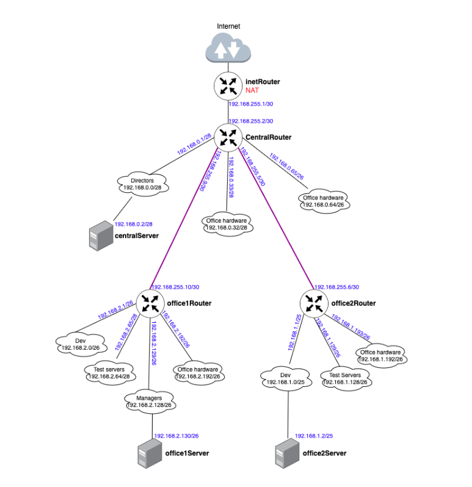

# Lesson №18 - Network

## Getting started

1. клонируйте репозиторий 
~~~
git clone git@github.com:leschfkg/otus.git
~~~
2. перейдите в директорию:
~~~
 cd otus/lesson_19_Network
~~~
3. измените конфигурцию под себя в файле Vagrantfile
4. добавьте публичную часть ключа в файл authorized_keys
5. запустите создание ВМ:

5.1 Linux bash
~~~
vagrant up && vagrant reload
~~~
5.2 Windows power shell
~~~
vagrant up; vagrant reload
~~~

Для быстрого запуска окружения и работы использован Vagrant-стенд из файла Vagrantfile с образом cdaf/UbuntuLVM.
Стенд протестирован на VirtualBox 7.0.14, Vagrant 2.4, хостовая система: Windows 11 Pro.

# Домашнее задание

### В теоретической части требуется: 

* Найти свободные подсети
* Посчитать сколько узлов в каждой подсети, включая свободные
* Указать broadcast адрес для каждой подсети
* проверить нет ли ошибок при разбиении

### В практической части требуется: 

* Соединить офисы в сеть согласно схеме и настроить роутинг
* Все сервера и роутеры должны ходить в инет черз inetRouter
* Все сервера должны видеть друг друга
* у всех новых серверов отключить дефолт на нат (eth0), который вагрант поднимает для связи
* при нехватке сетевых интервейсов добавить по несколько адресов на интерфейс

## Теоретическая часть

Первым шагом мы рассмотрим все сети, указанные в задании. Посчитаем для них количество узлов, найдём Broadcast-адрес, проверим, нет ли ошибок при разбиении.

У нас есть сеть directors 192.168.0.0/28

192.168.0.0 — это сама сеть, 28 — это маска. Маска показывает нам, границы сети 192.168.0.0. Маска может быть записана в 2-х видах: 
1.  /28
2.  255.255.255.240

Пример перевода маски /28 в формат 255.255.255.240:

Маска Ipv4-адреса — это 4 октета, т.е. 4 блока по 8 цифр (1 или 0).

/28 — это 28 единиц с начала маски: 11111111.11111111.11111111.11110000  
Всегда при разбиении сетей, после знака / указывается количество единиц с начала маски.

11111111.11111111.11111111.11110000 — это двоичный код маски, если мы переведем данное значение в десятичную систему счисления, то получим 255.255.255.240

Далее посчитаем количество устройств в сети: 
Количество устройств в сети рассчитывается по формуле = 232−маска−2
Таким образом, количество устройств для подсети /28 будет = 232−28−2=16−2=14

Цифра 2 вычитается, так как:
* Первый адрес (192.168.0.0) — это наименование подсети, его нельзя задать устройству
* Последний адрес (192.168.0.15) — это всегда broadcast-адрес. Broadcast-адрес нужен для рассылки всем устройствам сети. 
Таким образом мы можем сформировать таблицу топологии нашей сети

| Сеть         | Маска         | Кол-во адресов | Первый адрес всети | Последний адрес в сети |Broadcast — адрес|
|------------- | ------------- | -------------  | -------------------| ---------------------- |-----------------|
|192.168.0.0/28|255.255.255.240|        14      | 192.168.0.1        |     192.168.0.14       |192.168.0.15     |

После расчета всех сетей, получили следующую таблицу топологии

* Central Network

Name| Network      | Netmask       | N    | Hostmin            | Hostmax                |Broadcast        |
|----|------------- | ------------- | ---  | -------------------| ---------------------- |-----------------|
|Directors|192.168.0.0/28|255.255.255.240|        14      | 192.168.0.1        |     192.168.0.14       |192.168.0.15     |
|Office hardware|192.168.0.32/28|255.255.255.240|        14      | 192.168.0.33        |     192.168.0.46       |192.168.0.47     |
|Wifi(mgt network)|192.168.0.64/26|255.255.255.192|        62      | 192.168.0.65        |     192.168.0.126       |192.168.0.127     |

* Office 1 network

|Name| Network      | Netmask       | N    | Hostmin            | Hostmax                |Broadcast        |
|----|------------- | ------------- | ---  | -------------------| ---------------------- |-----------------|
|Dev|192.168.2.0/26|255.255.255.192|62|192.168.2.1|     192.168.2.62       |192.168.2.63     |
|Test|192.168.2.64/26|255.255.255.192|62| 192.168.2.65|     192.168.2.126       |192.168.2.127     |
|Managers|192.168.2.128/26|255.255.255.192|62| 192.168.2.129|     192.168.2.190       |192.168.2.191     |
|Office hardware|192.168.2.192/26|255.255.255.192|62| 192.168.2.193        |     192.168.2.254       |192.168.2.255     |

* Office 2 network

Name| Network      | Netmask       | N    | Hostmin            | Hostmax                |Broadcast        |
|----|------------- | ------------- | ---  | -------------------| ---------------------- |-----------------|
|Dev|192.168.1.0/25|255.255.255.128|        126      | 192.168.1.1        |     192.168.1.126       |192.168.1.127     |
|Test|192.168.1.128/26|255.255.255.192|        62      | 192.168.1.129        |     192.168.1.190       |192.168.1.191     |
|Office|192.168.1.192/26|255.255.255.192|        62      | 192.168.1.193        |     192.168.1.254       |192.168.1.255     |

* InetRouter — CentralRouter network

Name| Network      | Netmask       | N    | Hostmin            | Hostmax                |Broadcast        |
|----|------------- | ------------- | ---  | -------------------| ---------------------- |-----------------|
|Inet — central|192.168.255.0/30|255.255.255.252|        2      | 192.168.255.1        |     192.168.255.2       |192.168.255.3     |

После создания таблицы топологии, мы видим, что ошибок в задании нет, также мы сразу видим следующие свободные сети: 

* 192.168.0.16/28
* 192.168.0.48/28
* 192.168.0.128/25
* 192.168.255.64/26
* 192.168.255.32/27
* 192.168.255.16/28
* 192.168.255.8/29  
* 192.168.255.4/30 

На этом теоретическая часть заканчивается. Можем приступать к выполнению практической части.

## Практическая часть
Изучив таблицу топологии сети и Vagrant-стенд из задания, мы можем построить полную схему сети:

Давайте рассмотрим схему: 
Знак облака означает сеть, которую необходимо будет настроить на сервере
Значки роутеров и серверов означают хосты, которые нам нужно будет создать. 

На схеме, мы сразу можем увидеть, что нам потребуется создать дополнительно 2 сети (на схеме обозначены полужирными фиолетовыми линиями):
* Для соединения office1Router c centralRouter 
* Для соединения office2Router c centralRouter 

На основании этой схемы мы получаем готовый список серверов.
|Server|IP and Bitmask|
|-----|-----|
|inetRouter|Default-NAT address VirtualBox|
||192.168.255.1/30|
|centralRouter|
||192.168.255.2/30|
||192.168.0.1/28|
||192.168.0.33/28|
||192.168.0.65/26|
||192.168.255.9/30|
||192.168.255.5/30|
|centralServer|
||192.168.0.2/28|
office1Router
||192.168.255.10/30
||192.168.2.1/26
||192.168.2.65/26
||192.168.2.129/26
||192.168.2.193/26
|office1Server|
||192.168.2.130/26
|office2Router|
||192.168.255.6/30
||192.168.1.1/26
||192.168.1.129/26
||192.168.1.193/26
|office2Server
||192.168.1.2/26

### Настройка NAT

1. Подключиться по SSH к хосту inetRouter:
~~~
PS C:\Users\levitskyav\Documents\MobaXterm\home\otus\otus\lesson_19_Network> vagrant ssh inetRouter
Welcome to Ubuntu 22.04.1 LTS (GNU/Linux 5.15.0-48-generic x86_64)

 * Documentation:  https://help.ubuntu.com
 * Management:     https://landscape.canonical.com
 * Support:        https://ubuntu.com/advantage

  System information as of Mon Aug 19 01:30:48 PM UTC 2024

  System load:  0.0859375          Users logged in:          0
  Usage of /:   5.4% of 122.48GB   IPv4 address for enp0s19: 192.168.50.10
  Memory usage: 29%                IPv4 address for enp0s3:  10.0.2.15
  Swap usage:   0%                 IPv4 address for enp0s8:  192.168.255.1
  Processes:    108

3 updates can be applied immediately.
To see these additional updates run: apt list --upgradable

The list of available updates is more than a week old.
To check for new updates run: sudo apt update

vagrant@inetRouter:~$
~~~
2. Проверить, что отключен другой файервол:
~~~
vagrant@inetRouter:~$ systemctl status ufw
● ufw.service - Uncomplicated firewall
     Loaded: loaded (/lib/systemd/system/ufw.service; enabled; vendor preset: enabled)
     Active: active (exited) since Mon 2024-08-19 13:26:02 UTC; 6min ago
       Docs: man:ufw(8)
   Main PID: 560 (code=exited, status=0/SUCCESS)
        CPU: 2ms

Aug 19 13:26:02 ubuntu22 systemd[1]: Starting Uncomplicated firewall...
Aug 19 13:26:02 ubuntu22 systemd[1]: Finished Uncomplicated firewall.
vagrant@inetRouter:~$
~~~
Так как служба запущена, то нужно её отключить и удалить из автозагрузки:
~~~
vagrant@inetRouter:~$ sudo -i
root@inetRouter:~# systemctl stop ufw.service
root@inetRouter:~# systemctl disable ufw.service
Synchronizing state of ufw.service with SysV service script with /lib/systemd/systemd-sysv-install.
Executing: /lib/systemd/systemd-sysv-install disable ufw
Removed /etc/systemd/system/multi-user.target.wants/ufw.service.
root@inetRouter:~#
~~~
3. Создаём файл /etc/iptables_rules.ipv4:
~~~
# Generated by iptables-save v1.8.7 on Sat Oct 14 16:14:36 2023
*filter
:INPUT ACCEPT [90:8713]
:FORWARD ACCEPT [0:0]
:OUTPUT ACCEPT [54:7429]
-A INPUT -p icmp -j ACCEPT
-A INPUT -i lo -j ACCEPT
-A INPUT -p tcp -m state --state NEW -m tcp --dport 22 -j ACCEPT
COMMIT
# Completed on Sat Oct 14 16:14:36 2023
# Generated by iptables-save v1.8.7 on Sat Oct 14 16:14:36 2023
*nat
:PREROUTING ACCEPT [1:44]
:INPUT ACCEPT [1:44]
:OUTPUT ACCEPT [0:0]
:POSTROUTING ACCEPT [0:0]
-A POSTROUTING ! -d 192.168.0.0/16 -o eth0 -j MASQUERADE
COMMIT
# Completed on Sat Oct 14 16:14:36 2023
~~~
4. Создаём файл, в который добавим скрипт автоматического восстановления правил при перезапуске системы /etc/network/if-pre-up.d/iptables:
~~~
#!/bin/sh
/sbin/iptables-restore < /etc/iptables_rules.ipv4
~~~
5. Добавляем права на выполнение файла /etc/network/if-pre-up.d/iptables
~~~
root@inetRouter:~# chmod +x /etc/network/if-pre-up.d/iptables
root@inetRouter:~#
~~~
6. Перезагружаем сервер:
~~~
root@inetRouter:~# reboot
root@inetRouter:~# Connection to 127.0.0.1 closed by remote host.
Connection to 127.0.0.1 closed.
PS C:\Users\levitskyav\Documents\MobaXterm\home\otus\otus\lesson_19_Network>
~~~
7. После перезагрузки сервера проверяем правила iptables:
~~~
vagrant@inetRouter:~$ sudo -i
root@inetRouter:~# iptables-save
# Generated by iptables-save v1.8.7 on Tue Aug 20 08:55:45 2024
*filter
:INPUT ACCEPT [623:40249]
:FORWARD ACCEPT [971:124441]
:OUTPUT ACCEPT [610:48015]
-A INPUT -p icmp -j ACCEPT
-A INPUT -i lo -j ACCEPT
-A INPUT -p tcp -m state --state NEW -m tcp --dport 22 -j ACCEPT
COMMIT
# Completed on Tue Aug 20 08:55:45 2024
# Generated by iptables-save v1.8.7 on Tue Aug 20 08:55:45 2024
*nat
:PREROUTING ACCEPT [461:30036]
:INPUT ACCEPT [3:252]
:OUTPUT ACCEPT [5:569]
:POSTROUTING ACCEPT [1:72]
-A POSTROUTING ! -d 192.168.0.0/16 -o enp0s3 -j MASQUERADE
COMMIT
# Completed on Tue Aug 20 08:55:45 2024
root@inetRouter:~#
~~~
### Маршрутизация транзитных пакетов (IP forward)
Важным этапом настройки сетевой лаборатории, является маршрутизация транзитных пакетов. Если объяснить простыми словами — это возможность сервера Linux пропускать трафик через себя к другому серверу. По умолчанию эта функция отключена в Linux. Включить её можно командой: 
echo "net.ipv4.conf.all.forwarding = 1" >> /etc/sysctl.conf

sysctl -p

Посмотреть статус форвардинга можно командой: sysctl net.ipv4.ip_forward
Если параметр равен 1, то маршрутизация транзитных пакетов включена, если 0 — отключена. 

В нашей схеме необходимо включить данную маршрутизацию на всех роутерах.
1. inetRouter
~~~
vagrant@inetRouter:~$ sudo -i
root@inetRouter:~# sysctl net.ipv4.ip_forward
net.ipv4.ip_forward = 0
root@inetRouter:~# echo "net.ipv4.conf.all.forwarding = 1" >> /etc/sysctl.conf
root@inetRouter:~# sysctl -p
net.ipv4.conf.all.forwarding = 1
root@inetRouter:~#
~~~
2. centralRouter
~~~
vagrant@centralRouter:~$ sudo -i
root@centralRouter:~# sysctl net.ipv4.ip_forward
net.ipv4.ip_forward = 0
root@centralRouter:~# echo "net.ipv4.conf.all.forwarding = 1" >> /etc/sysctl.conf
root@centralRouter:~# sysctl -p
net.ipv4.conf.all.forwarding = 1
root@centralRouter:~#
~~~
3. office1Router
~~~
vagrant@office1Router:~$ sudo -i
root@office1Router:~# sysctl net.ipv4.ip_forward
net.ipv4.ip_forward = 0
root@office1Router:~# echo "net.ipv4.conf.all.forwarding = 1" >> /etc/sysctl.conf
root@office1Router:~# sysctl -p
net.ipv4.conf.all.forwarding = 1
root@office1Router:~#
~~~
4. office2Router
~~~
vagrant@office2Router:~$ sudo -i
root@office2Router:~# sysctl net.ipv4.ip_forward
net.ipv4.ip_forward = 0
root@office2Router:~# echo "net.ipv4.conf.all.forwarding = 1" >> /etc/sysctl.conf
root@office2Router:~# sysctl -p
net.ipv4.conf.all.forwarding = 1
root@office2Router:~#
~~~
### Отключение маршрута по умолчанию на интерфейсе eth0

При разворачивании нашего стенда Vagrant создает в каждом сервере свой интерфейс, через который у сервера появляется доступ в интернет. Отключить данный порт нельзя, так как через него Vagrant подключается к серверам. Обычно маршрут по умолчанию прописан как раз на этот интерфейс, данный маршрут нужно отключить:

Для отключения маршрута по умолчанию в файле /etc/netplan/00-installer-config.yaml добавляем отключение маршрутов, полученных через DHCP:
~~~
# This is the network config written by 'subiquity'
network:
  ethernets:
    eth0:
      dhcp4: true
      dhcp4-overrides:
          use-routes: false
      dhcp6: false
  version: 2
~~~
После внесения данных изменений перезапускаем сетевую службу: 
~~~
root@office2Router:~# vim /etc/netplan/00-installer-config.yaml
root@office2Router:~# netplan try
Do you want to keep these settings?

Press ENTER before the timeout to accept the new configuration

Changes will revert in 116 seconds
Configuration accepted.
root@office2Router:~# ping 8.8.8.8
ping: connect: Network is unreachable
root@office2Router:~#
~~~
Повторяем на всех хостах кроме inetRouter

### Настройка статических маршрутов

Для настройки статических маршрутов используется команда ip route. 

Давайте рассмотрим пример настройки статического маршрута на сервере office1Server. Исходя из схемы мы видим, что трафик с данного сервера будет идти через office1Router. Office1Server и office1Router у нас соединены через сеть managers (192.168.2.128/26). В статическом маршруте нужно указывать адрес следующего хоста. Таким образом мы должны указать на сервере office1Server маршрут, в котором доступ к любым IP-адресам у нас будет происходить через адрес 192.168.2.129, который расположен на сетевом интерфейсе office1Router. Команда будет выглядеть так: ip route add 0.0.0.0/0 via 192.168.2.129 

~~~
vagrant@office1Server:~$ sudo -i
root@office1Server:~# ip route add 0.0.0.0/0 via 192.168.2.129
root@office1Server:~# ping 8.8.8.8
PING 8.8.8.8 (8.8.8.8) 56(84) bytes of data.
From 192.168.2.129 icmp_seq=1 Destination Net Unreachable
From 192.168.2.129 icmp_seq=2 Destination Net Unreachable
From 192.168.2.129 icmp_seq=3 Destination Net Unreachable
From 192.168.2.129 icmp_seq=4 Destination Net Unreachable
^C
--- 8.8.8.8 ping statistics ---
5 packets transmitted, 0 received, +4 errors, 100% packet loss, time 4012ms

root@office1Server:~#
~~~
Важно помнить, что маршруты, настроенные через команду ip route удаляются после перезагрузки или перезапуске сетевой службы.

ля того, чтобы маршруты сохранялись после перезагрузки нужно их указывать непосредственно в файле конфигурации сетевых интерфейсов:

В современных версиях Ubuntu, для указания маршрута нужно поправить netplan-конфиг. Конфиги netplan хранятся в виде YAML-файлов и обычно лежат в каталоге /etc/netplan
В нашем стенде такой файл - /etc/netplan/50-vagrant.yaml 

Для добавления маршрута, после раздела addresses нужно добавить блок:
~~~
routes:
      - to: <сеть назначения>/<маска>
   via: <Next hop address>
~~~
Пример файла /etc/netplan/50-vagrant.yaml
~~~
     ---
network:
  version: 2
  renderer: networkd
  ethernets:
    enp0s8:
      addresses:
      - 192.168.2.130/26
      routes:
      - to: 0.0.0.0/0
        via: 192.168.2.129
    enp0s19:
      addresses:
      - 192.168.50.21/24
~~~
~~~
root@office1Server:~# vim /etc/netplan/50-vagrant.yaml
root@office1Server:~# netplan apply
root@office1Server:~#
~~~
Настройте самостоятельно все маршруты на серверах. Важно помнить, что помимо маршрутов по умолчанию, вам нужно будет использовать обратные маршруты. 

Давайте разберем пример такого маршрута: допустим мы хотим отправить команду ping с сервера office1Server (192.168.2.130) до сервера centralRouter (192.168.0.1) 
Наш трафик пойдёт следующим образом: office1Server — office1Router — centralRouter — office1Router — office1Server

Office1Router знает сеть (192.168.2.128/26), в которой располагается сервер office1Server, а сервер centralRouter, когда получит запрос от адреса 192.168.2.130 не будет понимать, куда отправить ответ. Решением этой проблемы будет добавление обратного маршрута. 

Обратный маршрут указывается также как остальные маршруты. Изучив схему мы видим, что связь между сетями 192.168.2.0/24 и 192.168.0.0/24 осуществляется через сеть 192.168.255.10/30. Также мы видим что сети office1 подключены к centralRouter через порт enp0s17. На основании этих данных мы можем добавить маршруты в файл /etc/netplan/50-vagrant.yaml

~~~
root@office1Server:~# ping 192.168.0.1
PING 192.168.0.1 (192.168.0.1) 56(84) bytes of data.
From 192.168.2.129 icmp_seq=1 Destination Net Unreachable
From 192.168.2.129 icmp_seq=2 Destination Net Unreachable
From 192.168.2.129 icmp_seq=3 Destination Net Unreachable
From 192.168.2.129 icmp_seq=4 Destination Net Unreachable
^C
--- 192.168.0.1 ping statistics ---
4 packets transmitted, 0 received, +4 errors, 100% packet loss, time 3007ms

root@office1Server:~#
~~~
Сервер office1Server не может связаться с centralRouter, добавляем маршрут на centralRouter
~~~
root@centralRouter:~# netplan apply
root@centralRouter:~# vim /etc/netplan/50-vagrant.yaml
~~~
~~~
    enp0s17:
      addresses:
      - 192.168.255.9/30
      routes:
      - to: 192.168.2.0/24
        via: 192.168.255.10
~~~
Сервер office1Server не может связаться с centralRouter, нужно также добавить маршрут на office1Router
~~~
    enp0s8:
      addresses:
      - 192.168.255.10/30
      routes:
      - to: 0.0.0.0/0
        via: 192.168.255.9
~~~
Теперь сервер office1Server видит centralRouter
~~~
root@office1Server:~# ping 192.168.0.1
PING 192.168.0.1 (192.168.0.1) 56(84) bytes of data.
64 bytes from 192.168.0.1: icmp_seq=1 ttl=63 time=1.41 ms
64 bytes from 192.168.0.1: icmp_seq=2 ttl=63 time=1.31 ms
64 bytes from 192.168.0.1: icmp_seq=3 ttl=63 time=1.35 ms
64 bytes from 192.168.0.1: icmp_seq=4 ttl=63 time=1.30 ms
64 bytes from 192.168.0.1: icmp_seq=5 ttl=63 time=1.28 ms
64 bytes from 192.168.0.1: icmp_seq=6 ttl=63 time=1.27 ms
^C
--- 192.168.0.1 ping statistics ---
6 packets transmitted, 6 received, 0% packet loss, time 5009ms
rtt min/avg/max/mdev = 1.267/1.319/1.412/0.048 ms
root@office1Server:~#
~~~
Так же для выхода в сеть интернет через роутер inetRoter, требуется добавить на нем обратный маршрут для всех внутренних сетей
~~~
network:
  version: 2
  renderer: networkd
  ethernets:
    enp0s8:
      addresses:
      - 192.168.255.1/30
      routes:
      - to: 192.168.0.0/16
        via: 192.168.255.2
    enp0s19:
      addresses:
      - 192.168.50.10/24
~~~
после добавления маршрута на внутренних хостах сети появится интернет!
~~~
root@office1Server:~# ping 8.8.8.8
PING 8.8.8.8 (8.8.8.8) 56(84) bytes of data.
64 bytes from 8.8.8.8: icmp_seq=1 ttl=53 time=45.5 ms
64 bytes from 8.8.8.8: icmp_seq=2 ttl=53 time=44.6 ms
64 bytes from 8.8.8.8: icmp_seq=3 ttl=53 time=44.4 ms
64 bytes from 8.8.8.8: icmp_seq=4 ttl=53 time=44.7 ms
^C
--- 8.8.8.8 ping statistics ---
4 packets transmitted, 4 received, 0% packet loss, time 3005ms
rtt min/avg/max/mdev = 44.350/44.796/45.521/0.439 ms
root@office1Server:~#
~~~

На данном этапе настройка серверов закончена. После настройки серверов рекомендуется перезагрузить все хосты, чтобы проверить, что правила не удаляются после перезагрузки. 

Помимо этого, рекомендуется на все хосты установить утилиту traceroute, для проверки нашего стенда.

Установка traceroute: apt install -y traceroute
~~~
root@office1Server:~# apt install traceroute
~~~
Пример проверки выхода в Интернет через сервер inetRouter c хоста office1Server:
~~~
root@office1Server:~# traceroute 8.8.8.8
traceroute to 8.8.8.8 (8.8.8.8), 30 hops max, 60 byte packets
 1  _gateway (192.168.2.129)  0.534 ms  0.302 ms  0.148 ms
 2  192.168.255.9 (192.168.255.9)  3.382 ms  6.185 ms  6.198 ms
 3  192.168.255.1 (192.168.255.1)  5.996 ms  6.168 ms  6.213 ms
 4  10.0.2.2 (10.0.2.2)  6.110 ms  6.125 ms  6.225 ms
 5  * * *
 6  * * *
 7  * * *
 8  * * *
 9  * * *
10  * * *
11  * * *
12  * * *
13  * * *
14  * * *
15  * * *
16  * * *
17  * * *
18  * * *
19  * * *
20  * * *
21  * * *
22  * * *
23  * * *
24  * * *
25  * * *
26  * * *
27  * * *
28  * * *
29  * * *
30  * * *
root@office1Server:~# 
~~~
В данном примере, в первых трёх переходах мы видим что запрос идет через сервера: office1Router — centralRouter — inetRouter

полные конфиги нескольких серверов серверов:

* office1Server:
~~~
 ---
network:
  version: 2
  renderer: networkd
  ethernets:
    enp0s8:
      addresses:
      - 192.168.2.130/26
      routes:
      - to: 0.0.0.0/0
        via: 192.168.2.129
    enp0s19:
      addresses:
      - 192.168.50.21/24
~~~
* office1Router
~~~
---
network:
  version: 2
  renderer: networkd
  ethernets:
    enp0s8:
      addresses:
      - 192.168.255.10/30
      routes:
      - to: 0.0.0.0/0
        via: 192.168.255.9
    enp0s9:
      addresses:
      - 192.168.2.1/26
    enp0s10:
      addresses:
      - 192.168.2.65/26
    enp0s16:
      addresses:
      - 192.168.2.129/26
    enp0s17:
      addresses:
      - 192.168.2.193/26
    enp0s19:
      addresses:
      - 192.168.50.20/24
~~~
* centralRouter
~~~
---
network:
  version: 2
  renderer: networkd
  ethernets:
    enp0s8:
      addresses:
      - 192.168.255.2/30
      routes:
      - to: 0.0.0.0/0
        via: 192.168.255.1
    enp0s9:
      addresses:
      - 192.168.0.1/28
    enp0s10:
      addresses:
      - 192.168.0.33/28
    enp0s16:
      addresses:
      - 192.168.0.65/26
    enp0s17:
      addresses:
      - 192.168.255.9/30
      routes:
      - to: 192.168.2.0/24
        via: 192.168.255.10
    enp0s18:
      addresses:
      - 192.168.255.5/30
    enp0s19:
      addresses:
      - 192.168.50.11/24
~~~
* inetRouter
~~~
---
network:
  version: 2
  renderer: networkd
  ethernets:
    enp0s8:
      addresses:
      - 192.168.255.1/30
      routes:
      - to: 192.168.0.0/16
        via: 192.168.255.2
    enp0s19:
      addresses:
      - 192.168.50.10/24
~~~
Для маршрутизации остальных сетей нужно так же добавить маршруты по примеру как сделано для сети Managers. Все тоже самое только адресация и интерыейсы для их сетей.
Задание выполнено, трафик маршрутизируется между сетями, так же есть доступ в интернет через роутер inetRouter

