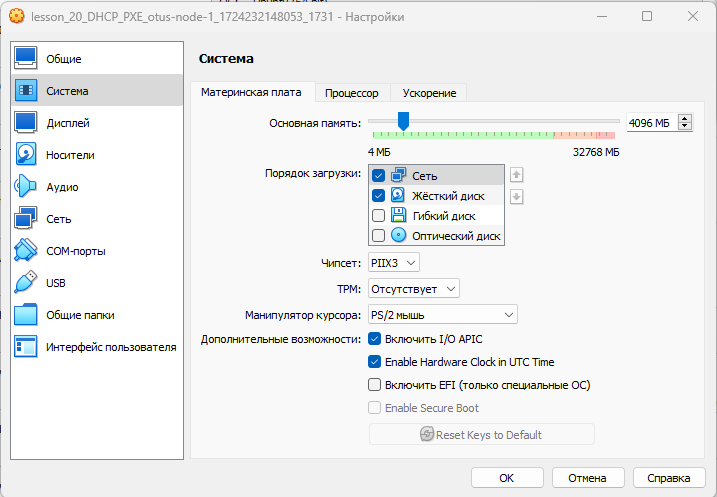
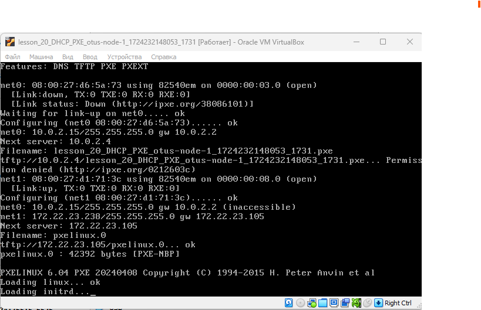
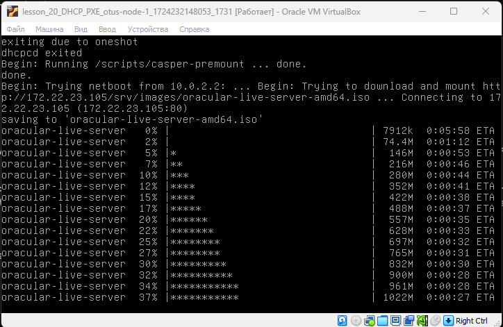
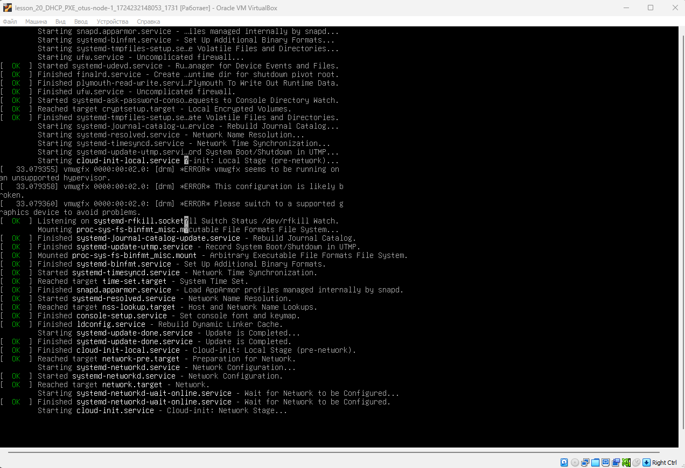
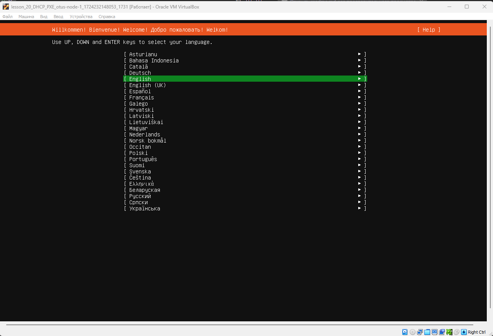
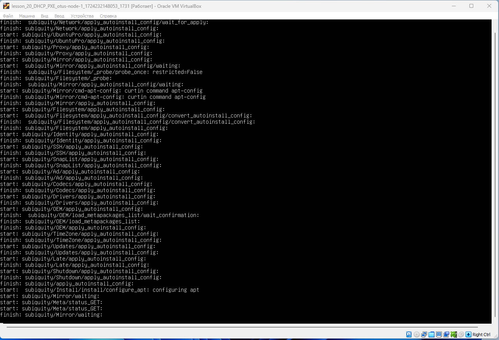

# Lesson №20 - DHCP, PXE

## Getting started

1. клонируйте репозиторий 
~~~
git clone git@github.com:leschfkg/otus.git
~~~
2. перейдите в директорию:
~~~
 cd otus/lesson_20_DHCP_PXE
~~~
3. измените конфигурцию под себя в файле Vagrantfile
4. добавьте публичную часть ключа в файл authorized_keys
5. запустите создание ВМ:

5.1 Linux bash
~~~
vagrant up && vagrant reload
~~~
5.2 Windows power shell
~~~
vagrant up; vagrant reload
~~~

Для быстрого запуска окружения и работы использован Vagrant-стенд из файла Vagrantfile с образом cdaf/UbuntuLVM.
Стенд протестирован на VirtualBox 7.0.14, Vagrant 2.4, хостовая система: Windows 11 Pro.

# Домашнее задание

1. Настроить загрузку по сети дистрибутива Ubuntu 24
2. Установка должна проходить из HTTP-репозитория.
3. Настроить автоматическую установку c помощью файла user-data
* Настроить автоматическую загрузку по сети дистрибутива Ubuntu 24 c использованием UEFI*

### Разворот хостов и настройка загрузки по сети

Подготовим Vagrantfile в котором будут описаны 2 виртуальные машины:
• otus-node-0 (хост к которому будут обращаться клиенты для установки ОС)
• otus-node-1 (хост, на котором будет проводиться установка)

запускаем наш стенд с помощью команды vagrant up
~~~
PS C:\Users\levitskyav\Documents\MobaXterm\home\otus\otus\lesson_20_DHCP_PXE> vagrant up
Bringing machine 'otus-node-0' up with 'virtualbox' provider...
Bringing machine 'otus-node-1' up with 'virtualbox' provider...
==> otus-node-0: Cloning VM...
==> otus-node-0: Matching MAC address for NAT networking...
==> otus-node-0: Setting the name of the VM: lesson_20_DHCP_PXE_otus-node-0_1724231544639_43078
==> otus-node-0: Fixed port collision for 22 => 2222. Now on port 2206.
...
~~~

### Настройка DHCP и TFTP-сервера
Для того, чтобы наш клиент мог получить ip-адрес нам требуется DHCP-сервер, чтобы можно было получить файл pxelinux.0 нам потребуется TFTP-сервер. Утилита dnsmasq совмещает в себе сразу и DHCP и TFTP-сервер.

1. отключаем firewall:
~~~
vagrant@otus-node-0 ~ $ sudo -i
root@otus-node-0 ~ # systemctl stop ufw
root@otus-node-0 ~ # systemctl disable ufw
Synchronizing state of ufw.service with SysV service script with /lib/systemd/systemd-sysv-install.
Executing: /lib/systemd/systemd-sysv-install disable ufw
Removed /etc/systemd/system/multi-user.target.wants/ufw.service.
root@otus-node-0 ~ #
~~~
2.  обновляем кэш и устанавливаем утилиту dnsmasq
~~~
root@otus-node-0 ~ # apt update && apt install dnsmasq
~~~
В процессе установки получил ошибку:
~~~
Created symlink /etc/systemd/system/multi-user.target.wants/dnsmasq.service → /lib/systemd/system/dnsmasq.service.
Job for dnsmasq.service failed because the control process exited with error code.
See "systemctl status dnsmasq.service" and "journalctl -xeu dnsmasq.service" for details.
invoke-rc.d: initscript dnsmasq, action "start" failed.
× dnsmasq.service - dnsmasq - A lightweight DHCP and caching DNS server
     Loaded: loaded (/lib/systemd/system/dnsmasq.service; enabled; vendor preset: enabled)
     Active: failed (Result: exit-code) since Wed 2024-08-21 12:25:00 MSK; 14ms ago
    Process: 64058 ExecStartPre=/etc/init.d/dnsmasq checkconfig (code=exited, status=0/SUCCESS)
    Process: 64066 ExecStart=/etc/init.d/dnsmasq systemd-exec (code=exited, status=2)
        CPU: 46ms

Aug 21 12:25:00 otus-node-0 systemd[1]: Starting dnsmasq - A lightweight DHCP and caching DNS server...
Aug 21 12:25:00 otus-node-0 dnsmasq[64066]: dnsmasq: failed to create listening socket for port 53: Address already in use
Aug 21 12:25:00 otus-node-0 dnsmasq[64066]: failed to create listening socket for port 53: Address already in use
Aug 21 12:25:00 otus-node-0 dnsmasq[64066]: FAILED to start up
Aug 21 12:25:00 otus-node-0 systemd[1]: dnsmasq.service: Control process exited, code=exited, status=2/INVALIDARGUMENT
Aug 21 12:25:00 otus-node-0 systemd[1]: dnsmasq.service: Failed with result 'exit-code'.
Aug 21 12:25:00 otus-node-0 systemd[1]: Failed to start dnsmasq - A lightweight DHCP and caching DNS server.
Processing triggers for man-db (2.10.2-1) ...
Processing triggers for dbus (1.12.20-2ubuntu4.1) ...
~~~
Для исправлния ошибки в конфиге /etc/dnsmasq.conf отключаем днс сервер путем указания порта = 0
~~~
# Listen on this specific port instead of the standard DNS port
# (53). Setting this to zero completely disables DNS function,
# leaving only DHCP and/or TFTP.
port=0
~~~
перезапускаем службу
~~~
root@otus-node-0 ~ # systemctl restart dnsmasq.service
root@otus-node-0 ~ # systemctl status dnsmasq.service
● dnsmasq.service - dnsmasq - A lightweight DHCP and caching DNS server
     Loaded: loaded (/lib/systemd/system/dnsmasq.service; enabled; vendor preset: enabled)
     Active: active (running) since Wed 2024-08-21 12:37:13 MSK; 6s ago
    Process: 64395 ExecStartPre=/etc/init.d/dnsmasq checkconfig (code=exited, status=0/SUCCESS)
    Process: 64403 ExecStart=/etc/init.d/dnsmasq systemd-exec (code=exited, status=0/SUCCESS)
    Process: 64413 ExecStartPost=/etc/init.d/dnsmasq systemd-start-resolvconf (code=exited, status=0/SUCCESS)
   Main PID: 64412 (dnsmasq)
      Tasks: 1 (limit: 4573)
     Memory: 584.0K
        CPU: 56ms
     CGroup: /system.slice/dnsmasq.service
             └─64412 /usr/sbin/dnsmasq -x /run/dnsmasq/dnsmasq.pid -u dnsmasq -I lo -7 /etc/dnsmasq.d,.dpkg-dist,.dpkg-old,.dpkg-new --local-service --trust-anchor=.,20326,8,2,e06d44b80b8f1d39a95c0b0d7c65d084>

Aug 21 12:37:13 otus-node-0 systemd[1]: Starting dnsmasq - A lightweight DHCP and caching DNS server...
Aug 21 12:37:13 otus-node-0 dnsmasq[64412]: started, version 2.90 DNS disabled
Aug 21 12:37:13 otus-node-0 dnsmasq[64412]: compile time options: IPv6 GNU-getopt DBus no-UBus i18n IDN2 DHCP DHCPv6 no-Lua TFTP conntrack ipset no-nftset auth cryptohash DNSSEC loop-detect inotify dumpfile
Aug 21 12:37:13 otus-node-0 systemd[1]: Started dnsmasq - A lightweight DHCP and caching DNS server.
lines 1-17/17 (END)
~~~
3. создаём файл /etc/dnsmasq.d/pxe.conf и добавляем в него следующее содержимое
~~~
#Указываем интерфейс в на котором будет работать DHCP/TFTP
interface=enp0s8
bind-interfaces
#Также указаваем интерфейс и range адресов которые будут выдаваться по DHCP
dhcp-range=enp0s8,172.22.23.200,172.22.23.254
#Имя файла, с которого надо начинать загрузку для Legacy boot (этот пример рассматривается в методичке)
dhcp-boot=pxelinux.0
#Имена файлов, для UEFI-загрузки (не обязательно добавлять)
dhcp-match=set:efi-x86_64,option:client-arch,7
dhcp-boot=tag:efi-x86_64,bootx64.efi
#Включаем TFTP-сервер
enable-tftp
#Указываем каталог для TFTP-сервера
tftp-root=/srv/tftp/amd64
~~~
4. создаём каталоги для файлов TFTP-сервера
~~~
root@otus-node-0 ~ # mkdir -p /srv/tftp
root@otus-node-0 ~ #
~~~
5. качиваем файлы для сетевой установки Ubuntu 24.04 и распаковываем их в каталог /srv/tftp
~~~
root@otus-node-0 ~ # cd /srv/tftp/
root@otus-node-0 /srv/tftp #
root@otus-node-0 /srv/tftp # wget http://cdimage.ubuntu.com/ubuntu-server/daily-live/current/oracular-netboot-amd64.tar.gz
--2024-08-21 12:43:56--  http://cdimage.ubuntu.com/ubuntu-server/daily-live/current/oracular-netboot-amd64.tar.gz
Resolving cdimage.ubuntu.com (cdimage.ubuntu.com)... 91.189.91.124, 185.125.190.40, 185.125.190.37, ...
Connecting to cdimage.ubuntu.com (cdimage.ubuntu.com)|91.189.91.124|:80... connected.
HTTP request sent, awaiting response... 200 OK
Length: 84655919 (81M) [application/x-gzip]
Saving to: ‘oracular-netboot-amd64.tar.gz’

oracular-netboot-amd64.tar.gz                        100%[===================================================================================================================>]  80.73M  2.74MB/s    in 29s

2024-08-21 12:44:25 (2.82 MB/s) - ‘oracular-netboot-amd64.tar.gz’ saved [84655919/84655919]

root@otus-node-0 /srv/tftp #
root@otus-node-0 /srv/tftp # tar -xzvf oracular-netboot-amd64.tar.gz .
./
./amd64/
./amd64/ldlinux.c32
./amd64/grubx64.efi
./amd64/initrd
./amd64/pxelinux.0
./amd64/pxelinux.cfg/
./amd64/pxelinux.cfg/default
./amd64/linux
./amd64/bootx64.efi
./amd64/grub/
./amd64/grub/grub.cfg
root@otus-node-0 /srv/tftp # 
~~~
по итогу, в каталоге /srv/tftp/amd64 мы увидем вот такие файлы:
~~~
root@otus-node-0 /srv/tftp # cd amd64/
root@otus-node-0 /srv/tftp/amd64 # ll
total 85072
drwxr-xr-x 4 root root     4096 Aug 21 08:50 .
drwxr-xr-x 3 root root     4096 Aug 21 08:50 ..
-rw-r--r-- 1 root root   966664 Apr  4 15:39 bootx64.efi
drwxr-xr-x 2 root root     4096 Aug 21 08:50 grub
-rw-r--r-- 1 root root  2332552 Jul 23 11:16 grubx64.efi
-rw-r--r-- 1 root root 68696229 Aug 21 08:50 initrd
-rw-r--r-- 1 root root   118676 Apr  8 19:20 ldlinux.c32
-rw-r--r-- 1 root root 14928264 Aug 21 08:50 linux
-rw-r--r-- 1 root root    42392 Apr  8 19:20 pxelinux.0
drwxr-xr-x 2 root root     4096 Aug 21 08:50 pxelinux.cfg
root@otus-node-0 /srv/tftp/amd64 #
~~~
6. перезапускаем службу dnsmasq
~~~
root@otus-node-0 /srv/tftp/amd64 # systemctl restart dnsmasq
root@otus-node-0 /srv/tftp/amd64 # systemctl status dnsmasq
● dnsmasq.service - dnsmasq - A lightweight DHCP and caching DNS server
     Loaded: loaded (/lib/systemd/system/dnsmasq.service; enabled; vendor preset: enabled)
     Active: active (running) since Wed 2024-08-21 12:46:32 MSK; 10s ago
    Process: 64457 ExecStartPre=/etc/init.d/dnsmasq checkconfig (code=exited, status=0/SUCCESS)
    Process: 64465 ExecStart=/etc/init.d/dnsmasq systemd-exec (code=exited, status=0/SUCCESS)
    Process: 64475 ExecStartPost=/etc/init.d/dnsmasq systemd-start-resolvconf (code=exited, status=0/SUCCESS)
   Main PID: 64474 (dnsmasq)
      Tasks: 1 (limit: 4573)
     Memory: 680.0K
        CPU: 58ms
     CGroup: /system.slice/dnsmasq.service
             └─64474 /usr/sbin/dnsmasq -x /run/dnsmasq/dnsmasq.pid -u dnsmasq -I lo -7 /etc/dnsmasq.d,.dpkg-dist,.dpkg-old,.dpkg-new --local-service --trust-anchor=.,20326,8,2,e06d44b80b8f1d39a95c0b0d7c65d084>

Aug 21 12:46:32 otus-node-0 systemd[1]: Starting dnsmasq - A lightweight DHCP and caching DNS server...
Aug 21 12:46:32 otus-node-0 dnsmasq[64474]: started, version 2.90 DNS disabled
Aug 21 12:46:32 otus-node-0 dnsmasq[64474]: compile time options: IPv6 GNU-getopt DBus no-UBus i18n IDN2 DHCP DHCPv6 no-Lua TFTP conntrack ipset no-nftset auth cryptohash DNSSEC loop-detect inotify dumpfile
Aug 21 12:46:32 otus-node-0 dnsmasq-dhcp[64474]: DHCP, IP range 172.22.23.200 -- 172.22.23.254, lease time 1h
Aug 21 12:46:32 otus-node-0 dnsmasq-dhcp[64474]: DHCP, sockets bound exclusively to interface enp0s8
Aug 21 12:46:32 otus-node-0 dnsmasq-tftp[64474]: TFTP root is /srv/tftp/amd64
Aug 21 12:46:32 otus-node-0 systemd[1]: Started dnsmasq - A lightweight DHCP and caching DNS server.
lines 1-20/20 (END)
~~~

### Настройка Web-сервера

Для того, чтобы отдавать файлы по HTTP нам потребуется настроенный веб-сервер.

1. устанавливаем Web-сервер apache2
~~~
root@otus-node-0 /srv/tftp/amd64 # apt install apache2
~~~
2. создаём каталог /srv/images в котором будут храниться iso-образы для установки по сети
~~~
root@otus-node-0 /srv/tftp/amd64 # mkdir /srv/images
root@otus-node-0 /srv/tftp/amd64 #
~~~
3. переходим в каталог /srv/images и скачиваем iso-образ ubuntu 24.04
~~~
root@otus-node-0 ~ # cd /srv/images
root@otus-node-0 /srv/images # wget http://cdimage.ubuntu.com/ubuntu-server/daily-live/current/oracular-live-server-amd64.iso
--2024-08-21 12:50:20--  http://cdimage.ubuntu.com/ubuntu-server/daily-live/current/oracular-live-server-amd64.iso
Resolving cdimage.ubuntu.com (cdimage.ubuntu.com)... 185.125.190.37, 91.189.91.124, 185.125.190.40, ...
Connecting to cdimage.ubuntu.com (cdimage.ubuntu.com)|185.125.190.37|:80... connected.
HTTP request sent, awaiting response... 200 OK
Length: 2895831040 (2.7G) [application/x-iso9660-image]
Saving to: ‘oracular-live-server-amd64.iso’

oracular-live-server-amd64.iso                         6%[======>                                                                                                             ] 171.74M  1.72MB/s    eta 33m 33s
~~~
4. создаём файл /etc/apache2/sites-available/ks-server.conf и добавлем в него следующее содержимое
~~~
<VirtualHost 172.22.23.105:80>
    DocumentRoot /
    <Directory /srv/images>
        Options Indexes MultiViews
        AllowOverride All
        Require all granted
    </Directory>
</VirtualHost> 
~~~
5. активируем конфигурацию ks-server в apache
~~~
root@otus-node-0 ~ # a2ensite ks-server.conf
Site ks-server already enabled
root@otus-node-0 ~ # systemctl reload apache2
root@otus-node-0 ~ #
~~~
6. вносим изменения в файл /srv/tftp/amd64/pxelinux.cfg/default
~~~
DEFAULT install
LABEL install
  KERNEL linux
  INITRD initrd
  APPEND root=/dev/ram0 ramdisk_size=3000000 ip=dhcp iso-url=http://172.22.23.205/srv/image/oracular-live-server-amd64.iso autoinstall
~~~
В данном файле мы указываем что файлы linux и initrd будут забираться по tftp, а сам iso-образ ubuntu 24.04 будет скачиваться из нашего веб-сервера 
http://172.22.23.205/srv/image/oracular-live-server-amd64.iso

Из-за того, что образ достаточно большой (2.6G) и он сначала загружается в ОЗУ, необходимо указать размер ОЗУ до 3 гигабайт (root=/dev/ram0 ramdisk_size=3000000)

7. перезагружаем web-сервер apache
~~~
root@otus-node-0 ~ # systemctl restart apache2emctl restart apache2
root@otus-node-0 ~ # systemctl status apache2
● apache2.service - The Apache HTTP Server
     Loaded: loaded (/lib/systemd/system/apache2.service; enabled; vendor preset: enabled)
     Active: active (running) since Wed 2024-08-21 13:29:52 MSK; 9s ago
       Docs: https://httpd.apache.org/docs/2.4/
    Process: 65576 ExecStart=/usr/sbin/apachectl start (code=exited, status=0/SUCCESS)
   Main PID: 65580 (apache2)
      Tasks: 55 (limit: 4573)
     Memory: 5.0M
        CPU: 48ms
     CGroup: /system.slice/apache2.service
             ├─65580 /usr/sbin/apache2 -k start
             ├─65581 /usr/sbin/apache2 -k start
             └─65582 /usr/sbin/apache2 -k start

Aug 21 13:29:52 otus-node-0 systemd[1]: Starting The Apache HTTP Server...
Aug 21 13:29:52 otus-node-0 systemd[1]: Started The Apache HTTP Server.
root@otus-node-0 ~ #
~~~
На этом настройка Web-сервера завершена.

Выключаем машину otus-node-1
~~~
vagrant@otus-node-1 ~ $ sudo -i
root@otus-node-1 ~ # poweroff
Connection to 127.0.0.1 closed by remote host.
Connection to 127.0.0.1 closed.
PS C:\Users\levitskyav\Documents\MobaXterm\home\otus\otus\lesson_20_DHCP_PXE>
~~~
Меняем приоритет загрузки, первым выставляем сетевую карту и проверяем работу

### Настройка автоматической установки Ubuntu 24.04

Осталось автоматизировать установку ubuntu 24 (чтобы не пользоваться мастером установки вручную)

1. cоздаём каталог для файлов с автоматической установкой
~~~
root@otus-node-0 ~ # mkdir /srv/ks
root@otus-node-0 ~ #
~~~
2. создаём файл /srv/ks/user-data и добавляем в него следующее содержимое
~~~
#cloud-config
autoinstall:
  version: 1
  locale: en_US.UTF-8
  keyboard:
    layout: us
  timezone: Europe/Moscow
  network:
    version: 2
    ethernets:
      enp3s0:
        dhcp4: true
      enp8s0:
        dhcp4: true
  identity:
    username: otus
    hostname: otus-node-1
    password: "$6$FhcddHFVZ7ABA4Gi$9l4yURWASWe8xEa1jzI0bacVLvhe3Yn4/G3AnU11K3X0yu/mICVRxfo6tZTB2noKljlIRzjkVZPocdf63MtzC0"
  ssh:
    install-server: true
    allow-pw: true
    authorized-keys: []
  storage:
    layout:
      name: lvm
      policy: all
  shutdown: reboot
~~~
В данном файле указываются следующие настройки:
* устанавливается apt-репозиторий http://us.archive.ubuntu.com/ubuntu
* отключена автоматическая загрузка драйверов
* задаётся hostname linux
* создаётся пользователь otus c паролем 123 (пароль зашифрован в SHA512)
* использование английской раскладки
* добавлена настройка получения адресов по DHCP (для обоих портов)
* устанавливается openssh-сервер с доступом по логину и паролю и т д.

3. создаём файл с метаданными /srv/ks/meta-data
~~~
root@otus-node-0 ~ # touch /srv/ks/meta-data
root@otus-node-0 ~ #
~~~
Файл с метаданными хранит дополнительную информацию о хосте, в нашем домашнем задании мы не будем добавлять дополнительную информацю
4. в конфигурации веб-сервера добавим каталог /srv/ks идёнтично каталогу /srv/images
~~~
<VirtualHost 172.22.23.105:80>
    DocumentRoot /
    <Directory /srv/ks>
        Options Indexes MultiViews
        AllowOverride All
        Require all granted
    </Directory>
    <Directory /srv/images>
        Options Indexes MultiViews
        AllowOverride All
        Require all granted
    </Directory>
</VirtualHost>
~~~
5. В файле /srv/tftp/amd64/pxelinux.cfg/default добавляем параметры автоматической установки
~~~
DEFAULT install
LABEL install
  KERNEL linux
  INITRD initrd
  APPEND root=/dev/ram0 ramdisk_size=3000000 ip=dhcp iso-url=http://172.22.23.105/srv/image/oracular-live-server-amd64.iso autoinstall ds=nocloud-net;s=http://172.22.23.105/srv/ks/
~~~
6. перезапускаем службы dnsmasq и apache2
~~~
root@otus-node-0 ~ # systemctl restart dnsmasq
root@otus-node-0 ~ # systemctl restart apache2
root@otus-node-0 ~ #
~~~
На этом настройка автоматической установки завершена. Теперь можно перезапустить ВМ otus-node-0 и мы должны увидеть автоматическую установку.

Iso образ с Ubuntu 24.10 скачивается, но после этого падает в ошибку:
~~~
unable to find a live file system on the network
~~~
переделал на ubuntu 22.04, после этого все заработало, видимо в версии 24.10 баг и она еще сыровата

Изменил файл user-data, так как он должен быть в формате .yml, в методичке - сплошной текст!
после этого автоматическая установка заработала

