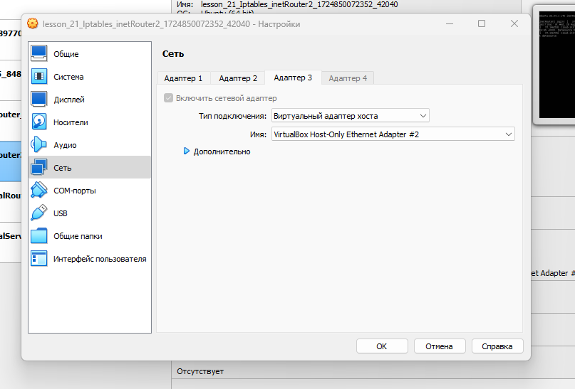
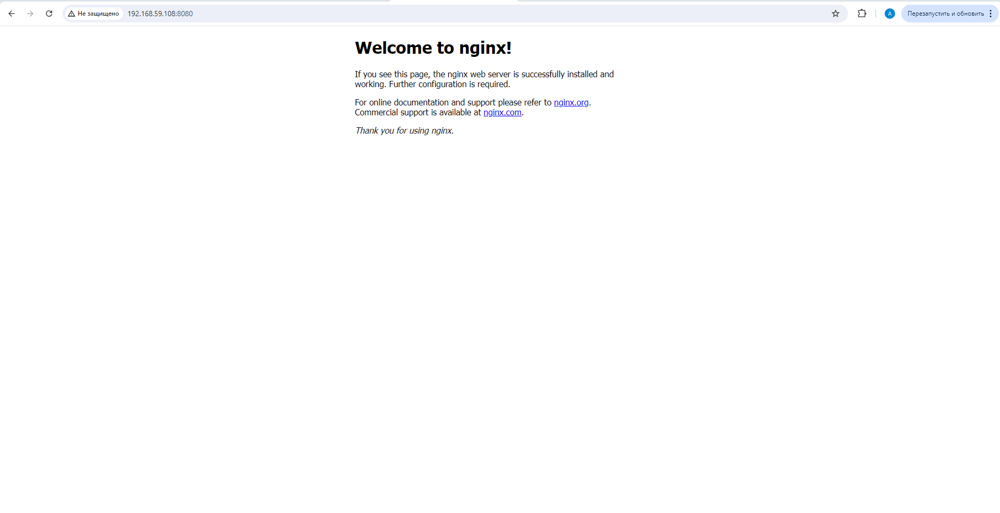
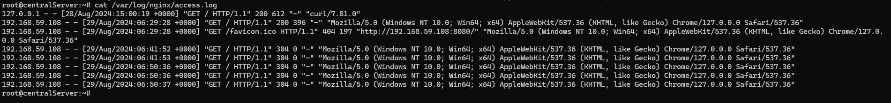

# Lesson №21 - Iptables

## Getting started

1. клонируйте репозиторий 
~~~
git clone git@github.com:leschfkg/otus.git
~~~
2. перейдите в директорию:
~~~
 cd otus/lesson_21_Iptables
~~~
3. измените конфигурцию под себя в файле Vagrantfile
4. добавьте публичную часть ключа в файл authorized_keys
5. запустите создание ВМ:

5.1 Linux bash
~~~
vagrant up && vagrant reload
~~~
5.2 Windows power shell
~~~
vagrant up; vagrant reload
~~~

Для быстрого запуска окружения и работы использован Vagrant-стенд из файла Vagrantfile с образом cdaf/UbuntuLVM.
Стенд протестирован на VirtualBox 7.0.14, Vagrant 2.4, хостовая система: Windows 11 Pro.

# Домашнее задание

Что нужно сделать?

* реализовать knocking port
* centralRouter может попасть на ssh inetrRouter через knock скрипт
пример в материалах.
* добавить inetRouter2, который виден(маршрутизируется (host-only тип сети для виртуалки)) с хоста или форвардится порт через локалхост.
* запустить nginx на centralServer.
* пробросить 80й порт на inetRouter2 8080.
* дефолт в инет оставить через inetRouter.

* Реализовать проход на 80й порт без маскарадинга*

### Реализовать knocking port

Заходим на inetRouter и переходим в roor:
~~~
PS C:\Users\levitskyav\Documents\MobaXterm\home\otus\otus\lesson_19_Network> vagrant ssh inetRouter
Welcome to Ubuntu 22.04.1 LTS (GNU/Linux 5.15.0-48-generic x86_64)

 * Documentation:  https://help.ubuntu.com
 * Management:     https://landscape.canonical.com
 * Support:        https://ubuntu.com/advantage

  System information as of Wed Aug 28 08:34:25 AM UTC 2024

  System load:  0.0                Users logged in:          0
  Usage of /:   5.7% of 122.48GB   IPv4 address for enp0s19: 192.168.50.10
  Memory usage: 29%                IPv4 address for enp0s3:  10.0.2.15
  Swap usage:   0%                 IPv4 address for enp0s8:  192.168.255.1
  Processes:    104

 * Strictly confined Kubernetes makes edge and IoT secure. Learn how MicroK8s
   just raised the bar for easy, resilient and secure K8s cluster deployment.

   https://ubuntu.com/engage/secure-kubernetes-at-the-edge

270 updates can be applied immediately.
196 of these updates are standard security updates.
To see these additional updates run: apt list --upgradable

The list of available updates is more than a week old.
To check for new updates run: sudo apt update

Last login: Tue Aug 20 06:46:42 2024 from 10.0.2.2
vagrant@inetRouter:~$ sudo -i
root@inetRouter:~#
~~~
редактируем файл конфигурации /etc/iptables_rules.ipv4
~~~
# Generated by iptables-save v1.8.7 on Sat Oct 14 16:14:36 2023
*filter
:INPUT DROP [0:0]
:FORWARD ACCEPT [0:0]
:OUTPUT ACCEPT [0:0]
:TRAFFIC - [0:0]
:SSH-INPUT - [0:0]
:SSH-INPUTTWO - [0:0]
# TRAFFIC chain for Port Knocking. The correct port sequence in this example is  8881 -> 7777 -> 9991; any other sequence will drop the traffic
-A INPUT -j TRAFFIC
-A TRAFFIC -p icmp --icmp-type any -j ACCEPT
-A TRAFFIC -m state --state ESTABLISHED,RELATED -j ACCEPT
-A TRAFFIC -m state --state NEW -m tcp -p tcp --dport 22 -m recent --rcheck --seconds 30 --name SSH2 -j ACCEPT
-A TRAFFIC -m state --state NEW -m tcp -p tcp -m recent --name SSH2 --remove -j DROP
-A TRAFFIC -m state --state NEW -m tcp -p tcp --dport 9991 -m recent --rcheck --name SSH1 -j SSH-INPUTTWO
-A TRAFFIC -m state --state NEW -m tcp -p tcp -m recent --name SSH1 --remove -j DROP
-A TRAFFIC -m state --state NEW -m tcp -p tcp --dport 7777 -m recent --rcheck --name SSH0 -j SSH-INPUT
-A TRAFFIC -m state --state NEW -m tcp -p tcp -m recent --name SSH0 --remove -j DROP
-A TRAFFIC -m state --state NEW -m tcp -p tcp --dport 8881 -m recent --name SSH0 --set -j DROP
-A SSH-INPUT -m recent --name SSH1 --set -j DROP
-A SSH-INPUTTWO -m recent --name SSH2 --set -j DROP
-A TRAFFIC -j DROP
COMMIT
# END or further rules
# # Completed on Sat Oct 14 16:14:36 2023
# Generated by iptables-save v1.8.7 on Sat Oct 14 16:14:36 2023
*nat
:PREROUTING ACCEPT [1:44]
:INPUT ACCEPT [1:44]
:OUTPUT ACCEPT [0:0]
:POSTROUTING ACCEPT [0:0]
-A POSTROUTING ! -d 192.168.0.0/16 -o enp0s3 -j MASQUERADE
COMMIT
# Completed on Sat Oct 14 16:14:36 2023
~~~
подгружаем правила и проверяем применились ли они
~~~
root@inetRouter:~# iptables-restore < /etc/iptables_rules.ipv4
root@inetRouter:~# iptables -nvL
Chain INPUT (policy DROP 0 packets, 0 bytes)
 pkts bytes target     prot opt in     out     source               destination
   25  1432 TRAFFIC    all  --  *      *       0.0.0.0/0            0.0.0.0/0

Chain FORWARD (policy DROP 0 packets, 0 bytes)
 pkts bytes target     prot opt in     out     source               destination

Chain OUTPUT (policy ACCEPT 13 packets, 988 bytes)
 pkts bytes target     prot opt in     out     source               destination

Chain SSH-INPUT (1 references)
 pkts bytes target     prot opt in     out     source               destination
    0     0 DROP       all  --  *      *       0.0.0.0/0            0.0.0.0/0            recent: SET name: SSH1 side: source mask: 255.255.255.255

Chain SSH-INPUTTWO (1 references)
 pkts bytes target     prot opt in     out     source               destination
    0     0 DROP       all  --  *      *       0.0.0.0/0            0.0.0.0/0            recent: SET name: SSH2 side: source mask: 255.255.255.255

Chain TRAFFIC (1 references)
 pkts bytes target     prot opt in     out     source               destination
    0     0 ACCEPT     icmp --  *      *       0.0.0.0/0            0.0.0.0/0            icmptype 255
   25  1432 ACCEPT     all  --  *      *       0.0.0.0/0            0.0.0.0/0            state RELATED,ESTABLISHED
    0     0 ACCEPT     tcp  --  *      *       0.0.0.0/0            0.0.0.0/0            state NEW tcp dpt:22 recent: CHECK seconds: 30 name: SSH2 side: source mask: 255.255.255.255
    0     0 DROP       tcp  --  *      *       0.0.0.0/0            0.0.0.0/0            state NEW tcp recent: REMOVE name: SSH2 side: source mask: 255.255.255.255
    0     0 SSH-INPUTTWO  tcp  --  *      *       0.0.0.0/0            0.0.0.0/0            state NEW tcp dpt:9991 recent: CHECK name: SSH1 side: source mask: 255.255.255.255
    0     0 DROP       tcp  --  *      *       0.0.0.0/0            0.0.0.0/0            state NEW tcp recent: REMOVE name: SSH1 side: source mask: 255.255.255.255
    0     0 SSH-INPUT  tcp  --  *      *       0.0.0.0/0            0.0.0.0/0            state NEW tcp dpt:7777 recent: CHECK name: SSH0 side: source mask: 255.255.255.255
    0     0 DROP       tcp  --  *      *       0.0.0.0/0            0.0.0.0/0            state NEW tcp recent: REMOVE name: SSH0 side: source mask: 255.255.255.255
    0     0 DROP       tcp  --  *      *       0.0.0.0/0            0.0.0.0/0            state NEW tcp dpt:8881 recent: SET name: SSH0 side: source mask: 255.255.255.255
    0     0 DROP       all  --  *      *       0.0.0.0/0            0.0.0.0/0
root@inetRouter:~# vim /etc/iptables_rules.ipv4
root@inetRouter:~#
~~~
настройка сервера завершена

### CentralRouter может попасть на ssh inetrRouter через knock скрипт

подключаемся по ssh к серверу centralRouter и проверяем работу
~~~
PS C:\Users\levitskyav\Documents\MobaXterm\home\otus\otus\lesson_19_Network> vagrant ssh centralRouter
Welcome to Ubuntu 22.04.1 LTS (GNU/Linux 5.15.0-48-generic x86_64)

 * Documentation:  https://help.ubuntu.com
 * Management:     https://landscape.canonical.com
 * Support:        https://ubuntu.com/advantage

  System information as of Wed Aug 28 09:52:54 AM UTC 2024

  System load:              0.0
  Usage of /:               5.7% of 122.48GB
  Memory usage:             29%
  Swap usage:               0%
  Processes:                103
  Users logged in:          0
  IPv4 address for enp0s10: 192.168.0.33
  IPv4 address for enp0s16: 192.168.0.65
  IPv4 address for enp0s17: 192.168.255.9
  IPv4 address for enp0s18: 192.168.255.5
  IPv4 address for enp0s19: 192.168.50.11
  IPv4 address for enp0s3:  10.0.2.15
  IPv4 address for enp0s8:  192.168.255.2
  IPv4 address for enp0s9:  192.168.0.1

 * Strictly confined Kubernetes makes edge and IoT secure. Learn how MicroK8s
   just raised the bar for easy, resilient and secure K8s cluster deployment.

   https://ubuntu.com/engage/secure-kubernetes-at-the-edge

274 updates can be applied immediately.
196 of these updates are standard security updates.
To see these additional updates run: apt list --upgradable

The list of available updates is more than a week old.
To check for new updates run: sudo apt update
Failed to connect to https://changelogs.ubuntu.com/meta-release-lts. Check your Internet connection or proxy settings

Last login: Mon Aug 19 14:20:08 2024 from 10.0.2.2
vagrant@centralRouter:~$ sudo -i
root@centralRouter:~# ssh vagrant@192.168.255.1
^C
root@centralRouter:~#
~~~
Подключиться не удается, пробуем через скрипт

Устанавливаем nmap на centralRouter
~~~
root@centralRouter:~# apt install nmap
~~~
Создаем скрипт
~~~
#!/bin/bash
HOST=$1
shift
for ARG in "$@"
do
        nmap -Pn --host-timeout 100 --max-retries 0 -p $ARG $HOST
done
~~~
~~~
root@centralRouter:~# vim knock.sh
root@centralRouter:~# chmod +x knock.sh
root@centralRouter:~# ll
total 44
drwx------  4 root root  4096 Aug 28 11:14 ./
drwxr-xr-x 20 root root  4096 Aug 19 13:27 ../
-rw-------  1 root root  1179 Aug 20 09:19 .bash_history
-rw-r--r--  1 root root  3106 Oct 15  2021 .bashrc
-rwxr-xr-x  1 root root   116 Aug 28 11:14 knock.sh*
-rw-r--r--  1 root root   161 Jul  9  2019 .profile
drwx------  3 root root  4096 Oct  5  2022 snap/
drwx------  2 root root  4096 Oct  5  2022 .ssh/
-rw-------  1 root root 11907 Aug 28 11:14 .viminfo
root@centralRouter:~#
~~~
запускаем скрипт и побуем подключиться
~~~
root@centralRouter:~# ./knock.sh 192.168.255.1 8881 7777 9991
Starting Nmap 7.80 ( https://nmap.org ) at 2024-08-28 11:19 UTC
Warning: 192.168.255.1 giving up on port because retransmission cap hit (0).
Nmap scan report for _gateway (192.168.255.1)
Host is up (0.00058s latency).

PORT     STATE    SERVICE
8881/tcp filtered galaxy4d
MAC Address: 08:00:27:67:84:A8 (Oracle VirtualBox virtual NIC)

Nmap done: 1 IP address (1 host up) scanned in 0.14 seconds
Starting Nmap 7.80 ( https://nmap.org ) at 2024-08-28 11:19 UTC
Warning: 192.168.255.1 giving up on port because retransmission cap hit (0).
Nmap scan report for _gateway (192.168.255.1)
Host is up (0.00062s latency).

PORT     STATE    SERVICE
7777/tcp filtered cbt
MAC Address: 08:00:27:67:84:A8 (Oracle VirtualBox virtual NIC)

Nmap done: 1 IP address (1 host up) scanned in 0.14 seconds
Starting Nmap 7.80 ( https://nmap.org ) at 2024-08-28 11:19 UTC
Warning: 192.168.255.1 giving up on port because retransmission cap hit (0).
Nmap scan report for _gateway (192.168.255.1)
Host is up (0.00076s latency).

PORT     STATE    SERVICE
9991/tcp filtered issa
MAC Address: 08:00:27:67:84:A8 (Oracle VirtualBox virtual NIC)

Nmap done: 1 IP address (1 host up) scanned in 0.15 seconds
root@centralRouter:~#
~~~
~~~
root@centralRouter:~# ssh vagrant@192.168.255.1
vagrant@192.168.255.1's password:
Welcome to Ubuntu 22.04.1 LTS (GNU/Linux 5.15.0-48-generic x86_64)

 * Documentation:  https://help.ubuntu.com
 * Management:     https://landscape.canonical.com
 * Support:        https://ubuntu.com/advantage

  System information as of Wed Aug 28 11:20:06 AM UTC 2024

  System load:  0.0                Users logged in:          1
  Usage of /:   5.7% of 122.48GB   IPv4 address for enp0s19: 192.168.50.10
  Memory usage: 33%                IPv4 address for enp0s3:  10.0.2.15
  Swap usage:   0%                 IPv4 address for enp0s8:  192.168.255.1
  Processes:    111

 * Strictly confined Kubernetes makes edge and IoT secure. Learn how MicroK8s
   just raised the bar for easy, resilient and secure K8s cluster deployment.

   https://ubuntu.com/engage/secure-kubernetes-at-the-edge

269 updates can be applied immediately.
195 of these updates are standard security updates.
To see these additional updates run: apt list --upgradable

Last login: Wed Aug 28 11:18:15 2024 from 192.168.255.2
vagrant@inetRouter:~$
~~~
подключение выполнено, все работает. Отключаемся отсервера и еще раз пробуем подключиться без выполнения скрипта
~~~
vagrant@inetRouter:~$
logout
Connection to 192.168.255.1 closed.
root@centralRouter:~# ssh vagrant@192.168.255.1
^C
root@centralRouter:~#
~~~
без скрипта поключение не работает, задание выполнено

### добавить inetRouter2, который виден(маршрутизируется (host-only тип сети для виртуалки)) с хоста или форвардится порт через локалхост.

Создание сервера описано в Vagrantfile, после создания ВМ добавляем серверу host-only сетевой адптер, для того чтобы с хоста можно было работать с ВМ.

прописываем в конфиге получение адреса по DHCP
~~~
root@inetRouter2:~# vim /etc/netplan/50-vagrant.yaml
~~~
~~~
---
network:
  version: 2
  renderer: networkd
  ethernets:
    enp0s8:
      addresses:
      - 192.168.255.2/29
    enp0s9:
      dhcp4: true
~~~
~~~
root@inetRouter2:~# netplan apply
root@inetRouter2:~# ip a
1: lo: <LOOPBACK,UP,LOWER_UP> mtu 65536 qdisc noqueue state UNKNOWN group default qlen 1000
    link/loopback 00:00:00:00:00:00 brd 00:00:00:00:00:00
    inet 127.0.0.1/8 scope host lo
       valid_lft forever preferred_lft forever
    inet6 ::1/128 scope host
       valid_lft forever preferred_lft forever
2: enp0s3: <BROADCAST,MULTICAST,UP,LOWER_UP> mtu 1500 qdisc fq_codel state UP group default qlen 1000
    link/ether 08:00:27:d6:5a:73 brd ff:ff:ff:ff:ff:ff
    inet 10.0.2.15/24 metric 100 brd 10.0.2.255 scope global dynamic enp0s3
       valid_lft 86397sec preferred_lft 86397sec
    inet6 fe80::a00:27ff:fed6:5a73/64 scope link
       valid_lft forever preferred_lft forever
3: enp0s8: <BROADCAST,MULTICAST,UP,LOWER_UP> mtu 1500 qdisc fq_codel state UP group default qlen 1000
    link/ether 08:00:27:a6:2b:4c brd ff:ff:ff:ff:ff:ff
    inet 192.168.255.2/29 brd 192.168.255.7 scope global enp0s8
       valid_lft forever preferred_lft forever
    inet6 fe80::a00:27ff:fea6:2b4c/64 scope link
       valid_lft forever preferred_lft forever
4: enp0s9: <BROADCAST,MULTICAST,UP,LOWER_UP> mtu 1500 qdisc fq_codel state UP group default qlen 1000
    link/ether 08:00:27:d6:6e:5d brd ff:ff:ff:ff:ff:ff
    inet 192.168.59.108/24 metric 100 brd 192.168.59.255 scope global dynamic enp0s9
       valid_lft 597sec preferred_lft 597sec
    inet6 fe80::a00:27ff:fed6:6e5d/64 scope link
       valid_lft forever preferred_lft forever
root@inetRouter2:~#
~~~
проверяем доступ с хоста
~~~
PS C:\Users\levitskyav> ping 192.168.59.108

Обмен пакетами с 192.168.59.108 по с 32 байтами данных:
Ответ от 192.168.59.108: число байт=32 время<1мс TTL=64
Ответ от 192.168.59.108: число байт=32 время<1мс TTL=64
Ответ от 192.168.59.108: число байт=32 время<1мс TTL=64
Ответ от 192.168.59.108: число байт=32 время<1мс TTL=64

Статистика Ping для 192.168.59.108:
    Пакетов: отправлено = 4, получено = 4, потеряно = 0
    (0% потерь)
Приблизительное время приема-передачи в мс:
    Минимальное = 0мсек, Максимальное = 0 мсек, Среднее = 0 мсек
PS C:\Users\levitskyav>
~~~

### запустить nginx на centralServer
для того чтоб заработал интернет через inetRouter добавляем в нем маршрут к сети 192.168.0.0/30
~~~
---
network:
  version: 2
  renderer: networkd
  ethernets:
    enp0s8:
      addresses:
      - 192.168.255.1/29
      routes:
      - to: 192.168.0.0/30
        via: 192.168.255.3
~~~

устанавливаем nginx
~~~
root@centralServer:~# apt install nginx
Reading package lists... Done
Building dependency tree... Done
Reading state information... Done
The following additional packages will be installed:
  libnginx-mod-http-geoip2 libnginx-mod-http-image-filter libnginx-mod-http-xslt-filter libnginx-mod-mail libnginx-mod-stream libnginx-mod-stream-geoip2 nginx-common nginx-core
Suggested packages:
  fcgiwrap nginx-doc ssl-cert
The following NEW packages will be installed:
  libnginx-mod-http-geoip2 libnginx-mod-http-image-filter libnginx-mod-http-xslt-filter libnginx-mod-mail libnginx-mod-stream libnginx-mod-stream-geoip2 nginx nginx-common nginx-core
0 upgraded, 9 newly installed, 0 to remove and 270 not upgraded.
Need to get 697 kB of archives.
After this operation, 2,395 kB of additional disk space will be used.
Do you want to continue? [Y/n] y

....
~~~
### пробросить 80й порт на inetRouter2 8080.

для того чтобы inetRouter2 видел centralServer добавляем маршрут

~~~
---
network:
  version: 2
  renderer: networkd
  ethernets:
    enp0s8:
      addresses:
      - 192.168.255.2/29
      routes:
      - to: 192.168.0.0/30
        via: 192.168.255.3
    enp0s9:
      dhcp4: true
~~~
проверяем работу
~~~
root@centralServer:~# ping 192.168.255.2
PING 192.168.255.2 (192.168.255.2) 56(84) bytes of data.
64 bytes from 192.168.255.2: icmp_seq=1 ttl=63 time=1.70 ms
64 bytes from 192.168.255.2: icmp_seq=2 ttl=63 time=1.14 ms
64 bytes from 192.168.255.2: icmp_seq=3 ttl=63 time=1.30 ms
^C
--- 192.168.255.2 ping statistics ---
3 packets transmitted, 3 received, 0% packet loss, time 2001ms
rtt min/avg/max/mdev = 1.143/1.381/1.703/0.236 ms
root@centralServer:~#
~~~
отключаем ufw inetRouter2
~~~
root@inetRouter2:~# systemctl stop ufw
root@inetRouter2:~# systemctl disable ufw
Synchronizing state of ufw.service with SysV service script with /lib/systemd/systemd-sysv-install.
Executing: /lib/systemd/systemd-sysv-install disable ufw
Removed /etc/systemd/system/multi-user.target.wants/ufw.service.
root@inetRouter2:~#
~~~
настраиваем iptables

Создаём файл /etc/iptables_rules.ipv4:
~~~
# Generated by iptables-save v1.8.7 on Sat Oct 14 16:14:36 2023
*filter
:INPUT ACCEPT [90:8713]
:FORWARD ACCEPT [0:0]
:OUTPUT ACCEPT [54:7429]
-A INPUT -p icmp -j ACCEPT
-A INPUT -i lo -j ACCEPT
-A INPUT -p tcp -m state --state NEW -m tcp --dport 22 -j ACCEPT
COMMIT
# Completed on Sat Oct 14 16:14:36 2023
# Generated by iptables-save v1.8.7 on Sat Oct 14 16:14:36 2023
*nat
:PREROUTING ACCEPT [1:44]
:INPUT ACCEPT [1:44]
:OUTPUT ACCEPT [0:0]
:POSTROUTING ACCEPT [0:0]
-A POSTROUTING ! -d 192.168.0.0/16 -o enp0s3 -j MASQUERADE
COMMIT
# Completed on Sat Oct 14 16:14:36 2023
~~~
~~~
root@inetRouter2:~# vim /etc/iptables_rules.ipv4
root@inetRouter2:~# iptables-restore < /etc/iptables_rules.ipv4
root@inetRouter2:~# iptables -nvL
Chain INPUT (policy ACCEPT 22 packets, 1276 bytes)
 pkts bytes target     prot opt in     out     source               destination
    0     0 ACCEPT     icmp --  *      *       0.0.0.0/0            0.0.0.0/0
    0     0 ACCEPT     all  --  lo     *       0.0.0.0/0            0.0.0.0/0
    0     0 ACCEPT     tcp  --  *      *       0.0.0.0/0            0.0.0.0/0            state NEW tcp dpt:22

Chain FORWARD (policy ACCEPT 0 packets, 0 bytes)
 pkts bytes target     prot opt in     out     source               destination

Chain OUTPUT (policy ACCEPT 12 packets, 876 bytes)
 pkts bytes target     prot opt in     out     source               destination
root@inetRouter2:~#
~~~
прописываем маршруты на серверах:

inetRouter
~~~
---
network:
  version: 2
  renderer: networkd
  ethernets:
    enp0s8:
      addresses:
      - 192.168.255.1/29
      routes:
      - to: 192.168.0.0/30
        via: 192.168.255.3
~~~
inetRouter2
~~~
---
network:
  version: 2
  renderer: networkd
  ethernets:
    enp0s8:
      addresses:
      - 192.168.255.2/29
      routes:
      - to: 192.168.0.2/32
        via: 192.168.255.3
    enp0s9:
      dhcp4: true
~~~
centralRouter
~~~
---
network:
  version: 2
  renderer: networkd
  ethernets:
    enp0s8:
      addresses:
      - 192.168.255.3/29
      routes:
      - to: 0.0.0.0/0
        via: 192.168.255.1
      - to: 192.168.59.108/32
        via: 192.168.255.2
    enp0s9:
      addresses:
      - 192.168.0.1/30
~~~
centralServer
~~~
---
network:
  version: 2
  renderer: networkd
  ethernets:
    enp0s8:
      addresses:
      - 192.168.0.2/30
      routes:
      - to: 0.0.0.0/0
        via: 192.168.0.1
~~~
публикуем сервер Nginx через inetRouter2, трафик в сеть интернет продолдит идти через inetRouter.

Добавляем правила публикации в iptables на сервере inetRouter2
~~~
root@inetRouter2:~# iptables -t nat -A PREROUTING -i enp0s9 -p tcp -m tcp --dport 8080 -j DNAT --to-destination 192.168.0.2:80
root@inetRouter2:~# iptables -t nat -A POSTROUTING --destination 192.168.0.2/32 -j SNAT --to-source 192.168.59.108
root@inetRouter2:~#
~~~
Проверяем доступ к nginx с хоста, переходим по адресу и порту http://192.168.59.108:8080/

### дефолт в инет оставить через inetRouter.

Если посмотреть конфигурации сетевых адаптеров выше, из них видно что доступ сеть интернет на всех хостах сделан через inetRouter. при обращении к nginx с хоста трафик пойдет через inetRouter2, так как прописан маршрут на centralRouter
~~~
      - to: 192.168.59.108/32
        via: 192.168.255.2
~~~

все работает, задание выполнено!

