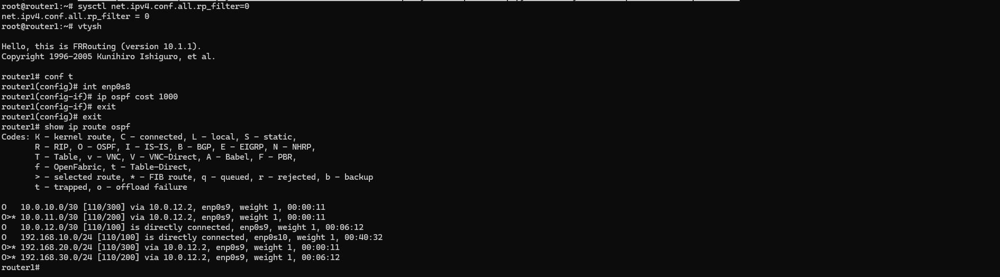
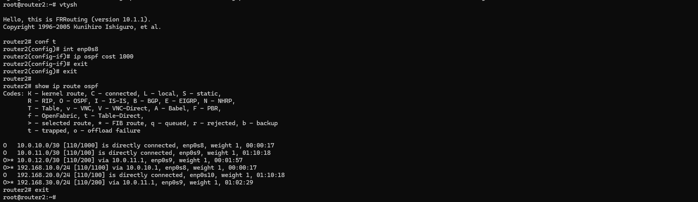

# Lesson №22 - OSPF

## Getting started

1. клонируйте репозиторий 
~~~
git clone git@github.com:leschfkg/otus.git
~~~
2. перейдите в директорию:
~~~
 cd otus/lesson_22_OSPF
~~~
3. измените конфигурцию под себя в файле Vagrantfile
4. добавьте публичную часть ключа в файл authorized_keys
5. запустите создание ВМ:

5.1 Linux bash
~~~
vagrant up && vagrant reload
~~~
5.2 Windows power shell
~~~
vagrant up; vagrant reload
~~~

Для быстрого запуска окружения и работы использован Vagrant-стенд из файла Vagrantfile с образом cdaf/UbuntuLVM.
Стенд протестирован на VirtualBox 7.0.14, Vagrant 2.4, хостовая система: Windows 11 Pro.

# Домашнее задание

1. Развернуть 3 виртуальные машины
2. Объединить их разными vlan
- настроить OSPF между машинами на базе Quagga;
- изобразить ассиметричный роутинг;
- сделать один из линков "дорогим", но что бы при этом роутинг был симметричным.

### 1. Разворачиваем 3 виртуальные машины

Так как мы планируем настроить OSPF, все 3 виртуальные машины должны быть соединены между собой (разными VLAN), а также иметь одну (или несколько) доолнительных сетей, к которым, далее OSPF сформирует маршруты. Исходя из данных требований, мы можем нарисовать топологию сети:

Установка пакетов для тестирования и настройки OSPF

Перед настройкой FRR рекомендуется поставить базовые программы для изменения конфигурационных файлов (vim) и изучения сети (traceroute, tcpdump, net-tools).

Для установки пакетов на все вм прописываем в Vagrantfile:
~~~
box.vm.provision "shell", inline: <<-SHELL
timedatectl set-timezone Europe/Moscow
apt update -y && apt install vim traceroute tcpdump net-tools -y
SHELL
~~~

Результатом выполнения команды vagrant up будут 3 созданные виртуальные машины, которые соединены между собой сетями (10.0.10.0/30, 10.0.11.0/30 и 10.0.12.0/30). У каждого роутера есть дополнительная сеть:
на router1 — 192.168.10.0/24
на router2 — 192.168.20.0/24
на router3 — 192.168.30.0/24
На данном этапе ping до дополнительных сетей (192.168.10-30.0/24) с соседних роутеров будет недоступен. 

### 2.1 Настройка OSPF между машинами на базе Quagga

Пакет Quagga перестал развиваться в 2018 году. Ему на смену пришёл пакет FRR, он построен на базе Quagga и продолжает своё развитие. В данном руководстве настойка OSPF будет осуществляться в FRR. 

Процесс установки FRR и настройки OSPF вручную:

1. Отключаем файерволл ufw и удаляем его из автозагрузки:

~~~
PS C:\Users\levitskyav\Documents\MobaXterm\home\otus\otus\lesson_22_OSPF> vagrant status
Current machine states:

router1                   running (virtualbox)
router2                   running (virtualbox)
router3                   running (virtualbox)

This environment represents multiple VMs. The VMs are all listed
above with their current state. For more information about a specific
VM, run `vagrant status NAME`.
PS C:\Users\levitskyav\Documents\MobaXterm\home\otus\otus\lesson_22_OSPF>
~~~
Заходим на вм router1 и переходим в root
~~~
PS C:\Users\levitskyav\Documents\MobaXterm\home\otus\otus\lesson_22_OSPF> vagrant ssh router1
Welcome to Ubuntu 22.04.1 LTS (GNU/Linux 5.15.0-48-generic x86_64)

 * Documentation:  https://help.ubuntu.com
 * Management:     https://landscape.canonical.com
 * Support:        https://ubuntu.com/advantage

  System information as of Mon Sep 30 11:56:05 AM MSK 2024

  System load:  0.0                Users logged in:          0
  Usage of /:   5.7% of 122.48GB   IPv4 address for enp0s10: 192.168.10.1
  Memory usage: 7%                 IPv4 address for enp0s3:  10.0.2.15
  Swap usage:   0%                 IPv4 address for enp0s8:  10.0.10.1
  Processes:    114                IPv4 address for enp0s9:  10.0.12.1

281 updates can be applied immediately.
195 of these updates are standard security updates.
To see these additional updates run: apt list --upgradable

New release '24.04.1 LTS' available.
Run 'do-release-upgrade' to upgrade to it.

Last login: Mon Sep 30 11:42:30 2024 from 10.0.2.2
vagrant@router1:~$ sudo -i
root@router1:~#
~~~
 Отключаем файерволл ufw и удаляем его из автозагрузки:
~~~
vagrant@router1:~$ sudo -i
root@router1:~# systemctl stop ufw
root@router1:~# systemctl disable ufw
Synchronizing state of ufw.service with SysV service script with /lib/systemd/systemd-sysv-install.
Executing: /lib/systemd/systemd-sysv-install disable ufw
Removed /etc/systemd/system/multi-user.target.wants/ufw.service.
root@router1:~#
~~~
Добавляем gpg ключ:
~~~
root@router1:~# curl -s https://deb.frrouting.org/frr/keys.asc | sudo apt-key add -
Warning: apt-key is deprecated. Manage keyring files in trusted.gpg.d instead (see apt-key(8)).
OK
root@router1:~#
~~~
Добавляем репозиторий c пакетом FRR:
~~~
root@router1:~# echo deb https://deb.frrouting.org/frr $(lsb_release -s -c) frr-stable > /etc/apt/sources.list.d/frr.list
root@router1:~#
~~~
Обновляем пакеты и устанавливаем FRR:
~~~
apt update
apt install frr frr-pythontools
~~~
Разрешаем (включаем) маршрутизацию транзитных пакетов:
~~~
root@router1:~# sysctl net.ipv4.conf.all.forwarding=1
net.ipv4.conf.all.forwarding = 1
root@router1:~#
~~~
Включаем демон ospfd в FRR

Для этого открываем в редакторе файл /etc/frr/daemons и меняем в нём параметры для пакетов zebra и ospfd на yes:

~~~
root@router1:~# vim /etc/frr/daemons

[1]+  Stopped                 vim /etc/frr/daemons
root@router1:~#
root@router1:~#
~~~
~~~
bgpd=no
zebra=yes
ospfd=yes
ospf6d=no
ripd=no
ripngd=no
isisd=no
pimd=no
pim6d=no
ldpd=no
nhrpd=no
eigrpd=no
babeld=no
sharpd=no
pbrd=no
bfdd=no
fabricd=no
vrrpd=no
pathd=no
~~~
Настройка OSPF

Для настройки OSPF нам потребуется создать файл /etc/frr/frr.conf который будет содержать в себе информацию о требуемых интерфейсах и OSPF. Разберем пример создания файла на хосте router1.

Для начала нам необходимо узнать имена интерфейсов и их адреса. Сделать это можно с помощью двух способов:

* Посмотреть в linux: ip a | grep inet:
~~~
root@router1:~# ip a | grep inet
    inet 127.0.0.1/8 scope host lo
    inet6 ::1/128 scope host
    inet 10.0.2.15/24 metric 100 brd 10.0.2.255 scope global dynamic enp0s3
    inet6 fe80::a00:27ff:fed6:5a73/64 scope link
    inet 10.0.10.1/30 brd 10.0.10.3 scope global enp0s8
    inet6 fe80::a00:27ff:febe:ca9a/64 scope link
    inet 10.0.12.1/30 brd 10.0.12.3 scope global enp0s9
    inet6 fe80::a00:27ff:fe1d:15ca/64 scope link
    inet 192.168.10.1/24 brd 192.168.10.255 scope global enp0s10
    inet6 fe80::a00:27ff:fe69:36ce/64 scope link
root@router1:~#
~~~
* Зайти в интерфейс FRR и посмотреть информацию об интерфейсах
~~~
root@router1:~# vtysh

Hello, this is FRRouting (version 10.1.1).
Copyright 1996-2005 Kunihiro Ishiguro, et al.

router1# show interface brief
Interface       Status  VRF             Addresses
---------       ------  ---             ---------
enp0s3          up      default         10.0.2.15/24
                                        fe80::a00:27ff:fed6:5a73/64
enp0s8          up      default         10.0.10.1/30
                                        fe80::a00:27ff:febe:ca9a/64
enp0s9          up      default         10.0.12.1/30
                                        fe80::a00:27ff:fe1d:15ca/64
enp0s10         up      default         192.168.10.1/24
                                        fe80::a00:27ff:fe69:36ce/64
lo              up      default

router1# exit
root@router1:~#
~~~
В обоих примерах мы увидели имена сетевых интерфейсов, их ip-адреса и маски подсети. Исходя из схемы мы понимаем, что для настройки OSPF нам достаточно описать интерфейсы enp0s8, enp0s9, enp0s10

Создаём файл /etc/frr/frr.conf и вносим в него следующую информацию:
~~~
!Указание версии FRR
frr version 8.1
frr defaults traditional
!Указываем имя машины
hostname router1
log syslog informational
no ipv6 forwarding
service integrated-vtysh-config
!
!Добавляем информацию об интерфейсе enp0s8
interface enp0s8
 !Указываем имя интерфейса
 description r1-r2
 !Указываем ip-aдрес и маску (эту информацию мы получили в прошлом шаге)
 ip address 10.0.10.1/30
 !Указываем параметр игнорирования MTU
 ip ospf mtu-ignore
 !Если потребуется, можно указать «стоимость» интерфейса
 !ip ospf cost 1000
 !Указываем параметры hello-интервала для OSPF пакетов
 ip ospf hello-interval 10
 !Указываем параметры dead-интервала для OSPF пакетов
 !Должно быть кратно предыдущему значению
 ip ospf dead-interval 30
!
interface enp0s9
 description r1-r3
 ip address 10.0.12.1/30
 ip ospf mtu-ignore
 !ip ospf cost 45
 ip ospf hello-interval 10
 ip ospf dead-interval 30

interface enp0s10
 description net_router1
 ip address 192.168.10.1/24
 ip ospf mtu-ignore
 !ip ospf cost 45
 ip ospf hello-interval 10
 ip ospf dead-interval 30 
!
!Начало настройки OSPF
router ospf
 !Указываем router-id 
 router-id 1.1.1.1
 !Указываем сети, которые хотим анонсировать соседним роутерам
 network 10.0.10.0/30 area 0
 network 10.0.12.0/30 area 0
 network 192.168.10.0/24 area 0 
 !Указываем адреса соседних роутеров
 neighbor 10.0.10.2
 neighbor 10.0.12.2

!Указываем адрес log-файла
log file /var/log/frr/frr.log
default-information originate always
~~~
Сохраняем изменения и выходим из данного файла.

Вместо файла frr.conf мы можем задать данные параметры вручную из vtysh. Vtysh использует cisco-like команды.

В ходе создания файла мы видим несколько OSPF-параметров, которые требуются для настройки:
* hello-interval — интервал который указывает через сколько секунд протокол OSPF будет повторно отправлять запросы на другие роутеры. Данный интервал должен быть одинаковый на всех портах и роутерах, между которыми настроен OSPF. 
* Dead-interval — если в течении заданного времени роутер не отвечает на запросы, то он считается вышедшим из строя и пакеты уходят на другой роутер (если это возможно). Значение должно быть кратно hello-интервалу. Данный интервал должен быть одинаковый на всех портах и роутерах, между которыми настроен OSPF.
* router-id — идентификатор маршрутизатора (необязательный параметр), если данный параметр задан, то роутеры определяют свои роли по  данному параметру. Если данный идентификатор не задан, то роли маршрутизаторов определяются с помощью Loopback-интерфейса или самого большого ip-адреса на роутере.

После создания файлов /etc/frr/frr.conf и /etc/frr/daemons нужно проверить, что владельцем файла является пользователь frr. Группа файла также должна быть frr. Должны быть установленны следующие права:
* у владельца на чтение и запись
* у группы только на чтение

~~~
root@router1:~# ls -la /etc/frr/
total 32
drwxr-x---   2 frr  frr  4096 Sep 30 12:13 .
drwxr-xr-x 100 root root 4096 Sep 30 11:59 ..
-rw-r-----   1 frr  frr  4138 Sep 30 12:04 daemons
-rw-r-----   1 frr  frr  2389 Sep 30 12:13 frr.conf
-rw-r-----   1 frr  frr  6663 Sep 12 17:07 support_bundle_commands.conf
-rw-r-----   1 frr  frr    32 Sep 12 17:07 vtysh.conf
root@router1:~#
~~~

Перезапускаем FRR и добавляем его в автозагрузку
~~~
root@router1:~# systemctl restart frr
root@router1:~# systemctl enable frr
Synchronizing state of frr.service with SysV service script with /lib/systemd/systemd-sysv-install.
Executing: /lib/systemd/systemd-sysv-install enable frr
root@router1:~#
~~~
Проверям, что OSPF перезапустился без ошибок
~~~
root@router1:~# systemctl status frr
● frr.service - FRRouting
     Loaded: loaded (/lib/systemd/system/frr.service; enabled; vendor preset: enabled)
     Active: active (running) since Mon 2024-09-30 12:16:28 MSK; 27s ago
       Docs: https://frrouting.readthedocs.io/en/latest/setup.html
   Main PID: 5910 (watchfrr)
     Status: "FRR Operational"
      Tasks: 10 (limit: 4574)
     Memory: 19.2M
        CPU: 230ms
     CGroup: /system.slice/frr.service
             ├─5910 /usr/lib/frr/watchfrr -d -F traditional zebra mgmtd ospfd staticd
             ├─5921 /usr/lib/frr/zebra -d -F traditional -A 127.0.0.1 -s 90000000
             ├─5926 /usr/lib/frr/mgmtd -d -F traditional -A 127.0.0.1
             ├─5928 /usr/lib/frr/ospfd -d -F traditional -A 127.0.0.1
             └─5931 /usr/lib/frr/staticd -d -F traditional -A 127.0.0.1

Sep 30 12:16:23 router1 ospfd[5928]: [VTVCM-Y2NW3] Configuration Read in Took: 00:00:00
Sep 30 12:16:23 router1 frrinit.sh[5938]: [5938|ospfd] Configuration file[/etc/frr/frr.conf] processing failure: 2
Sep 30 12:16:23 router1 watchfrr[5910]: [ZJW5C-1EHNT] restart all process 5911 exited with non-zero status 2
Sep 30 12:16:28 router1 watchfrr[5910]: [QDG3Y-BY5TN] ospfd state -> up : connect succeeded
Sep 30 12:16:28 router1 watchfrr[5910]: [QDG3Y-BY5TN] mgmtd state -> up : connect succeeded
Sep 30 12:16:28 router1 watchfrr[5910]: [QDG3Y-BY5TN] staticd state -> up : connect succeeded
Sep 30 12:16:28 router1 watchfrr[5910]: [QDG3Y-BY5TN] zebra state -> up : connect succeeded
Sep 30 12:16:28 router1 watchfrr[5910]: [KWE5Q-QNGFC] all daemons up, doing startup-complete notify
Sep 30 12:16:28 router1 frrinit.sh[5900]:  * Started watchfrr
Sep 30 12:16:28 router1 systemd[1]: Started FRRouting.
root@router1:~#
~~~
На хостах router2 и router3 также потребуется настроить конфигруационные файлы, предварительно поменяв ip -адреса интерфейсов.

router2:
~~~
!Указание версии FRR
frr version 8.1
frr defaults traditional
!Указываем имя машины
hostname router2
log syslog informational
no ipv6 forwarding
service integrated-vtysh-config
!
!Добавляем информацию об интерфейсе enp0s8
interface enp0s8
 !Указываем имя интерфейса
 description r2-r1
 !Указываем ip-aдрес и маску (эту информацию мы получили в прошлом шаге)
 ip address 10.0.10.2/30
 !Указываем параметр игнорирования MTU
 ip ospf mtu-ignore
 !Если потребуется, можно указать «стоимость» интерфейса
 !ip ospf cost 1000
 !Указываем параметры hello-интервала для OSPF пакетов
 ip ospf hello-interval 10
 !Указываем параметры dead-интервала для OSPF пакетов
 !Должно быть кратно предыдущему значению
 ip ospf dead-interval 30
!
interface enp0s9
 description r2-r3
 ip address 10.0.11.2/30
 ip ospf mtu-ignore
 !ip ospf cost 45
 ip ospf hello-interval 10
 ip ospf dead-interval 30

interface enp0s10
 description net_router1
 ip address 192.168.20.1/24
 ip ospf mtu-ignore
 !ip ospf cost 45
 ip ospf hello-interval 10
 ip ospf dead-interval 30 
!
!Начало настройки OSPF
router ospf
 !Указываем router-id 
 router-id 2.2.2.2
 !Указываем сети, которые хотим анонсировать соседним роутерам
 network 10.0.10.0/30 area 0
 network 10.0.11.0/30 area 0
 network 192.168.20.0/24 area 0 
 !Указываем адреса соседних роутеров
 neighbor 10.0.10.1
 neighbor 10.0.11.1

!Указываем адрес log-файла
log file /var/log/frr/frr.log
default-information originate always
~~~
router3
~~~
!Указание версии FRR
frr version 8.1
frr defaults traditional
!Указываем имя машины
hostname router3
log syslog informational
no ipv6 forwarding
service integrated-vtysh-config
!
!Добавляем информацию об интерфейсе enp0s8
interface enp0s8
 !Указываем имя интерфейса
 description r3-r2
 !Указываем ip-aдрес и маску (эту информацию мы получили в прошлом шаге)
 ip address 10.0.11.1/30
 !Указываем параметр игнорирования MTU
 ip ospf mtu-ignore
 !Если потребуется, можно указать «стоимость» интерфейса
 !ip ospf cost 1000
 !Указываем параметры hello-интервала для OSPF пакетов
 ip ospf hello-interval 10
 !Указываем параметры dead-интервала для OSPF пакетов
 !Должно быть кратно предыдущему значению
 ip ospf dead-interval 30
!
interface enp0s9
 description r3-r1
 ip address 10.0.12.2/30
 ip ospf mtu-ignore
 !ip ospf cost 45
 ip ospf hello-interval 10
 ip ospf dead-interval 30

interface enp0s10
 description net_router1
 ip address 192.168.30.1/24
 ip ospf mtu-ignore
 !ip ospf cost 45
 ip ospf hello-interval 10
 ip ospf dead-interval 30 
!
!Начало настройки OSPF
router ospf
 !Указываем router-id 
 router-id 3.3.3.3
 !Указываем сети, которые хотим анонсировать соседним роутерам
 network 10.0.11.0/30 area 0
 network 10.0.12.0/30 area 0
 network 192.168.30.0/24 area 0 
 !Указываем адреса соседних роутеров
 neighbor 10.0.12.1
 neighbor 10.0.11.2

!Указываем адрес log-файла
log file /var/log/frr/frr.log
default-information originate always
~~~
Если мы правильно настроили OSPF, то с любого хоста нам должны быть доступны сети:
* 192.168.10.0/24
* 192.168.20.0/24
* 192.168.30.0/24
* 10.0.10.0/30 
* 10.0.11.0/30
* 10.0.13.0/30

Проверим доступность сетей с хоста router1:

Запустим трассировку до адреса 192.168.30.1

Попробуем отключить интерфейс enp0s9 и немного подождем и снова запустим трассировку до ip-адреса 192.168.30.1

Как мы видим, после отключения интерфейса сеть 192.168.30.0/24 нам остаётся доступна.

Также мы можем проверить из интерфейса vtysh какие маршруты мы видим на данный момент:

### 2.2 Настройка ассиметричного роутинга

Для настройки ассиметричного роутинга нам необходимо выключить блокировку ассиметричной маршрутизации: sysctl net.ipv4.conf.all.rp_filter=0

Далее, выбираем один из роутеров, на котором изменим «стоимость интерфейса». Например поменяем стоимость интерфейса enp0s8 на router1:

~~~
root@router1:~# sysctl net.ipv4.conf.all.rp_filter=0
net.ipv4.conf.all.rp_filter = 0
root@router1:~#
~~~

После внесения данных настроек, мы видим, что маршрут до сети 192.168.20.0/30  теперь пойдёт через router2, но обратный трафик от router2 пойдёт по другому пути. Давайте это проверим:

1) На router1 запускаем пинг от 192.168.10.1 до 192.168.20.1: 
ping -I 192.168.10.1 192.168.20.1

2) На router2 запускаем tcpdump, который будет смотреть трафик только на порту enp0s9:

Видим что данный порт только получает ICMP-трафик с адреса 192.168.10.1
3) На router2 запускаем tcpdump, который будет смотреть трафик только на порту enp0s8:

Видим что данный порт только отправляет ICMP-трафик на адрес 192.168.10.1

Таким образом мы видим ассиметричный роутинг.

### 2.3 Настройка симметичного роутинга

Так как у нас уже есть один «дорогой» интерфейс, нам потребуется добавить ещё один дорогой интерфейс, чтобы у нас перестала работать ассиметричная маршрутизация. 

Так как в прошлом задании мы заметили что router2 будет отправлять обратно трафик через порт enp0s8, мы также должны сделать его дорогим и далее проверить, что теперь используется симметричная маршрутизация:

Поменяем стоимость интерфейса enp0s8 на router2:

После внесения данных настроек, мы видим, что маршрут до сети 192.168.10.0/30  пойдёт через router2.

Давайте это проверим:
1) На router1 запускаем пинг от 192.168.10.1 до 192.168.20.1: 

2) На router2 запускаем tcpdump, который будет смотреть трафик только на порту enp0s9:

Теперь мы видим, что трафик между роутерами ходит симметрично.

