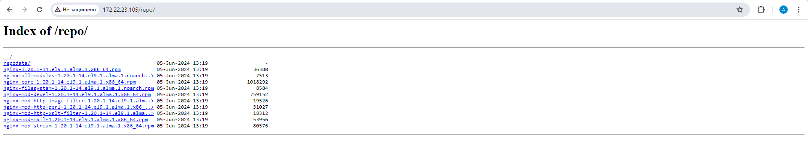
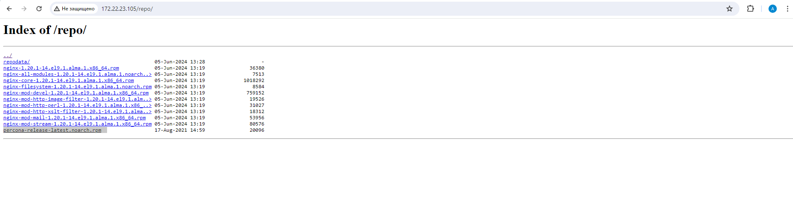

# Lesson №6 - Build Package

## Getting started

1. клонируйте репозиторий 
~~~
git clone git@github.com:leschfkg/otus.git
~~~
2. перейдите в директорию:
~~~
 cd otus/lesson_6_Build_package
~~~
3. измените конфигурцию под себя в файле Vagrantfile
4. добавьте публичную часть ключа в файл authorized_keys
5. запустите создание ВМ:

5.1 Linux bash
~~~
vagrant up && vagrant reload
~~~
5.2 Windows power shell
~~~
vagrant up; vagrant reload
~~~

Для быстрого запуска окружения и работы использован Vagrant-стенд из файла Vagrantfile с образом almalinux/9.
Стенд протестирован на VirtualBox 7.0.14, Vagrant 2.4, хостовая система: Windows 11 Pro.

### Создать свой RPM пакет

Задание выполняется на AlmaLinux release 9.3
~~~
root@otus-node-0 ~ # cat /etc/*release
AlmaLinux release 9.3 (Shamrock Pampas Cat)
NAME="AlmaLinux"
VERSION="9.3 (Shamrock Pampas Cat)"
ID="almalinux"
ID_LIKE="rhel centos fedora"
VERSION_ID="9.3"
PLATFORM_ID="platform:el9"
PRETTY_NAME="AlmaLinux 9.3 (Shamrock Pampas Cat)"
ANSI_COLOR="0;34"
LOGO="fedora-logo-icon"
CPE_NAME="cpe:/o:almalinux:almalinux:9::baseos"
HOME_URL="https://almalinux.org/"
DOCUMENTATION_URL="https://wiki.almalinux.org/"
BUG_REPORT_URL="https://bugs.almalinux.org/"

ALMALINUX_MANTISBT_PROJECT="AlmaLinux-9"
ALMALINUX_MANTISBT_PROJECT_VERSION="9.3"
REDHAT_SUPPORT_PRODUCT="AlmaLinux"
REDHAT_SUPPORT_PRODUCT_VERSION="9.3"
AlmaLinux release 9.3 (Shamrock Pampas Cat)
AlmaLinux release 9.3 (Shamrock Pampas Cat)
root@otus-node-0 ~ #
~~~

Для данного задания нам понадобятся следующие установленные пакеты:
~~~
yum install -y wget rpmdevtools rpm-build createrepo yum-utils cmake gcc git vim
~~~
Для примера возьмем пакет Nginx и соберем его с дополнительным модулем ngx_brotli
Загрузим SRPM пакет Nginx для дальнейшей работы над ним:
~~~
root@otus-node-0 ~ # mkdir rpm && cd rpm
root@otus-node-0 ~/rpm # yumdownloader --source nginx
enabling appstream-source repository
enabling baseos-source repository
enabling extras-source repository
AlmaLinux 9 - AppStream - Source                                                                                                                                         312 kB/s | 799 kB     00:02
AlmaLinux 9 - BaseOS - Source                                                                                                                                            139 kB/s | 265 kB     00:01
AlmaLinux 9 - Extras - Source                                                                                                                                            4.5 kB/s | 5.6 kB     00:01
nginx-1.20.1-14.el9_2.1.alma.1.src.rpm                                                                                                                                   650 kB/s | 1.1 MB     00:01
root@otus-node-0 ~/rpm #
~~~
При установке такого пакета в домашней директории создается дерево каталогов для сборки, далее поставим все зависимости для сборки пакета Nginx:
~~~
root@otus-node-0 ~/rpm # ll
total 1084
drwxr-xr-x. 2 root root      52 Jun  5 14:52 .
dr-xr-x---. 4 root root     130 Jun  5 14:52 ..
-rw-r--r--. 1 root root 1106890 Jun  5 14:52 nginx-1.20.1-14.el9_2.1.alma.1.src.rpm
root@otus-node-0 ~/rpm # rpm -Uvh *.src.rpm
Updating / installing...
################################# [100%]
root@otus-node-0 ~/rpm # yum-builddep nginx -y
~~~
Также нужно клонировать исходный код модуля ngx_brotli — он
потребуется при сборке:
~~~
root@otus-node-0 ~/rpm # cd /root
root@otus-node-0 ~ # git clone --recurse-submodules -j8 https://github.com/google/ngx_brotli
Cloning into 'ngx_brotli'...
remote: Enumerating objects: 237, done.
remote: Counting objects: 100% (37/37), done.
remote: Compressing objects: 100% (16/16), done.
remote: Total 237 (delta 24), reused 21 (delta 21), pack-reused 200
Receiving objects: 100% (237/237), 79.51 KiB | 460.00 KiB/s, done.
Resolving deltas: 100% (114/114), done.
Submodule 'deps/brotli' (https://github.com/google/brotli.git) registered for path 'deps/brotli'
Cloning into '/root/ngx_brotli/deps/brotli'...
remote: Enumerating objects: 7574, done.
remote: Counting objects: 100% (1100/1100), done.
remote: Compressing objects: 100% (406/406), done.
remote: Total 7574 (delta 777), reused 846 (delta 678), pack-reused 6474
Receiving objects: 100% (7574/7574), 36.59 MiB | 6.03 MiB/s, done.
Resolving deltas: 100% (4909/4909), done.
Submodule path 'deps/brotli': checked out 'ed738e842d2fbdf2d6459e39267a633c4a9b2f5d'
root@otus-node-0 ~ # cd ngx_brotli/deps/brotli
root@otus-node-0 ~/ngx_brotli/deps/brotli # mkdir out && cd out
root@otus-node-0 ~/ngx_brotli/deps/brotli/out #
~~~
Собираем модуль ngx_brotli:
~~~
root@otus-node-0 ~/ngx_brotli/deps/brotli/out # cmake -DCMAKE_BUILD_TYPE=Release -DBUILD_SHARED_LIBS=OFF -DCMAKE_C_FLAGS="-Ofast -m64 -march=native -mtune=native -flto -funroll-loops -ffunction-sections -fdata-sections -Wl,--gc-sections" -DCMAKE_CXX_FLAGS="-Ofast -m64 -march=native -mtune=native -flto -funroll-loops -ffunction-sections -fdata-sections -Wl,--gc-sections" -DCMAKE_INSTALL_PREFIX=./installed ..
-- The C compiler identification is GNU 11.4.1
-- Detecting C compiler ABI info
-- Detecting C compiler ABI info - done
-- Check for working C compiler: /usr/bin/cc - skipped
-- Detecting C compile features
-- Detecting C compile features - done
-- Build type is 'Release'
-- Performing Test BROTLI_EMSCRIPTEN
-- Performing Test BROTLI_EMSCRIPTEN - Failed
-- Compiler is not EMSCRIPTEN
-- Looking for log2
-- Looking for log2 - not found
-- Looking for log2
-- Looking for log2 - found
-- Configuring done (0.8s)
-- Generating done (0.0s)
CMake Warning:
  Manually-specified variables were not used by the project:

    CMAKE_CXX_FLAGS

-- Build files have been written to: /root/ngx_brotli/deps/brotli/out
root@otus-node-0 ~/ngx_brotli/deps/brotli/out # 
~~~
~~~
root@otus-node-0 ~/ngx_brotli/deps/brotli/out # cmake --build . --config Release -j 2 --target brotlienc
[  3%] Building C object CMakeFiles/brotlicommon.dir/c/common/constants.c.o
[  6%] Building C object CMakeFiles/brotlicommon.dir/c/common/context.c.o
[ 10%] Building C object CMakeFiles/brotlicommon.dir/c/common/dictionary.c.o
[ 13%] Building C object CMakeFiles/brotlicommon.dir/c/common/platform.c.o
[ 17%] Building C object CMakeFiles/brotlicommon.dir/c/common/shared_dictionary.c.o
[ 20%] Building C object CMakeFiles/brotlicommon.dir/c/common/transform.c.o
[ 24%] Linking C static library libbrotlicommon.a
[ 24%] Built target brotlicommon
[ 31%] Building C object CMakeFiles/brotlienc.dir/c/enc/backward_references_hq.c.o
[ 31%] Building C object CMakeFiles/brotlienc.dir/c/enc/backward_references.c.o
[ 34%] Building C object CMakeFiles/brotlienc.dir/c/enc/bit_cost.c.o
[ 37%] Building C object CMakeFiles/brotlienc.dir/c/enc/block_splitter.c.o
[ 41%] Building C object CMakeFiles/brotlienc.dir/c/enc/brotli_bit_stream.c.o
[ 44%] Building C object CMakeFiles/brotlienc.dir/c/enc/cluster.c.o
[ 48%] Building C object CMakeFiles/brotlienc.dir/c/enc/command.c.o
[ 51%] Building C object CMakeFiles/brotlienc.dir/c/enc/compound_dictionary.c.o
[ 55%] Building C object CMakeFiles/brotlienc.dir/c/enc/compress_fragment.c.o
[ 58%] Building C object CMakeFiles/brotlienc.dir/c/enc/compress_fragment_two_pass.c.o
[ 62%] Building C object CMakeFiles/brotlienc.dir/c/enc/dictionary_hash.c.o
[ 65%] Building C object CMakeFiles/brotlienc.dir/c/enc/encode.c.o
[ 68%] Building C object CMakeFiles/brotlienc.dir/c/enc/encoder_dict.c.o
[ 72%] Building C object CMakeFiles/brotlienc.dir/c/enc/entropy_encode.c.o
[ 75%] Building C object CMakeFiles/brotlienc.dir/c/enc/fast_log.c.o
[ 79%] Building C object CMakeFiles/brotlienc.dir/c/enc/histogram.c.o
[ 82%] Building C object CMakeFiles/brotlienc.dir/c/enc/literal_cost.c.o
[ 86%] Building C object CMakeFiles/brotlienc.dir/c/enc/memory.c.o
[ 89%] Building C object CMakeFiles/brotlienc.dir/c/enc/metablock.c.o
[ 93%] Building C object CMakeFiles/brotlienc.dir/c/enc/static_dict.c.o
[ 96%] Building C object CMakeFiles/brotlienc.dir/c/enc/utf8_util.c.o
[100%] Linking C static library libbrotlienc.a
[100%] Built target brotlienc
root@otus-node-0 ~/ngx_brotli/deps/brotli/out #
~~~
~~~
root@otus-node-0 ~/ngx_brotli # cd  ~/ngx_brotli
root@otus-node-0 ~/ngx_brotli #
~~~
Нужно поправить сам spec файл, чтобы Nginx собирался с необходимыми нам опциями: находим секцию с параметрами configure (до условий if) и добавляем указание на модуль (не забудьте указать завершающий обратный слэш):
--add-module=/root/ngx_brotli \
~~~
root@otus-node-0 ~/rpmbuild # cd
root@otus-node-0 ~ # cd rpmbuild/
root@otus-node-0 ~/rpmbuild # ll
total 4
drwxr-xr-x. 4 root root   34 Jun  5 14:57 .
dr-xr-x---. 6 root root  164 Jun  5 15:01 ..
drwxr-xr-x. 2 root root 4096 Jun  5 14:57 SOURCES
drwxr-xr-x. 2 root root   24 Jun  5 14:57 SPECS
root@otus-node-0 ~/rpmbuild #
~~~
~~~
root@otus-node-0 ~/rpmbuild # vim SPECS/nginx.spec
~~~
~~~
if ! ./configure \
    --prefix=%{_datadir}/nginx \
    --sbin-path=%{_sbindir}/nginx \
    --modules-path=%{nginx_moduledir} \
    --conf-path=%{_sysconfdir}/nginx/nginx.conf \
    --error-log-path=%{_localstatedir}/log/nginx/error.log \
    --http-log-path=%{_localstatedir}/log/nginx/access.log \
    --http-client-body-temp-path=%{_localstatedir}/lib/nginx/tmp/client_body \
    --http-proxy-temp-path=%{_localstatedir}/lib/nginx/tmp/proxy \
    --http-fastcgi-temp-path=%{_localstatedir}/lib/nginx/tmp/fastcgi \
    --http-uwsgi-temp-path=%{_localstatedir}/lib/nginx/tmp/uwsgi \
    --http-scgi-temp-path=%{_localstatedir}/lib/nginx/tmp/scgi \
    --pid-path=/run/nginx.pid \
    --lock-path=/run/lock/subsys/nginx \
    --user=%{nginx_user} \
    --group=%{nginx_user} \
    --with-compat \
    --with-debug \
    --add-module=/root/ngx_brotli \
~~~
По этой ссылке можно посмотреть все доступные опции для сборки.

Теперь можно приступить к сборке RPM пакета:
~~~
root@otus-node-0 ~/rpmbuild # cd SPECS/
root@otus-node-0 ~/rpmbuild/SPECS # rpmbuild -ba nginx.spec -D 'debug_package %{nil}'
root@otus-node-0 ~/rpmbuild/SPECS #
~~~
Убедимся, что пакеты создались:
~~~
root@otus-node-0 ~/rpmbuild/SPECS # ls -lah ../RPMS/
total 4.0K
drwxr-xr-x. 4 root root   34 Jun  5 15:18 .
drwxr-xr-x. 8 root root   89 Jun  5 15:17 ..
drwxr-xr-x. 2 root root  123 Jun  5 15:18 noarch
drwxr-xr-x. 2 root root 4.0K Jun  5 15:18 x86_64
root@otus-node-0 ~/rpmbuild/SPECS # ls -lah ../RPMS/x86_64/
total 2.0M
drwxr-xr-x. 2 root root 4.0K Jun  5 15:18 .
drwxr-xr-x. 4 root root   34 Jun  5 15:18 ..
-rw-r--r--. 1 root root  36K Jun  5 15:18 nginx-1.20.1-14.el9.1.alma.1.x86_64.rpm
-rw-r--r--. 1 root root 995K Jun  5 15:18 nginx-core-1.20.1-14.el9.1.alma.1.x86_64.rpm
-rw-r--r--. 1 root root 742K Jun  5 15:18 nginx-mod-devel-1.20.1-14.el9.1.alma.1.x86_64.rpm
-rw-r--r--. 1 root root  20K Jun  5 15:18 nginx-mod-http-image-filter-1.20.1-14.el9.1.alma.1.x86_64.rpm
-rw-r--r--. 1 root root  31K Jun  5 15:18 nginx-mod-http-perl-1.20.1-14.el9.1.alma.1.x86_64.rpm
-rw-r--r--. 1 root root  18K Jun  5 15:18 nginx-mod-http-xslt-filter-1.20.1-14.el9.1.alma.1.x86_64.rpm
-rw-r--r--. 1 root root  53K Jun  5 15:18 nginx-mod-mail-1.20.1-14.el9.1.alma.1.x86_64.rpm
-rw-r--r--. 1 root root  79K Jun  5 15:18 nginx-mod-stream-1.20.1-14.el9.1.alma.1.x86_64.rpm
root@otus-node-0 ~/rpmbuild/SPECS #
~~~
Копируем пакеты в общий каталог:
~~~
root@otus-node-0 ~/rpmbuild/SPECS # cp ~/rpmbuild/RPMS/noarch/* ~/rpmbuild/RPMS/x86_64/
root@otus-node-0 ~/rpmbuild/SPECS # cd ~/rpmbuild/RPMS/x86_64
root@otus-node-0 ~/rpmbuild/RPMS/x86_64 #
~~~
Теперь можно установить наш пакет и убедиться, что nginx работает:
~~~
root@otus-node-0 ~/rpmbuild/RPMS/x86_64 # yum localinstall *.rpm
root@otus-node-0 ~/rpmbuild/RPMS/x86_64 # systemctl enable --now nginx
Created symlink /etc/systemd/system/multi-user.target.wants/nginx.service → /usr/lib/systemd/system/nginx.service.
root@otus-node-0 ~/rpmbuild/RPMS/x86_64 #  systemctl status nginx
● nginx.service - The nginx HTTP and reverse proxy server
     Loaded: loaded (/usr/lib/systemd/system/nginx.service; enabled; preset: disabled)
     Active: active (running) since Wed 2024-06-05 16:17:15 MSK; 15s ago
    Process: 70580 ExecStartPre=/usr/bin/rm -f /run/nginx.pid (code=exited, status=0/SUCCESS)
    Process: 70581 ExecStartPre=/usr/sbin/nginx -t (code=exited, status=0/SUCCESS)
    Process: 70582 ExecStart=/usr/sbin/nginx (code=exited, status=0/SUCCESS)
   Main PID: 70583 (nginx)
      Tasks: 7 (limit: 50168)
     Memory: 9.7M
        CPU: 51ms
     CGroup: /system.slice/nginx.service
             ├─70583 "nginx: master process /usr/sbin/nginx"
             ├─70584 "nginx: worker process"
             ├─70585 "nginx: worker process"
             ├─70586 "nginx: worker process"
             ├─70587 "nginx: worker process"
             ├─70588 "nginx: worker process"
             └─70589 "nginx: worker process"

Jun 05 16:17:15 otus-node-0.local systemd[1]: Starting The nginx HTTP and reverse proxy server...
Jun 05 16:17:15 otus-node-0.local nginx[70581]: nginx: the configuration file /etc/nginx/nginx.conf syntax is ok
Jun 05 16:17:15 otus-node-0.local nginx[70581]: nginx: configuration file /etc/nginx/nginx.conf test is successful
Jun 05 16:17:15 otus-node-0.local systemd[1]: Started The nginx HTTP and reverse proxy server.
root@otus-node-0 ~/rpmbuild/RPMS/x86_64 #
~~~

### Создать свой репозиторий и разместить там ранее собранный RPM
Теперь приступим к созданию своего репозитория. Директория для статики у Nginx по умолчанию /usr/share/nginx/html. Создадим там каталог repo
~~~
root@otus-node-0 ~/rpmbuild/RPMS/x86_64 # mkdir /usr/share/nginx/html/repo
root@otus-node-0 ~/rpmbuild/RPMS/x86_64 #
~~~
Копируем туда наши собранные RPM-пакеты:
~~~
root@otus-node-0 ~/rpmbuild/RPMS/x86_64 # cp ~/rpmbuild/RPMS/x86_64/*.rpm /usr/share/nginx/html/repo/
root@otus-node-0 ~/rpmbuild/RPMS/x86_64 #
~~~
Инициализируем репозиторий командой
~~~
root@otus-node-0 ~/rpmbuild/RPMS/x86_64 # createrepo /usr/share/nginx/html/repo/
Directory walk started
Directory walk done - 10 packages
Temporary output repo path: /usr/share/nginx/html/repo/.repodata/
Preparing sqlite DBs
Pool started (with 5 workers)
Pool finished
root@otus-node-0 ~/rpmbuild/RPMS/x86_64 #
~~~
Для прозрачности настроим в NGINX доступ к листингу каталога. В файле /etc/nginx/nginx.conf в блоке server добавим следующие директивы:
~~~
	index index.html index.htm;
	autoindex on;
~~~
~~~
    server {
        listen       80;
        listen       [::]:80;
        server_name  _;
        root         /usr/share/nginx/html;

        index index.html index.htm;
        autoindex on;

        # Load configuration files for the default server block.
        include /etc/nginx/default.d/*.conf;

        error_page 404 /404.html;
        location = /404.html {
        }

        error_page 500 502 503 504 /50x.html;
        location = /50x.html {
        }
    }
~~~
Проверяем синтаксис и перезапускаем NGINX
~~~
root@otus-node-0 ~/rpmbuild/RPMS/x86_64 # nginx -t
nginx: the configuration file /etc/nginx/nginx.conf syntax is ok
nginx: configuration file /etc/nginx/nginx.conf test is successful
root@otus-node-0 ~/rpmbuild/RPMS/x86_64 # nginx -s reload
root@otus-node-0 ~/rpmbuild/RPMS/x86_64 #
~~~
Теперь ради интереса можно посмотреть в браузере или с помощью curl:

~~~
root@otus-node-0 ~/rpmbuild/RPMS/x86_64 # curl -a http://localhost/repo/
<html>
<head><title>Index of /repo/</title></head>
<body>
<h1>Index of /repo/</h1>
<pre><a href="../">../</a>
<a href="repodata/">repodata/</a>                                          05-Jun-2024 13:19                   -
<a href="nginx-1.20.1-14.el9.1.alma.1.x86_64.rpm">nginx-1.20.1-14.el9.1.alma.1.x86_64.rpm</a>            05-Jun-2024 13:19               36380
<a href="nginx-all-modules-1.20.1-14.el9.1.alma.1.noarch.rpm">nginx-all-modules-1.20.1-14.el9.1.alma.1.noarch..&gt;</a> 05-Jun-2024 13:19                7513
<a href="nginx-core-1.20.1-14.el9.1.alma.1.x86_64.rpm">nginx-core-1.20.1-14.el9.1.alma.1.x86_64.rpm</a>       05-Jun-2024 13:19             1018292
<a href="nginx-filesystem-1.20.1-14.el9.1.alma.1.noarch.rpm">nginx-filesystem-1.20.1-14.el9.1.alma.1.noarch.rpm</a> 05-Jun-2024 13:19                8584
<a href="nginx-mod-devel-1.20.1-14.el9.1.alma.1.x86_64.rpm">nginx-mod-devel-1.20.1-14.el9.1.alma.1.x86_64.rpm</a>  05-Jun-2024 13:19              759152
<a href="nginx-mod-http-image-filter-1.20.1-14.el9.1.alma.1.x86_64.rpm">nginx-mod-http-image-filter-1.20.1-14.el9.1.alm..&gt;</a> 05-Jun-2024 13:19               19526
<a href="nginx-mod-http-perl-1.20.1-14.el9.1.alma.1.x86_64.rpm">nginx-mod-http-perl-1.20.1-14.el9.1.alma.1.x86_..&gt;</a> 05-Jun-2024 13:19               31027
<a href="nginx-mod-http-xslt-filter-1.20.1-14.el9.1.alma.1.x86_64.rpm">nginx-mod-http-xslt-filter-1.20.1-14.el9.1.alma..&gt;</a> 05-Jun-2024 13:19               18312
<a href="nginx-mod-mail-1.20.1-14.el9.1.alma.1.x86_64.rpm">nginx-mod-mail-1.20.1-14.el9.1.alma.1.x86_64.rpm</a>   05-Jun-2024 13:19               53956
<a href="nginx-mod-stream-1.20.1-14.el9.1.alma.1.x86_64.rpm">nginx-mod-stream-1.20.1-14.el9.1.alma.1.x86_64.rpm</a> 05-Jun-2024 13:19               80576
</pre>
</body>
</html>
root@otus-node-0 ~/rpmbuild/RPMS/x86_64 #
~~~
 Все готово для того, чтобы протестировать репозиторий.

 Добавим его в /etc/yum.repos.d:
~~~
root@otus-node-0 ~/rpmbuild/RPMS/x86_64 # cat >> /etc/yum.repos.d/otus.repo << EOF
> [otus]
name=otus-linux
baseurl=http://localhost/repo
gpgcheck=0
enabled=1
EOF

root@otus-node-0 ~/rpmbuild/RPMS/x86_64 # cat /etc/yum.repos.d/otus.repo
[otus]
name=otus-linux
baseurl=http://localhost/repo
gpgcheck=0
enabled=1
root@otus-node-0 ~/rpmbuild/RPMS/x86_64 #
~~~
Убедимся, что репозиторий подключился и посмотрим, что в нем есть:
~~~
root@otus-node-0 ~/rpmbuild/RPMS/x86_64 # yum repolist enabled | grep otus
otus                             otus-linux
root@otus-node-0 ~/rpmbuild/RPMS/x86_64 #
~~~
Добавим пакет в наш репозиторий:
~~~
root@otus-node-0 ~/rpmbuild/RPMS/x86_64 # cd /usr/share/nginx/html/repo/
root@otus-node-0 /usr/share/nginx/html/repo # wget https://repo.percona.com/yum/percona-release-latest.noarch.rpm
--2024-06-05 16:28:18--  https://repo.percona.com/yum/percona-release-latest.noarch.rpm
Resolving repo.percona.com (repo.percona.com)... 49.12.125.205, 2a01:4f8:242:5792::2
Connecting to repo.percona.com (repo.percona.com)|49.12.125.205|:443... connected.
HTTP request sent, awaiting response... 200 OK
Length: 20096 (20K) [application/x-redhat-package-manager]
Saving to: ‘percona-release-latest.noarch.rpm’

percona-release-latest.noarch.rpm                   100%[==================================================================================================================>]  19.62K  --.-KB/s    in 0s

2024-06-05 16:28:18 (140 MB/s) - ‘percona-release-latest.noarch.rpm’ saved [20096/20096]

root@otus-node-0 /usr/share/nginx/html/repo #
~~~
Обновим список пакетов в репозитории:
~~~
root@otus-node-0 /usr/share/nginx/html/repo # createrepo /usr/share/nginx/html/repo/
Directory walk started
Directory walk done - 11 packages
Temporary output repo path: /usr/share/nginx/html/repo/.repodata/
Preparing sqlite DBs
Pool started (with 5 workers)
Pool finished
root@otus-node-0 /usr/share/nginx/html/repo #  yum makecache
AlmaLinux 9 - AppStream                                                                                                                                                        6.2 kB/s | 4.2 kB     00:00
AlmaLinux 9 - BaseOS                                                                                                                                                           6.5 kB/s | 3.8 kB     00:00
AlmaLinux 9 - Extras                                                                                                                                                           5.5 kB/s | 3.3 kB     00:00
otus-linux                                                                                                                                                                     1.0 MB/s | 7.2 kB     00:00
Metadata cache created.
root@otus-node-0 /usr/share/nginx/html/repo # yum list | grep otus
percona-release.noarch                               1.0-27                              otus
root@otus-node-0 /usr/share/nginx/html/repo #
~~~
Так как Nginx у нас уже стоит, установим репозиторий percona-release:
~~~
root@otus-node-0 /usr/share/nginx/html/repo # yum install -y percona-release.noarch
Last metadata expiration check: 0:01:07 ago on Wed Jun  5 16:29:05 2024.
Dependencies resolved.
===============================================================================================================================================================================================================
 Package                                                  Architecture                                    Version                                          Repository                                     Size
===============================================================================================================================================================================================================
Installing:
 percona-release                                          noarch                                          1.0-27                                           otus                                           20 k

Transaction Summary
===============================================================================================================================================================================================================
Install  1 Package

Total download size: 20 k
Installed size: 32 k
Downloading Packages:
percona-release-latest.noarch.rpm                                                                                                                                              2.1 MB/s |  20 kB     00:00
---------------------------------------------------------------------------------------------------------------------------------------------------------------------------------------------------------------
Total                                                                                                                                                                          1.9 MB/s |  20 kB     00:00
Running transaction check
Transaction check succeeded.
Running transaction test
Transaction test succeeded.
Running transaction
  Preparing        :                                                                                                                                                                                       1/1
  Installing       : percona-release-1.0-27.noarch                                                                                                                                                         1/1
  Running scriptlet: percona-release-1.0-27.noarch                                                                                                                                                         1/1
* Enabling the Percona Original repository
<*> All done!
* Enabling the Percona Release repository
<*> All done!
The percona-release package now contains a percona-release script that can enable additional repositories for our newer products.

For example, to enable the Percona Server 8.0 repository use:

  percona-release setup ps80

Note: To avoid conflicts with older product versions, the percona-release setup command may disable our original repository for some products.

For more information, please visit:
  https://www.percona.com/doc/percona-repo-config/percona-release.html

  Verifying        : percona-release-1.0-27.noarch                                                                                                                                                         1/1

Installed:
  percona-release-1.0-27.noarch

Complete!
root@otus-node-0 /usr/share/nginx/html/repo #
~~~
Репозиторий изменился и в него добавился пакет percona-release-latest.noarch.rpm

 Все прошло успешно. В случае, если вам потребуется обновить репозиторий (а это
делается при каждом добавлении файлов) снова, то выполните команду
createrepo /usr/share/nginx/html/repo/.
