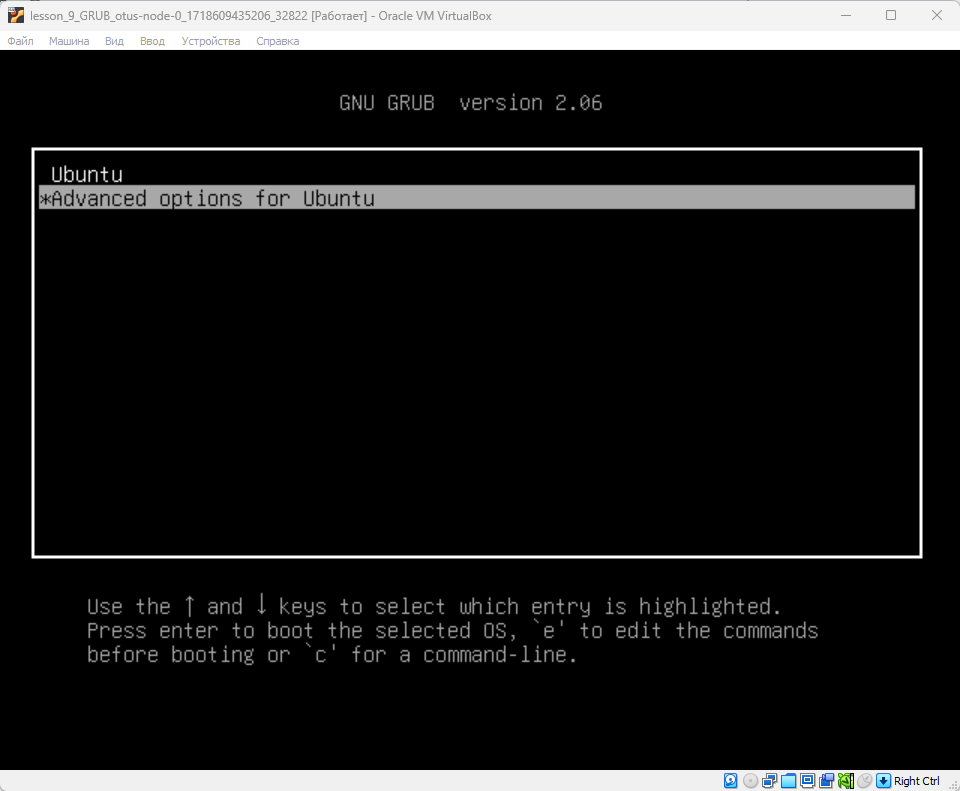

# Lesson №9 - GRUB

## Getting started

1. клонируйте репозиторий 
~~~
git clone git@github.com:leschfkg/otus.git
~~~
2. перейдите в директорию:
~~~
 cd otus/lesson_9_GRUB
~~~
3. измените конфигурцию под себя в файле Vagrantfile
4. добавьте публичную часть ключа в файл authorized_keys
5. запустите создание ВМ:

5.1 Linux bash
~~~
vagrant up && vagrant reload
~~~
5.2 Windows power shell
~~~
vagrant up; vagrant reload
~~~

Для быстрого запуска окружения и работы использован Vagrant-стенд из файла Vagrantfile с образом cdaf/UbuntuLVM.
Стенд протестирован на VirtualBox 7.0.14, Vagrant 2.4, хостовая система: Windows 11 Pro.

# Задание
Включить отображение меню Grub.

Попасть в систему без пароля несколькими способами.

Установить систему с LVM, после чего переименовать VG.

### Включить отображение меню Grub
По умолчанию меню загрузчика Grub скрыто и нет задержки при загрузке. Для отображения меню нужно отредактировать конфигурационный файл.
~~~
root@otus-node-0 ~ # vim /etc/default/grub
~~~
Комментируем строку, скрывающую меню и ставим задержку для выбора пункта меню в 10 секунд.
~~~
GRUB_DEFAULT=0
#GRUB_TIMEOUT_STYLE=hidden
GRUB_TIMEOUT=10
GRUB_DISTRIBUTOR=`lsb_release -i -s 2> /dev/null || echo Debian`
GRUB_CMDLINE_LINUX_DEFAULT=""
GRUB_CMDLINE_LINUX=""
~~~
Обновляем конфигурацию загрузчика и перезагружаемся для проверки.
~~~
root@otus-node-0 ~ # update-grub
Sourcing file `/etc/default/grub'
Sourcing file `/etc/default/grub.d/init-select.cfg'
Generating grub configuration file ...
Found linux image: /boot/vmlinuz-5.15.0-48-generic
Found initrd image: /boot/initrd.img-5.15.0-48-generic
Warning: os-prober will not be executed to detect other bootable partitions.
Systems on them will not be added to the GRUB boot configuration.
Check GRUB_DISABLE_OS_PROBER documentation entry.
done
root@otus-node-0 ~ # reboot

Remote side unexpectedly closed network connection
~~~
При загрузке в окне виртуальной машины мы должны увидеть меню загрузчика.

### Попасть в систему без пароля несколькими способами

Для получения доступа необходимо открыть GUI VirtualBox (или другой системы виртуализации), запустить виртуальную машину и при выборе ядра для загрузки нажать e - в данном контексте edit. Попадаем в окно, где мы можем изменить параметры загрузки:

### Способ 1. init=/bin/bash
В конце строки, начинающейся с linux, добавляем init=/bin/bash и нажимаем сtrl-x для загрузки в систему
В целом на этом все, Вы попали в систему. Но есть один нюанс. Рутовая файловая
система при этом монтируется в режиме Read-Only. Если вы хотите перемонтировать ее в режим Read-Write, можно воспользоваться командой:
~~~
mount -o remount,rw /
~~~
или если внимательно посмотреть на строку, то увидим в конце строки параметр монтирования в режиме ro, можно переписать его на rw и получить режим Read-Write сразу

 

После загрузки можно убедиться, записав данные в любой файл или прочитав вывод
команды:
~~~
mount | grep ubuntu
~~~

### Способ 2. Recovery mode
В меню загрузчика на первом уровне выбрать второй пункт (Advanced options…), далее загрузить пункт меню с указанием recovery mode в названии. 
Получим меню режима восстановления.

В этом меню сначала включаем поддержку сети (network) для того, чтобы файловая система перемонтировалась в режим read/write (либо это можно сделать вручную).
Далее выбираем пункт root и попадаем в консоль с пользователем root. Если вы ранее устанавливали пароль для пользователя root (по умолчанию его нет), то необходимо его ввести. 
В этой консоли можно производить любые манипуляции с системой.

### Установить систему с LVM, после чего переименовать VG
Мы установили систему Ubuntu 22.04 со стандартной разбивкой диска с использованием  LVM.
Первым делом посмотрим текущее состояние системы (список Volume Group):
~~~
root@otus-node-0 ~ # vgs
  VG        #PV #LV #SN Attr   VSize    VFree
  ubuntu-vg   1   1   0 wz--n- <125.00g    0
root@otus-node-0 ~ #
~~~
Нас интересует вторая строка с именем Volume Group. Приступим к переименованию:
~~~
root@otus-node-0 ~ # vgrename ubuntu-vg ubuntu-otus
  Volume group "ubuntu-vg" successfully renamed to "ubuntu-otus"
root@otus-node-0 ~ #
~~~
Далее правим /boot/grub/grub.cfg. Везде заменяем старое название VG на новое (в файле дефис меняется на два дефиса ubuntu--vg ubuntu--otus).
После чего можем перезагружаться и, если все сделано правильно, успешно грузимся с новым именем Volume Group и проверяем:
~~~
root@otus-node-0 ~ # sed -i 's/ubuntu--vg/ubuntu--otus/g' /boot/grub/grub.cfg
root@otus-node-0 ~ # vim /boot/grub/grub.cfg
~~~
перезагружаем вм для проверки
~~~
Last login: Mon Jun 17 11:26:58 2024 from 172.22.21.223
root@otus-node-0 ~ # vgs
  VG          #PV #LV #SN Attr   VSize    VFree
  ubuntu-otus   1   1   0 wz--n- <125.00g    0
root@otus-node-0 ~ #
~~~
ВМ загрузилась с новым именем VG